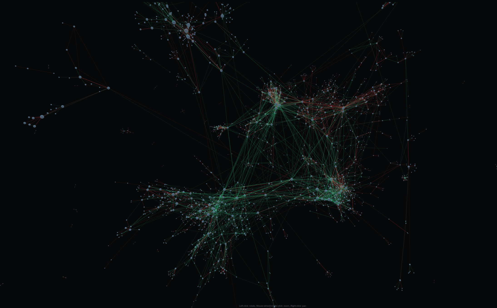

# CRIMENET — Knowledge Graph of Global Organized Crime

Open-source knowledge graph of relationships between criminal organizations worldwide, extracted from multi-language Wikipedia with an LLM pipeline.

Every edge carries the verbatim Wikipedia sentence that justifies it, plus a paraphrased description, an extracted time period, and a versioned source URL. The dataset is fully auditable: any claim can be traced back to a specific revision of a specific article.

<!-- crimenet-stats:start — auto-generated by tools/update_readme_stats.py; do not edit by hand -->
The current build holds **4,505 organizations** and **10,935 relationships** (1,032 organizations are profiled from their own article; 3,473 are kept as mentions; 317 are flagged defunct), extracted from 1,418 Wikipedia articles across four languages. Of these organizations, **3,521 (78%)** are connected to at least one other and **984 (22%)** are isolated, with no relationship extracted. An isolated organization reflects the absence of a documented tie in the Wikipedia articles processed, not necessarily the absence of any real-world connection.
<!-- crimenet-stats:end -->

- Browse live: <a href="https://www.alvarofrancomartins.com/crimenet" target="_blank">alvarofrancomartins.com/crimenet</a>

To my knowledge, CRIMENET is the most extensive catalog of criminal organizations ever assembled. Wikipedia's own <a href="https://en.wikipedia.org/wiki/List_of_criminal_enterprises,_gangs,_and_syndicates">list of criminal enterprises, gangs, and syndicates</a> covers a few hundred groups; a search for "all criminal organizations worldwide" returns the candid admission that "an exhaustive list of all criminal organizations globally does not exist." CRIMENET's nearly 5,000 organizations and nearly 11,000 relationships come closer than anything else, each one backed by a specific Wikipedia source. This was an accidental achievement: the goal was to build a knowledge graph of how criminal organizations relate to each other, but because the LLM pipeline reads nearly 1,500 articles across four languages and extracts every organization mentioned in each one, it ended up capturing the vast majority of criminal organizations documented on English, Italian, Portuguese, and Spanish Wikipedia.

<p align="center">
  <a href="https://www.alvarofrancomartins.com/crimenet">
    
  </a>
</p>

## What's in the graph

**Nodes** are criminal organizations — cartels, mafias, gangs, motorcycle clubs, triads, clans, factions, militias, and terrorist groups. Each organization that has a dedicated Wikipedia article is profiled directly from that article and carries a canonical name, the full alias list, a description, a country of origin, a list of `country_links` (countries where the text documents a footprint, each backed by an evidence quote), an activity period, an `is_defunct` flag, and founded/dissolved years. Organizations that appear only as mentions in other orgs' articles are kept too, marked `profiled: false`, with their attributes left empty rather than guessed.

> **Scope note: organizations only, not individuals (for now).** CRIMENET models criminal organizations, not the people in them. Individuals (bosses, founders, traffickers) are not nodes; they appear only inside node descriptions and edge evidence quotes. An article whose subject is a person is declined by the pipeline (step 3 writes `{"canonical_name": null}`), so it never becomes a node. This is a deliberate current limitation, not an oversight: a future version may promote individuals to first-class nodes (for example, to link a boss to the organizations he ran). Until then, the graph is organizations and the ties between them.

> **Scope note: not every organization retrieved is necessarily criminal.** The LLM pipeline extracts every organization mentioned in the source articles. Some state forces, political parties, religious institutions, or other non-criminal entities may have slipped in as nodes, especially those that appear only as mentions in other orgs' articles. The audit step `5_review_non_criminal_orgs.py` flags and removes the most clear-cut cases, but edge cases remain. CRIMENET's scope is criminal organizations, but the extraction process is inclusive by design — it is easier to filter out non-criminal nodes after the fact than to recover a criminal org the pipeline missed.

> **Scope note: cybercrime is out of scope (for now).** Purely cyber criminal groups (ransomware crews, carding rings, hacking groups) are not modeled yet. Where one slips in as a node (for example LockBit), it is excluded. As with individuals, this is a current limitation, not a claim that they are not criminal: a future version may bring cybercrime groups into the graph.

**Edges** are relationships between two organizations. The taxonomy is deliberately coarse — **three types** — so the model can classify reliably from the source text without overreaching:

```
cooperation  — the two orgs act WITH each other: joint operations, mutual
               support, alliances, pacts, protection, coordinated action,
               or commercial dealings (one buys from / sells to / supplies /
               launders for the other).

conflict     — the two orgs act AGAINST each other: fighting, war, clashes,
               killings, hits, raids, retaliation, or a framed rivalry.

other        — a real tie that is neither cooperative nor hostile: structural
               ties (sub-unit, faction, wing, splinter, successor, merged
               into), a truce/ceasefire, or an unspecified asserted link
               ("linked to", "associated with").
```

All three types are symmetric (one edge per pair per statement). An edge requires a relationship between the two orgs *themselves* — mere co-occurrence, a shared external cause, or each being independently related to some third party is **not** a relationship and produces no edge.

**Temporal note.** Every edge carries its own time period, extracted from the source article (e.g., "2005", "since 2014", "Late 1980s-present"). The graph as a whole is a union across time: an edge documenting a 2005 alliance and another documenting a 2020 partnership coexist in the same topology. A shortest path from A to C through B can therefore traverse relationships from different decades. This is standard for historical network data: the graph layers relationships from different eras onto a single topology. The benefit is coverage — paths surface connections no single contemporary source would capture — but not every path represents a set of alliances active at the same historical moment.

Each edge represents a single extracted statement. If three different Wikipedia articles each describe the PCC–'Ndrangheta partnership, the graph keeps three edges — not one merged "alliance". This is by design: the unit of evidence is the LLM-extracted statement, not the abstract pair. The app groups them for display, but the source-of-truth keeps every statement separately.

### Node / edge schema (`data/crimenet.json`)

```jsonc
// node
{
  "standard_name": "Sinaloa Cartel",
  "aliases": ["Cartel de Sinaloa", "CDS", ...],
  "original_text_names": ["Sinaloa cartel", ...],   // every surface form mentions used
  "description": "Mexican drug-trafficking organization ...",
  "country": "Mexico",                               // single country of origin (a foreign HQ goes in country_links)
  "country_links": [                                 // foreign footprints, audited
    {"country": "United States",
     "evidence_quote": "...", "context": "..."}
  ],
  "time_period": "Late 1980s-present",
  "is_defunct": false,                               // true | false | "unknown"
  "founded_year": "1989",
  "dissolved_year": null,
  "profiled": true,                                  // false = mention-only node
  "own_sources":   [{"url": "...", "title": "..."}], // the org's dedicated article(s)
  "mentioned_in":  [{"url": "...", "title": "..."}]  // every other article referencing it
}

// edge
{
  "source": "Primeiro Comando da Capital",
  "target": "'Ndrangheta",
  "relationship": "cooperation",                     // cooperation | conflict | other
  "descriptions":  ["LLM paraphrase of the tie", ...],
  "time_periods":  ["since 2014", ...],
  "evidence_quote": "verbatim sentence from the source article",
  "source_urls":   ["https://en.wikipedia.org/w/index.php?oldid=..."]
}
```

`tools/crimenet_schema.json` is the machine-readable version of this shape.

## Repository layout

```
crime_database/
├── pipeline/                    # The extraction pipeline (run in numbered order)
│   ├── run_pipeline.py          # Runs steps 0→4 end to end, stops on first failure
│   ├── 0_urls_to_articles.py    # page_hyperlinks.csv → articles.csv (versioned URLs)
│   ├── 1_fetch_wikipedia.py     # Wikipedia HTML → txts/<lang>_<slug>/{content.txt,url.txt}
│   ├── 2_extract_network.py     # LLM extraction → txts/<folder>/article_graph.json
│   ├── 3_enrich_nodes.py        # per-org LLM profiling → txts/<folder>/org_profile.json
│   ├── 4_merge.py               # merge + auto-dedup + attach profiles → crimenet_raw.json
│   ├── lib/
│   │   ├── countries.py          # Canonical country allowlist + alias folding (used by step 4)
│   │   └── (countries.py only — curated_corrections.py lives in audit/)
│
├── data/                        # Pipeline inputs + outputs
│   ├── page_hyperlinks.csv      # Input: one Wikipedia URL per row
│   ├── articles.csv             # Generated: title, folder_name, versioned URL
│   ├── txts/                    # One folder per article (content/url/article_graph/org_profile)
│   └── crimenet.json            # FINAL dataset — the single source of truth
│
├── build/                       # Turn crimenet.json into the deployable app assets
│   ├── build_adjacency.py                # → app/data/crimenet_adj.json  (adjacency list for the connection finder)
│   ├── build_compact_data.py             # → app/data/compact.json  (org metadata for in-panel previews)
│   ├── build_evidence_shards.py          # → app/data/evidence/NNN.json  (sharded heavy evidence payload)
│   ├── build_relationship_summaries.py   # → app/data/relationship_summaries/NNN.json  (LLM summary per pair)
│   ├── build_communities_data.py         # → app/data/communities.json  (Infomap + DeepSeek communities)
│   ├── build_bridges_data.py             # → app/data/bridges.json  (cross-community bridge nodes)
│   ├── build_triadic_data.py             # → app/data/triadic_signals.json  (triadic closure candidates)
│   ├── build_centrality.py               # → app/data/centrality.json  (degree, betweenness, PageRank)
│   └── build_static_pages.py             # → app/index.html + sitemap.xml + app/css/main.css
│
├── app/                         # The deployable web app (static, no backend) — the whole front end
│   ├── index.html              # generated by build/ (two-panel dashboard: orgs + countries)
│   ├── browse.html             # connection finder + communities/bridges/triadic signals tabs
│   ├── footprints.html          # world map of country-to-country footprints
│   ├── knowledge_graph.html     # interactive 3D network of the full graph
│   ├── triadic_signals.html     # standalone triadic signals table
│   ├── about.html               # project about page (static)
│   ├── data/                    # generated by build/ (all data files)
│   │   ├── crimenet.json        # full dataset the map/graph load at runtime
│   │   ├── compact.json         # org metadata for client-side detail panels
│   │   ├── crimenet_adj.json    # adjacency list for the finder's autocomplete
│   │   ├── communities.json     # Infomap community clusters with LLM titles + summaries
│   │   ├── bridges.json         # top 50 cross-community bridge organizations
│   │   ├── triadic_signals.json # 2,561 candidate undocumented ally pairs
│   │   ├── centrality.json      # degree, betweenness, PageRank for every org
│   │   ├── evidence/            # 128 shard files; per-org connection evidence
│   │   └── relationship_summaries/   # 128 shard files; LLM pair summaries
│   ├── css/                      # shared stylesheet directory
│   │   ├── main.css              # generated by build/ (foundation + shared page styles)
│   │   └── ask.css               # hand-authored (Ask CRIMENET AI styles)
│   ├── sitemap.xml              # generated by build/ (every URL, for search engines)
│   └── crimenet_app_notes.md    # App architecture / deploy notes
│
├── audit/                       # QA tools (NOT pipeline steps — they never change data)
│   ├── judge.py                 # shared infra: DeepSeek judging + token/cost accounting + rendering
│   ├── 0_review_wrong_merges.py      # identity: wrong merges (name collisions) → BLOCKLIST
│   ├── 1_review_missed_merges.py     # identity: missed merges (fuzzy + reordered names) → KNOWN_DUPLICATES
│   ├── 2_review_edges.py             # relationships: spurious org→org edges → EDGE_BLOCKLIST
│   ├── 3_review_country_links.py     # relationships: unsupported org→country links → COUNTRY_LINK_BLOCKLIST
│   ├── 4_review_umbrella_orgs.py     # node validity: umbrella terms / collective categories → TO_BE_EXCLUDED
│   ├── 5_review_non_criminal_orgs.py # node validity: non-criminal entities (state forces, parties, ...) → TO_BE_EXCLUDED
│   ├── 6_review_suggestions.py       # LLM re-reviews 0–5 suggestions → 6_llm_verdicts.json (apply reads it to veto identity auto-suggestions)
│   ├── 7_apply_corrections.py        # auto-apply confident audit suggestions + manual overrides → crimenet.json
│   ├── curated_corrections.py          # manual override baseline — wins over auto on conflict
│   └── audit_data/              # audit outputs land here
│
├── tools/                       # Small helpers
│   ├── coverage_statistics.py   # Optional: orgs with no dedicated article → coverage report
│   ├── crimenet_schema.json     # Machine-readable schema of crimenet.json
│   ├── get_crimenet_schema.py   # Infer the schema from a JSON file
│   ├── make_requirements.py     # Regenerate requirements.txt by scanning imports
│   └── update_readme_stats.py   # Sync headline counts (README + about.html + ask_ai.js system prompt) with crimenet.json (7_apply_corrections.py calls it)
│
├── notebooks/
│   ├── v1/                       # v1 network-analysis notebook + figures (first dataset)
│   └── v2/                       # Current data-analysis scripts + CSV outputs (current crimenet.json)
├── report/                      # Technical write-up (LaTeX source + compiled PDF)
├── requirements.txt
├── LICENSE
└── README.md
```

## The whole sequence, in order

The pipeline turns Wikipedia URLs into `crimenet.json`, the audit tools find problems, you fix them in one file, rebuild, verify, then build turns it into the static site.

```
page_hyperlinks.csv
    │
    ▼  Step 0   0_urls_to_articles.py
  articles.csv   (versioned Wikipedia URLs)
    │
    ▼  Step 1   1_fetch_wikipedia.py
  data/txts/     (clean text + infobox per article)
    │
    ▼  Step 2   2_extract_network.py  (LLM)
  article_graph.json   (org nodes + edges per article)
    │
    ▼  Step 3   3_enrich_nodes.py  (LLM)
  org_profile.json     (description, country, footprints, defunct status)
    │
    ▼  Step 4   4_merge.py
  crimenet_raw.json    (raw dataset, no corrections)
    │
    ▼  Audit   0, 1, 2, 3, 4, 5 → write suggestions to audit_data/
    │          6 → LLM second opinion → 6_llm_verdicts.json
    │          7_apply_corrections.py → auto-apply confident suggestions
    │                                  + manual overrides from curated_corrections.py
    │                                  (step 6's high-confidence rejections veto
    │                                   the matching identity auto-suggestions)
  crimenet.json        (corrected dataset)
    │
    ▼  Fix errors ───────────────────────────────────┐
    │  (add fix to curated_corrections.py,                  │ iterate
    │   re-run 7_apply_corrections.py) ────────────────┘
    │
    ▼  Build
    build_compact_data.py            → app/data/compact.json
    build_adjacency.py               → app/data/crimenet_adj.json
    build_evidence_shards.py         → app/data/evidence/
    build_relationship_summaries.py  → app/data/relationship_summaries/
    build_communities_data.py        → app/data/communities.json
    build_bridges_data.py            → app/data/bridges.json
    build_triadic_data.py            → app/data/triadic_signals.json
    build_centrality.py              → app/data/centrality.json
    build_static_pages.py            → app/index.html, app/sitemap.xml, app/css/main.css
    │
    ▼
  app/   ── deploy to any static host
```

**Copy-paste runbook** (every command, in order, from the repo root):

```bash
# ── 0. One-time setup ──────────────────────────────────────────────────────
pip install -r requirements.txt
export DEEPSEEK_API_KEY="sk-..."          # steps 2 & 3 and all LLM audits use this

# ── 1. EXTRACT ─────────────────────────────────────────────────────────────
#    (To change coverage, edit data/page_hyperlinks.csv first — one URL per row.)
cd pipeline && python run_pipeline.py && cd ..
#    ↳ steps 0→4 → data/crimenet_raw.json (the raw dataset).

# ── 2. AUDIT ────────────────────────────────────────────────────────────────
python audit/0_review_wrong_merges.py && python audit/1_review_missed_merges.py \
  && python audit/2_review_edges.py && python audit/3_review_country_links.py \
  && python audit/4_review_umbrella_orgs.py && python audit/5_review_non_criminal_orgs.py

# ── 3. REVIEW ─────────────────────────────────────────────────────────────────
#    Second opinion on the 0–5 suggestions → 6_llm_verdicts.json. The apply step
#    reads it and vetoes any identity auto-suggestion it high-confidence rejects,
#    so run it before applying (not a skippable extra).
python audit/6_review_suggestions.py

# ── 4. APPLY ────────────────────────────────────────────────────────────────
#    Auto-applies confident audit suggestions + manual overrides from
#    curated_corrections.py. If you spot an error, add a fix there and re-run.
python audit/7_apply_corrections.py            # apply all corrections → data/crimenet.json

# ── 5. BUILD the static site from data/crimenet.json (ORDER MATTERS) ───────
python build/build_compact_data.py        --input data/crimenet.json --output app/data/compact.json
python build/build_adjacency.py               --input data/crimenet.json --output app/data/crimenet_adj.json
python build/build_evidence_shards.py         --input data/crimenet.json --output app/data/evidence
python build/build_relationship_summaries.py  --input data/crimenet.json --output app/data/relationship_summaries
python build/build_communities_data.py        --input data/crimenet.json --output app/data/communities.json --workers 10
python build/build_bridges_data.py            --input data/crimenet.json --communities app/data/communities.json --output app/data/bridges.json
python build/build_triadic_data.py            --input data/crimenet.json --output app/data/triadic_signals.json
python build/build_centrality.py              --input data/crimenet.json --output app/data/centrality.json
python build/build_static_pages.py            --input data/crimenet.json --output app \
    --base-url https://www.alvarofrancomartins.com/crimenet

# ── Deploy: publish the app/ folder (static — any host/CDN) ─────────────────
#    Preview locally first:  python -m http.server 8000   →   /app/index.html
```

> **Where do fixes go?** Run the audit scripts (0–5), then `7_apply_corrections.py` — it auto-applies their confident suggestions from `audit/audit_data/`. When you spot an error the LLM missed, add a fix to `audit/curated_corrections.py` — manual entries always win over auto-suggestions. `audit/6_review_suggestions.py` is the second-opinion gate before apply: it never edits `curated_corrections.py`, but it writes `6_llm_verdicts.json`, and `7_apply_corrections.py` reads that report and lets its high-confidence rejections veto the matching wrong-merge and duplicate auto-suggestions (the two identity audits only). Run it before applying.

The rest of this README is the detail behind each phase: **Pipeline** (extract), **Build the app assets** (build), **Visualize** (what the outputs look like), and **Audit & correct** (the optional quality loop).

## Pipeline

The pipeline lives in `pipeline/` and reads/writes under `data/`. Steps 2 and 3 call the DeepSeek API, so set your key first:

```bash
export DEEPSEEK_API_KEY="sk-..."
```

Run everything in order with the wrapper (it stops at the first step that fails so a broken step never feeds the next):

```bash
cd pipeline
python run_pipeline.py
```

Or run the steps individually (paths shown are what `run_pipeline.py` uses):

```bash
cd pipeline
python 0_urls_to_articles.py  --input ../data/page_hyperlinks.csv --output ../data/articles.csv
python 1_fetch_wikipedia.py   --csv   ../data/articles.csv        --output ../data/txts
python 2_extract_network.py   --dir   ../data/txts
python 3_enrich_nodes.py      --dir   ../data/txts
python 4_merge.py          --dir   ../data/txts --output ../data/crimenet_raw.json
```

Each step writes to a distinct place, so any individual step can be re-run without invalidating the others. Steps 1–4 are all resumable.

`run_pipeline.py` ends at **`data/crimenet_raw.json`**, the complete raw dataset; it does **not** build the app. **→ Next:** run the **[Audit & correct](#audit--correct)** loop, whose `7_apply_corrections.py` turns `crimenet_raw.json` into the final **`data/crimenet.json`** (run it even if you skip the audits, since it also applies `curated_corrections.py`). Then **[Build the app assets](#build-the-app-assets)** reads that file to produce the site.

### Step 0 — URLs to versioned articles

`0_urls_to_articles.py` reads plain Wikipedia URLs from `page_hyperlinks.csv` (one URL per row), queries the Wikipedia API for the current revision ID of each, and writes `articles.csv` with title, folder_name, and versioned URL (`?oldid=...`).

English, Italian, Portuguese, and Spanish Wikipedia URLs are supported. Language is detected from the domain.

Folder names are `<lang>_<slug>` (e.g. `en_Primeiro_Comando_da_Capital`, `pt_Primeiro_Comando_da_Capital`, `it_Cosa_nostra`, `es_Cártel_de_Sinaloa`). The language prefix is unconditional, so two articles with the same title in different languages never collide on disk. URLs are de-duplicated by `(lang, title)`, so the same title in two languages is kept as two rows.

Resumable: re-run and it picks up where it left off. Titles that fail to resolve are listed at the end and never silently saved.

### Step 1 — Fetch article text

`1_fetch_wikipedia.py` reads `articles.csv` and, for each article, makes **one call** to the MediaWiki Action API (`action=parse&prop=text`) pinned to the recorded revision. The response HTML is walked with BeautifulSoup to:

1. Extract the infobox (kept separate, appended at the end of `content.txt` under a `--- INFOBOX ---` marker).
2. Convert the rest of the body into clean plain text — paragraphs, lists, and section headings preserved; tables, navboxes, edit links, citation markers, and unwanted trailing sections (References, See also, …, in all four languages) dropped.

Walking the rendered HTML directly (rather than the `extracts` API) sidesteps a whole class of bug: the `extracts` endpoint silently strips content wrapped in column-layout templates (`{{Divcol}}`, `{{Colonne}}`, `{{Columns-list}}`, …).

Writes `txts/<folder>/content.txt` and `txts/<folder>/url.txt`. Resumable. Use `--force` to re-fetch all.

### Step 2 — LLM extraction

`2_extract_network.py` sends each article to the DeepSeek API with a structured prompt that enforces canonical output directly.

For each article the LLM extracts:

- **Nodes**: `standard_name`, `original_text_name`, `aliases`, `context`, `time_period`.
- **Edges**: `source`, `target`, **`evidence_quote`** (verbatim source-text snippet supporting the claim), `context` (LLM paraphrase), `relationship` (one of `cooperation` / `conflict` / `other`), `time_period`.

The edge fields are filled in a deliberate order — quote the supporting sentence, describe the actual tie in plain words, *then* classify it — so the relationship label follows the evidence instead of leading it. The `evidence_quote` is the audit trail: a sentence copied verbatim from the source so anyone can search for it in the linked revision and confirm it appears letter-for-letter. The quote is verbatim against the article text the model reads, which step 1 has already cleaned of citation markers (`[49]`, `[citation needed]`) and invisible formatting, so it matches the readable Wikipedia prose rather than the raw wikitext.

The infobox is split out of the article body before chunking and attached to every chunk's prompt as one more source of relationships (Allies → cooperation, Rivals → conflict, structural labels → other). The article's lead paragraphs are also passed to every chunk so the model always knows the subject org. Articles longer than 2,500 words are chunked — the only place in the pipeline where article text is divided, and it is lossless (every chunk is processed and merged).

Every emitted node and edge is stamped with the article's versioned `source_url`. Writes `txts/<folder>/article_graph.json`. Runs in parallel across 50 workers by default; retries on JSON parse errors and `finish_reason=length` truncations.

- `--force`: re-extract everything.
- `--force-failed`: retry only folders with missing, broken, or partial output.
- `--workers N`: override default parallelism.

### Step 3 — Per-org enrichment

`3_enrich_nodes.py` profiles the criminal organization each article is about. It runs **two passes**, both writing into one `org_profile.json`:

```
txts/<folder>/content.txt   →   txts/<folder>/org_profile.json
```

- **Pass 1 — profile** (one call, lead paragraphs + infobox): identity and fixed facts — `canonical_name`, `aliases`, `description`, `country` (single primary origin), `time_period`, `is_defunct`, `founded_year`, `dissolved_year`. This pass also decides whether the article is about an org at all.
- **Pass 2 — country footprints** (chunked over the full body + infobox): for each chunk, the model reports only the countries where that passage documents the **org itself** having a real footprint, each backed by a verbatim `evidence_quote`. A footprint must be one of four situations: the org is **based / operating** there (members, cells, chapters, territory, an attack carried out there), **sourcing** *from* there, or **routing** *through* there. A country that fits none of these is not a footprint. The org's home country is passed in so origin-restatement is skipped, and the prompt explicitly excludes non-footprints (actions a country/press/court takes *toward* the org — designating, reporting on, allying, arresting; failed/proposed presence; statistical/background mentions; a lone member fleeing/arrested/dying somewhere; region-to-country expansion). Results are unioned across chunks (strongest evidence wins) into `country_links`, a list of `{country, evidence_quote, context}` records.

Almost every article in the corpus is about a criminal organization — including broad or collective ones like "Russian mafia", "American Mafia", "People Nation", which are profiled normally. Only when the article is clearly **not** about a criminal group (a person, place, event, abstract concept, book/film, disambiguation or "List of …" page, or a law-enforcement/government body) does the model decline, writing exactly `{"canonical_name": null}`.

`is_defunct` is **three-state** — `true`, `false`, or `"unknown"` — so the model isn't forced to guess when the text is silent. A concrete `dissolved_year` forces it to `true`.

Output is always exactly one `org_profile.json` per folder (a full profile, or `{"canonical_name": null}` for non-orgs). There are no hidden marker files; deleting a folder's `org_profile.json` is the only reset needed. `--force` re-profiles everything. Runs in parallel (50 workers by default); API failures write nothing, so they retry on the next run.

Because each folder is exactly one article and the model reads the whole text, every org with a dedicated article is profiled directly from it — the folder **is** the source, so there's no fragile name/slug matching. Each language version produces its own profile (`en_Sinaloa_Cartel`, `es_Cártel_de_Sinaloa`); step 4 merges them across languages. The `canonical_name` + `aliases` pair is the raw material step 4 uses to build its deduplication map automatically.

### Step 4 — Merge, auto-dedup, and country normalization

`4_merge.py` combines every folder's `article_graph.json` into one graph, folds variant names together, attaches the profiles, normalizes countries, and writes `crimenet_raw.json`. No API calls — pure data work. This step does NOT apply any hand-curated corrections; run `audit/7_apply_corrections.py` afterward to produce the final `crimenet.json`.

**Cross-language unification first.** Before any maps are built, profiles that are the same org named differently across languages are merged on a **mutual** canonical-reference signal — profile A lists B's canonical name as an alias *and* B lists A's. (A one-way reference is not enough; that's the hijack case.) Each cluster collapses to one canonical, with the others' names preserved as aliases.

**Auto-built dedup map.** Each `org_profile.json` declares a canonical name and an alias list. The script turns all profiles into two lookups: an exact-fold map (`fold(name) → canonical`, where `fold()` NFKD-strips accents, lowercases, and keeps alphanumerics only, so `"Beltrán-Leyva Cartel"` == `"Beltran Leyva Cartel"`) and a significant-token "core" map (generic org-type words — *crime, family, mafia, clan, mc, motorcycle, club, …* — are stripped first, so `"Balistrieri family"` matches `"Balistrieri crime family"` and `"Devils Diciples MC"` matches `"Devils Diciples Motorcycle Club"`).

**Matching a mention to a profiled org.** Every node from every article graph is resolved using **all** the names it is known by — its `standard_name`, its own extracted aliases, and its `original_text_name` — exact-fold first, then core. This folds `"Black Disciple Nation"` into the profiled `"Black Disciples"` (via its own alias) and `"Calabrian Mafia"` into `"'Ndrangheta"`. Resolutions are fed into an augmented map so **edges** pointing at any of those names follow the same merge.

**Safety rails.** Core matching only fires when exact found nothing, never overrides a real canonical, requires a ≥4-character core, and refuses cores claimed by two different profiled orgs (reported as conflicts). Generic category names (`"mafia"`, `"camorra"`, `"the family"`, …) can never become a matching key. Every cross-name merge is printed at run time for auditing.

**Profile attachment.** If a group's canonical name has a profile, the node takes its authoritative fields (`description`, `country`, `country_links`, `time_period`, `is_defunct`, `founded_year`, `dissolved_year`, `aliases`) and is marked `profiled: true`. Multiple profiles for one canonical (en + es of the same org) are merged **field by field**: aliases / country_links union, `founded_year` takes the earliest, `dissolved_year` the latest, `description` and `time_period` the longest string, `country` the first language profile that names a real one, `is_defunct` resolves to `true` if any says so (or any sets a `dissolved_year`) / `false` if any says active / `"unknown"` otherwise, and each language article becomes one `own_source`.

> **Cross-language divergence is resolved per field, not arbitrated (a known limitation, and a planned improvement).** When an org's articles in different languages disagree, step 4 does not choose one as authoritative. Each field is settled by its own rule above, independently of the others, so the merged profile can come out internally inconsistent. The clearest case: an English article that still calls a group active and a Portuguese article that records its dissolution together yield `is_defunct: true` with a `dissolved_year`, yet a `time_period` that still ends in `-present` (the longest period string wins). For now these are patched by hand in `audit/curated_corrections.py`. A planned next step is a reconciliation pass that detects such conflicts, prefers the most complete or most recent source per field, and enforces internal consistency (for example, a set `dissolved_year` must end the `time_period` rather than leave it at `-present`).

**Country validation.** The origin `country` and every `country_links` destination are run through `countries.py` (a canonical allowlist). Values that aren't real countries — subnational regions the model mis-filed (Brazilian/US states, Sicily), continents (`"Europe"`), or UK constituents (`"England"`) — are **dropped**, and alias spellings are **folded to one canonical name** (`Ivory Coast → Côte d'Ivoire`, `Burma → Myanmar`, `Bosnia → Bosnia and Herzegovina`). This keeps the geographic data clean and de-duplicated at the source, so the app, the footprints map, and the static pages all inherit it — no place is filtered downstream.

**Unprofiled nodes** — orgs mentioned in articles but with no dedicated profile — are **kept** (they're still real relationship endpoints) with `profiled: false` and empty attributes (`country: null`, `is_defunct: "unknown"`, no description). Mention-scraped guesses are deliberately *not* fabricated; only identity (names + aliases) and `mentioned_in` are retained.

**Edges.** Endpoints are canonicalized through the same matching, self-loops and edges to dropped/missing nodes are removed, and byte-identical statements from the same source collapse. Each surviving edge keeps its relationship, descriptions, time_periods, evidence_quote, and source_urls.

Output `data/crimenet_raw.json` is the raw dataset — no hand-curated corrections applied yet. Its metadata reports node/edge counts plus how many nodes are profiled, unprofiled, and defunct.

### Applying corrections (`7_apply_corrections.py`)

`audit/7_apply_corrections.py` reads `crimenet_raw.json`, auto-loads the confident LLM suggestions from `audit/audit_data/*.py`, layers on manual overrides from `audit/curated_corrections.py` (which always win on conflict), applies the six correction types in a fixed order (TO_BE_EXCLUDED → KNOWN_DUPLICATES → BLOCKLIST → NODE_OVERRIDES → EDGE_BLOCKLIST → COUNTRY_LINK_BLOCKLIST), then re-filters home-country leaks, recomputes the `profiled` flag, dedups edges, and writes `data/crimenet.json`. (Country names are already normalized by step 4, so the raw input is clean.) No API calls — pure data work.

If `6_review_suggestions.py` left a `6_llm_verdicts.json` report, the apply step also reads it (`--verdicts`) and uses its high-confidence rejections to veto the matching auto BLOCKLIST and KNOWN_DUPLICATES suggestions — the two identity corrections only, where a confident-but-wrong auto split or merge would damage the graph. Verdicts on the other four audits are recorded in the report but not enforced (re-judging edge types and footprints is itself error-prone). Manual overrides are never vetoed. Pass `--verdicts ""` to ignore the report, or `--auto-dir ""` to disable auto-loading entirely and use only `curated_corrections.py`.

After writing the final dataset it runs `tools/update_readme_stats.py` (best-effort, never fails), which rewrites the headline counts between the `crimenet-stats` markers in three files: this README, `app/about.html`'s stat cards, and the `app/js/ask_ai.js` Ask AI system prompt line. All three carry the same marker pair (in `ask_ai.js` the markers are `//` JS comments), so the counts stay in sync with the data on every build.

### Curated data (`curated_corrections.py`)

All hand-curated fixes live in one file, `audit/curated_corrections.py`. This is your manual baseline — add fixes here when you spot an error. `7_apply_corrections.py` loads it on top of the auto-suggestions; manual entries always win on conflict. Six dictionaries, all case-insensitive:

- `KNOWN_DUPLICATES` — manual `canonical → {variants}` for residual cases automatic matching can't bridge (an org the LLM named differently across languages, an ambiguous shared short name, a typo). Overrides the auto-built map.
- `NODE_OVERRIDES` — force specific fields on a resolved node (`is_defunct`, `country`, `description`, `own_sources`, …). For fixing contaminated values or dropping noisy sub-article sources.
- `BLOCKLIST` — symmetric pairs of names that must **never** merge into one node, by any mechanism. Covers alias collisions (a name that is a real alias of one org but also the name of another) and fuzzy core-token collisions (two distinct orgs that reduce to the same token).
- `TO_BE_EXCLUDED` — canonical names to drop entirely (umbrella terms, non-criminal entities that slipped through).
- `EDGE_BLOCKLIST` — `{org: {other_org: {relationship, …}}}`, symmetric — drop org→org edges of the listed type(s) (or `"*"` for all) when the evidence doesn't support a real relationship.
- `COUNTRY_LINK_BLOCKLIST` — `{org: {country, …}}` — drop org→country links the evidence doesn't support (the country was only mentioned incidentally).

The `audit/` tools generate paste-ready suggestions for all six dicts. Confident (high/medium) entries are auto-applied by `7_apply_corrections.py`. Add manual overrides to `curated_corrections.py` when you spot an error the LLM missed.

## Build the app assets

The web app in `app/` is fully static — no database, no backend. After a pipeline rebuild, regenerate the assets from `data/crimenet.json` (run from the repo root). **Order matters:** `build_static_pages.py` references `compact.json`, `crimenet_adj.json`, the `evidence/` shards, and the `relationship_summaries/` shards, so build those first.

```bash
python build/build_compact_data.py        --input data/crimenet.json --output app/data/compact.json
python build/build_adjacency.py               --input data/crimenet.json --output app/data/crimenet_adj.json
python build/build_evidence_shards.py         --input data/crimenet.json --output app/data/evidence
python build/build_relationship_summaries.py  --input data/crimenet.json --output app/data/relationship_summaries
python build/build_communities_data.py        --input data/crimenet.json --output app/data/communities.json --workers 10
python build/build_bridges_data.py            --input data/crimenet.json --communities app/data/communities.json --output app/data/bridges.json
python build/build_triadic_data.py            --input data/crimenet.json --output app/data/triadic_signals.json
python build/build_centrality.py              --input data/crimenet.json --output app/data/centrality.json
python build/build_static_pages.py            --input data/crimenet.json --output app \
    --base-url https://www.alvarofrancomartins.com/crimenet
```

- **`compact.json`** — lightweight org metadata + country listings for the browse page's in-panel detail rendering. Edges are excluded (the connection finder uses `crimenet_adj.json` + evidence shards directly).
- **`crimenet_adj.json`** — graph topology only (who connects to whom + relationship types). Powers the in-browser connection finder's autocomplete.
- **`evidence/NNN.json`** — the heavy per-org payload (full edge evidence + the long description) split into 128 shard files, keyed by a 32-bit FNV-1a hash of the org name. The finder fetches one shard (tens of KB) when it needs evidence and caches it; every other org in that bucket is then free.
- **`relationship_summaries/NNN.json`** — LLM-generated paragraph summaries for every directly-connected pair, sharded into 128 files by FNV-1a hash of the pair key. The finder fetches the single shard it needs when two orgs are queried; the summary appears above Direct linkages (collapsible, defaults expanded).
- **`communities.json`** — Infomap community clusters with LLM-generated titles, full summaries, and short summaries. Built by `build_communities_data.py` (self-contained, reads crimenet.json directly). The browse page's Communities tab renders these.
- **`bridges.json`** — top 50 bridge organizations by cross-community cooperation edges. Built by `build_bridges_data.py` (self-contained, reads crimenet.json + communities.json). The browse page's Bridges tab renders these.
- **`triadic_signals.json`** — 2,561 candidate undocumented ally pairs from triadic closure (common cooperation partners and common adversaries). Built by `build_triadic_data.py` (self-contained, reads crimenet.json directly). The browse page's Triadic Signals tab renders these.
- **`centrality.json`** — network centrality metrics (degree, betweenness, PageRank) for all 3,521 connected orgs, on full, cooperation, and conflict graphs. Built by `build_centrality.py` (reads crimenet.json directly). The Ask CRIMENET AI tool's `get_centrality` function queries this file.

The bucket count is the one coupling to remember: `--buckets` in `build_evidence_shards.py` must equal `EVIDENCE_BUCKETS` in `build_static_pages.py`'s generated JavaScript, and `--buckets` in `build_relationship_summaries.py` must equal `SUMMARY_BUCKETS` (both default to 128). See `app/crimenet_app_notes.md` for the full architecture and deploy notes. Deploying is just publishing the `app/` folder.

**→ Next:** preview locally with **[Visualize](#visualize)**, then deploy by publishing `app/` to any static host.

## Visualize

Serve the repo root and open whichever view you want:

```bash
python -m http.server 8000
```

Everything lives under `app/` and is linked together — start at `index.html` and reach any view from there (the **Explore the network visually** cards) or from any page footer; each visualization links back to Browse and across to the others.

- **The app home** — [http://localhost:8000/app/index.html](http://localhost:8000/app/index.html). Browse organizations and countries side by side in a two-panel dashboard: left panel toggles between Organizations (sorted by degree) and Countries (sorted by total activity); clicking any name renders its full detail in the right panel. Also links to the standalone **connection finder** (`browse.html`) and the visual explorers.
- **The visual explorers** (also in `app/`, each loading the bundled `crimenet.json`):
  - [footprints.html](app/footprints.html) — world map of country-to-country footprints (uses a world-atlas TopoJSON).
  - [knowledge_graph.html](app/knowledge_graph.html) — interactive 3D force-directed network of the full graph.

### Ask CRIMENET AI

**When to use what.** For specific, structured queries — looking up a single organization, finding all edges between two specific orgs, seeing which orgs operate in a given country, browsing community clusters, or exploring triadic signals — use the dedicated tabs on the [connection finder](app/browse.html) and the [dashboard](app/index.html). These tabs render the data directly with no LLM involvement. For complex questions that combine multiple pieces of information — tracing indirect relationships through intermediaries, comparing organizations across countries, ranking by network influence, or asking about structural patterns — use Ask CRIMENET AI. The AI queries the graph's structure through tools and synthesizes an answer. As with any LLM response, verify claims against the source evidence the answer cites.

A natural language query interface on `app/ask.html`. Users ask questions about organized crime in plain English; the LLM calls tools that query the static data files, and the agent loop runs entirely in the browser. Only the DeepSeek API call goes through a Netlify Function proxy. 13 tools give the LLM direct access to the topology: org lookup, category search, connections, relationship summaries, country search, multi-country search, path finding, cooperation routes, network neighborhoods, communities, triadic signals, bridges, and centrality. Every answer cites the underlying Wikipedia sources so claims remain auditable. Code lives in `app/js/ask_ai.js`; `app/crimenet_app_notes.md` is the human-readable reference — update it whenever `app/ask.html` or `app/js/ask_ai.js` changes.

## Audit & correct

*This is **phase 2** of [the whole sequence](#the-whole-sequence-in-order) — optional but recommended. It runs **after** the pipeline produces `crimenet_raw.json` and **before** you build the app: run the audit tools (0–5), run the review pass (6), then `7_apply_corrections.py` auto-applies the confident suggestions, minus any the review vetoes. Add manual overrides to `curated_corrections.py` when needed.*

The tools in `audit/` are QA aids — audits 0–5 *find* problems (wrong merges, missed merges, bad edges, bad country links, umbrella terms, non-criminal entities) and emit suggestions to `audit/audit_data/`; audit 6 pre-screens them; `7_apply_corrections.py` auto-applies the confident ones and layers manual overrides from `curated_corrections.py` on top. None of the numbered audits changes your data directly. Every script runs from the repo root (default paths resolve there: inputs from `data/` and `pipeline/`, all **outputs** to `audit/audit_data/`). All the LLM audits share `audit/judge.py` — one DeepSeek client, the same "is this supported?" judging runner, and token/cost accounting (each run prints what it spent) — and use the same `DEEPSEEK_API_KEY` as the pipeline.

The number prefix is the suggested order of a cleanup pass — node **identity** (0–1) → **relationships** (2–3) → **node validity** (4–5) → **review** (6) → **apply** (7). Every audit reads the same raw input (`data/crimenet_raw.json`), and `7_apply_corrections.py` re-derives the corrected dataset from raw each run, so the order is a convenience, not a correctness requirement: blocklist entries keyed on a pre-merge variant name still resolve through the identity merges at apply time. The node-validity audits (4–5) identify nodes that should be excluded entirely and can run at any point. `tools/coverage_statistics.py` is a standalone report in `tools/`, not part of the correction loop. Each tool is independent — run any one alone.

### What each tool does

| script | what it does | reads | writes |
|--------|--------------|-------|--------|
| `0_review_wrong_merges.py` | Rebuilds step 4's merge map in memory (every name folded into each canonical, with `⚠ via-alias` risk flags), then has DeepSeek judge the suspect merges (`alias`/`core`) and emit a `BLOCKLIST` of the ones judged **different** orgs sharing a name (confident entries auto-applied by `7_apply_corrections.py`). Ordered by canonical degree. | `data/txts/`, `pipeline/4_merge.py` | `audit/audit_data/0_node_blocklist.py` |
| `1_review_missed_merges.py` | Finds one org split across two nodes by a **fuzzy** spelling (typo/prefix/accents, difflib ≥ 0.85) **or** a **reordered** spelling ("Clan Misso" vs "Misso clan") or an alias cross-reference — runs all three blockers — and has DeepSeek judge each pair, emitting a `KNOWN_DUPLICATES` of the ones judged the **same** org (confident entries auto-applied by `7_apply_corrections.py`). Ordered by degree, each with how it was found + confidence/reason + source URLs. | `data/crimenet_raw.json` | `audit/audit_data/1_known_duplicates.py` |
| `2_review_edges.py` | Judges each org→org edge on ONE question: do the two orgs have a **real relationship of any kind**, or is the edge spurious (only co-mentioned / evidence about a third party)? It does *not* re-judge the relationship type — that re-typing is where the model fails. To supply context a short quote lacks, each edge is judged alongside an **excerpt of its source article** (`data/txts/<…>/content.txt`), with a conservative "keep when unsure" prompt. Emits an `EDGE_BLOCKLIST` of the no-relationship ones, grouped by the more-connected org (a relationship type is only confidently blocked when every same-type edge between the pair is judged spurious, so a real co-typed statement is never dropped with it). | `data/crimenet_raw.json`, `data/txts/` | `audit/audit_data/2_edge_blocklist.py` |
| `3_review_country_links.py` | Judges each org→country link: does its `evidence_quote` support a real link, or is the country only mentioned incidentally? Emits a `COUNTRY_LINK_BLOCKLIST` of the unsupported ones, ordered by org degree. | `data/crimenet_raw.json` | `audit/audit_data/3_country_link_blocklist.py` |
| `4_review_umbrella_orgs.py` | Finds organizations that are umbrella terms / collective categories (e.g. "Organised crime in Nigeria", "Greek mafia") rather than real single criminal organizations. Sends every node (profiled and unprofiled, no pre-filtering) to DeepSeek to judge from its full profile (description, country, aliases, time period). Emits a `TO_BE_EXCLUDED` set of the ones judged to be umbrella terms (confident entries auto-applied by `7_apply_corrections.py`), each annotated with the model's reason, confidence, and source URLs. | `data/crimenet_raw.json` | `audit/audit_data/4_umbrella_orgs.py` |
| `5_review_non_criminal_orgs.py` | Finds nodes that are **not criminal organizations at all** — legitimate state, political, religious, or civil bodies that slipped in as mention-only nodes (state armed forces, national police, mainstream political parties, a church). Sends every node to DeepSeek, which keeps non-state armed groups (insurgencies, militias, paramilitaries) in scope and flags only genuine non-criminal entities. Emits a `TO_BE_EXCLUDED` set (unioned with audit 4's at apply time), conservative "keep when unsure" prompt. Enforces the mention-side of CRIMENET's *criminal-organizations-only* scope (step 3 handles article subjects; see "Why each step exists"). | `data/crimenet_raw.json` | `audit/audit_data/5_non_criminal_orgs.py` |
| `6_review_suggestions.py` | **Second opinion (run before apply).** Re-reviews suggestions from audits 0–5 with DeepSeek, using the same prompts as the original audits. Writes a JSON verdict report (`audit_data/6_llm_verdicts.json`) with approved/rejected/error lists. Does NOT modify `curated_corrections.py`, but the apply step reads the report and lets its high-confidence rejections veto the matching identity auto-suggestions. | `audit/audit_data/0..5_*.py`, `data/crimenet_raw.json`, `data/txts/` | `audit/audit_data/6_llm_verdicts.json` |
| `7_apply_corrections.py` | **Applies all corrections.** Reads `crimenet_raw.json`, auto-loads confident suggestions from `audit/audit_data/*.py`, layers on manual overrides from `curated_corrections.py` (manual wins on conflict), applies all six correction types in order (TO_BE_EXCLUDED, KNOWN_DUPLICATES, BLOCKLIST, NODE_OVERRIDES, EDGE_BLOCKLIST, COUNTRY_LINK_BLOCKLIST), and writes `crimenet.json`. Splits wrongly-merged nodes using article provenance from `data/txts/`. If `6_llm_verdicts.json` exists, its high-confidence rejections veto the matching auto BLOCKLIST/KNOWN_DUPLICATES suggestions (identity audits only). No LLM calls. Pass `--auto-dir ""` to disable auto-loading, `--verdicts ""` to ignore the veto report. | `data/crimenet_raw.json`, `audit/curated_corrections.py`, `audit/audit_data/*.py` (incl. `6_llm_verdicts.json`), `data/txts/` | `data/crimenet.json` |
| `tools/coverage_statistics.py` | **Optional statistics.** Orgs with no dedicated article (`own_sources` empty, `mentioned_in` not), most-referenced first, with the articles that mention them — candidates to add to `page_hyperlinks.csv`. Lives in `tools/`, not part of the correction loop; no LLM calls. | `data/crimenet.json` | `audit/audit_data/coverage_statistics.json` |
| `judge.py` | Shared infrastructure imported by the LLM audits (DeepSeek client + judging runner + token/cost accounting, node helpers, renderers). Not run directly. | — | — |

### Why each step exists

The pipeline extracts ~5,500 orgs and ~13,700 edges from Wikipedia with an LLM. The LLM makes mistakes — it conflates names, misses duplicates, invents edges, misattributes countries, and pulls in non-criminal bystanders (state forces, parties). These audits are the systematic fix: each one targets a specific class of error, uses the LLM to judge with all available evidence, and emits suggestions to `audit/audit_data/`. `7_apply_corrections.py` auto-applies the confident ones and layers on manual overrides from `curated_corrections.py`.

**0_review_wrong_merges.py — wrong merges.** Step 4 auto-deduplicates: if two names fold to the same key or share a significant token, it merges them into one node. This is correct most of the time but fails when two *different* orgs genuinely share a name. The neo-Nazi group "The Base" gets absorbed into Al-Qaeda (because "the base" is an Al-Qaeda alias). "La Oficina" (a Chilean torture center) collides with "La Oficina de Envigado" (a Colombian cartel). This step rebuilds step 4's exact merge map in memory — so it sees exactly what step 4 will do — and has the LLM judge every suspect merge (the ones matched by alias or core token, not exact name match). The ones judged to be different orgs go into a `BLOCKLIST` that `7_apply_corrections.py` reads to split them apart.

**1_review_missed_merges.py — missed merges.** The reverse problem: the same org recorded under two different names that step 4's dedup can't bridge. The LLM may call one article "18th Street Gang" and a Spanish article "Barrio 18" — same gang, zero shared tokens. Or "Clan Misso" vs "Misso clan" — same words, different order (difflib scores these low). This step runs three independent blockers (fuzzy spelling, word reordering, alias cross-references) to find candidate pairs the auto-dedup missed, then has the LLM judge each one. The confirmed duplicates go into `KNOWN_DUPLICATES` so `7_apply_corrections.py` folds them together.

**2_review_edges.py — spurious edges.** The extractor can hallucinate a relationship between two orgs that are merely mentioned in the same paragraph, or attribute a third party's action to the wrong org. A short evidence quote often lacks the context to spot this, so the LLM gets the full source-article passage around each quote. It deliberately does NOT re-judge the relationship type (cooperation vs conflict) — re-typing causes confident-but-wrong removals because a single sentence about a killing reads like "conflict" even when the two orgs are cooperating against a third party. Instead it asks only: is there a real org-to-org relationship of any kind? Edges with no real relationship go into `EDGE_BLOCKLIST`.

**3_review_country_links.py — unsupported country links.** Step 3 extracts every country footprint it finds, but some are false positives: a single member arrested there, a country that designated the org, a statistical mention. This step sends each org→country link's evidence quote to the LLM with explicit rules for what counts as a footprint (presence, activity, supply, transit) and what doesn't. Unsupported links go into `COUNTRY_LINK_BLOCKLIST`.

**4_review_umbrella_orgs.py — umbrella terms.** Some "organizations" in the graph aren't real single groups at all: "Organised crime in Nigeria" describes a phenomenon, "Greek mafia" is a colloquial term for various unrelated groups. These slipped through because Wikipedia has articles about them and the LLM profiled them like any other org. This step sends every node to the LLM, which judges each from its full profile (description, country, aliases, time period), using a conservative prompt — only flag when clearly an umbrella. The flagged ones go into `TO_BE_EXCLUDED`, and 7_apply_corrections.py drops those nodes and all their edges.

**5_review_non_criminal_orgs.py — non-criminal entities.** A different node-validity problem: entries that are not criminal organizations at all, but legitimate state, political, religious, or civil bodies. Step 3 of the pipeline only profiles the org each *article* is about and declines a non-org subject there, but a body that appears only as a **mention** in another org's article is never run through that check. So national armies, federal police forces, intelligence agencies, mainstream political parties, and even a church slip in as empty mention nodes (e.g. "Sudanese Armed Forces", "National Police of Colombia", "Chinese Communist Party"). They are real endpoints in the source text but pollute a graph of organized crime. This step sends every node to the LLM with a conservative prompt that **keeps non-state armed groups in scope** (insurgencies, guerrillas, paramilitaries, militias, terrorist groups, mercenary companies) and flags only genuine non-criminal entities. The flagged ones go into `TO_BE_EXCLUDED` (the same set audit 5 feeds; `7_apply_corrections.py` unions them).

> **Design decision — CRIMENET's scope is criminal organizations only.** The boundary is enforced in *two* places: the pipeline's step 3 declines a non-org article **subject** (writing `{"canonical_name": null}`), and this audit catches the non-orgs that slip in only as **mentions** in other articles (step 3 never profiles those). Audit 5 is kept *separate* from the umbrella audit (4) on purpose, because the two ask orthogonal questions: audit 4 asks "is this one group or a collective label for many?" (a national army is a single, well-defined org, so audit 4 correctly keeps it); audit 5 asks "is this a criminal org at all, or a state/political/civil body?". Splitting the mention-side scope check into its own step makes that half of the policy explicit and self-contained: it has its own `audit_data/` file and its own prompt. If CRIMENET later **widens** its scope to model how organized crime interacts with states and politics (treating governments, armed forces, and parties as first-class nodes), this is the step you relax or drop — but note it is only one half: you would also loosen step 3's decline rule so non-org subjects stop being refused at the pipeline. Audit 5 owns the mention-side of that decision; the umbrella audit (4) is unaffected either way.

**6_review_suggestions.py — second opinion.** Audits 0–5 each produce hundreds of suggestions. Confident ones are auto-applied by `7_apply_corrections.py`. This step re-judges every suggestion with DeepSeek (using the same prompts the original audit used, reading both the confident and the `*_LOW_CONFIDENCE` blocks) and enriches the evidence from `crimenet_raw.json` and source articles. It writes a JSON verdict report (`6_llm_verdicts.json`) with `approved`, `rejected`, and `errors` lists per audit. It never edits `curated_corrections.py`, but it is not purely advisory: `7_apply_corrections.py` reads the report and lets its **high-confidence rejections veto the matching auto-suggestions for the two identity audits** (wrong-merge `BLOCKLIST` and duplicate `KNOWN_DUPLICATES`). That scope is deliberate: a confident-but-wrong auto split or merge structurally damages the graph, while declining on disagreement just leaves the node as it was. The verdicts for the other four audits (edges, country links, umbrella, non-criminal) are recorded but **not** enforced, because the second opinion is itself error-prone there (it has, for example, defended "Mafia" as a single organization and counted attacks on foreign US bases as a US footprint). Manual overrides are never vetoed.


**tools/coverage_statistics.py — what's missing?** Lists every organization that appears only as a mention (no dedicated Wikipedia article), sorted by how many articles reference it. These are candidates to add to `page_hyperlinks.csv` — each one could become a profiled node with its own article. This is a standalone report in `tools/`, not part of the correction loop. No LLM calls.

Audits 0–5 each emit suggestion dicts/sets to `audit/audit_data/` (`BLOCKLIST` / `KNOWN_DUPLICATES` / `EDGE_BLOCKLIST` / `COUNTRY_LINK_BLOCKLIST` / `TO_BE_EXCLUDED`). Confident (high/medium) entries are auto-applied by `7_apply_corrections.py`; low-confidence ones follow in a `*_LOW_CONFIDENCE` block of the same shape (skipped by auto-apply, available for manual review). Each carries the model's reason + evidence (quote / source URL). (`0_review_wrong_merges.py` appends its uncertain cases as a commented note instead of a second dict.)

All LLM audits take `-w/--workers` (default 50) and `--limit`.

### Review and apply (step 6 + 7_apply_corrections.py)

`6_review_suggestions.py` re-reviews suggestions from audits 0–5 with DeepSeek (same prompts the original audits used), and writes a JSON verdict report at `audit_data/6_llm_verdicts.json` with `approved`, `rejected`, and `errors` lists per audit type. It enriches evidence from `crimenet_raw.json` and source articles. Use `--limit` for a quick test. It never edits `curated_corrections.py`, but the report is not inert: `7_apply_corrections.py` reads it and vetoes the auto identity suggestions (BLOCKLIST / KNOWN_DUPLICATES) it high-confidence rejects.

`7_apply_corrections.py` then reads `crimenet_raw.json`, applies the auto-suggestions (minus any vetoed) plus the manual overrides from `curated_corrections.py`, and writes `data/crimenet.json`. Run it even if you skip every audit; it still applies `curated_corrections.py` and refreshes the README/about.html stat markers.

### Workflow

1. **Extract** — pipeline produces `crimenet_raw.json`
2. **Audit** — run audits 0–5 to find problems
3. **Review** — run `6_review_suggestions.py`; its verdicts veto the bad identity auto-suggestions at apply
4. **Apply** — run `7_apply_corrections.py` (auto-applies confident suggestions + manual overrides, minus any vetoed)
5. **Build** — generate the static site

```bash
# 2. Audit (0–5)
python audit/0_review_wrong_merges.py && python audit/1_review_missed_merges.py \
  && python audit/2_review_edges.py && python audit/3_review_country_links.py \
  && python audit/4_review_umbrella_orgs.py && python audit/5_review_non_criminal_orgs.py

# 3. Review (before apply)
python audit/6_review_suggestions.py             # second opinion → 6_llm_verdicts.json (vetoes identity auto-suggestions)

# (manual: add any fixes you spot to audit/curated_corrections.py)

# 4. Apply
python audit/7_apply_corrections.py                # apply all corrections → data/crimenet.json

# 5. Build (order matters)
python build/build_compact_data.py        --input data/crimenet.json --output app/data/compact.json
python build/build_adjacency.py               --input data/crimenet.json --output app/data/crimenet_adj.json
python build/build_evidence_shards.py         --input data/crimenet.json --output app/data/evidence
python build/build_relationship_summaries.py  --input data/crimenet.json --output app/data/relationship_summaries
python build/build_communities_data.py        --input data/crimenet.json --output app/data/communities.json --workers 10
python build/build_bridges_data.py            --input data/crimenet.json --communities app/data/communities.json --output app/data/bridges.json
python build/build_triadic_data.py            --input data/crimenet.json --output app/data/triadic_signals.json
python build/build_centrality.py              --input data/crimenet.json --output app/data/centrality.json
python build/build_static_pages.py            --input data/crimenet.json --output app \
    --base-url https://www.alvarofrancomartins.com/crimenet
```

## Analysis & report

- `notebooks/v1/` — v1 network-analysis notebook (`Full Data Analysis.ipynb`), its exported figures, and the dataset snapshot it was run against.
- `notebooks/v2/` — current data-analysis scripts against the latest `crimenet.json`. `common.py` loads and preprocesses the data; `1_triadic_signals.py` through `5_cross_community.py` run each analysis independently, saving results as CSV files in `v2/data/`.
- `report/` — a technical write-up (LaTeX source + compiled `crimenet.pdf`) analyzing the alliance and rivalry layers with network-science tools. *Note: the report reflects an earlier, smaller snapshot of the dataset and uses the earlier alliance/rivalry framing; the live `crimenet.json` is larger and uses the current `cooperation`/`conflict`/`other` taxonomy.*

## Requirements

The pipeline depends only on `requests` and `beautifulsoup4` (see `requirements.txt`). Regenerate the file by scanning the source imports:

```bash
python tools/make_requirements.py
```

The notebooks additionally use the usual scientific-Python stack (pandas, networkx, matplotlib, …), installed separately.

## License

Code: [MIT](LICENSE). Data (derived from Wikipedia): [CC BY-SA 4.0](https://creativecommons.org/licenses/by-sa/4.0/).
