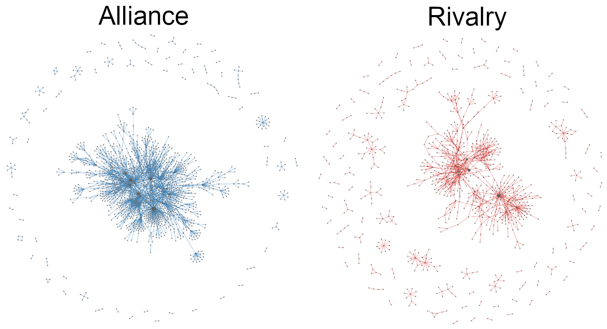
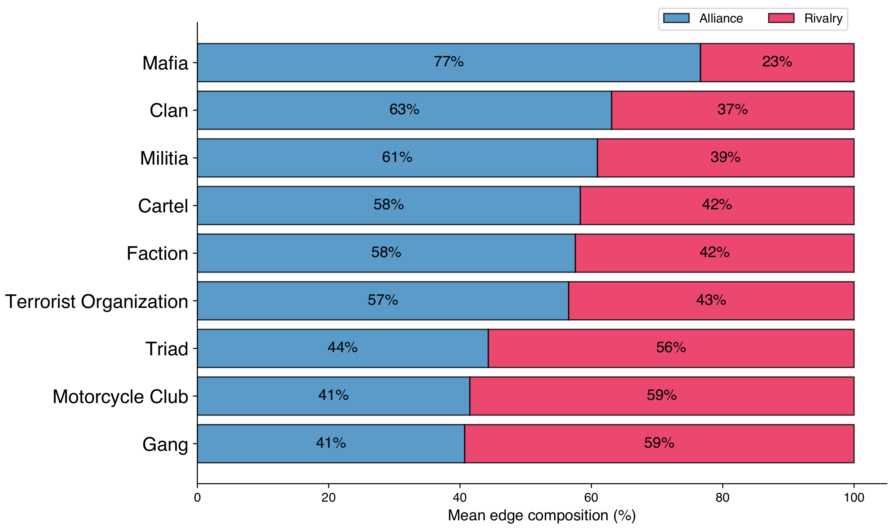

Mapping the network of global organized crime used to be impractical. It would mean reading thousands of documents in dozens of languages and reconciling thousands of named entities by hand. Nobody had done it. The result is that the public picture of organized crime stayed fragmented: one cartel paper here, one mafia study there, never the full graph.

<br>

LLMs change that. In a few weeks, working solo, I built **CRIMENET**: an open-source network of 1,173 criminal organizations worldwide and the 2,765 alliances and rivalries between them, extracted from 737 Wikipedia articles. Every node and edge is traceable back to a Wikipedia source.

<br>

In this post, I will

<br>

- Describe the data and the pipeline [](#data)
- Show the interactive visualization [](#play)
- Walk through the main findings [](#results)
- Share the LLM extraction prompt [](#prompt)

<br>

# The data {#data}

<br>

I manually compiled a list of 737 Wikipedia article URLs about criminal organizations, aiming for broad coverage across cartels, mafias, gangs, triads, motorcycle clubs, militias, and terrorist groups. The pipeline then runs in five steps:

<br>

1. **Fetch.** For each article, retrieve the clean text via the Wikipedia API and the page's HTML via the MediaWiki Action API. Parse the infobox table with BeautifulSoup and append it to the article text.
2. **Extract.** Send each article to the DeepSeek API with a structured prompt enforcing a strict JSON schema. Extract entities (organizations, with type and time period) and relationships (alliance, rivalry, or other).
3. **Merge.** Combine all per-article extractions into one global network, deduplicating nodes by name and edges by `(source, target, relationship, detail)`.
4. **Clean.** Consolidate 60+ LLM-generated organization types into 9 canonical ones (gang, mafia, cartel, clan, motorcycle club, triad, militia, faction, terrorist organization). Filter generic umbrella terms, defunct organizations, and noisy edge labels.
5. **Centrality.** Compute betweenness centrality three ways (alliance-only, rivalry-only, combined) so the visualization can resize nodes correctly for each filter.

<br>

The final dataset has 1,173 organizations and 2,765 relationships (1,547 alliances, 1,218 rivalries). The full pipeline, dataset, and analysis code are open-source on [GitHub](https://github.com/alvarofrancomartins/CRIMENET).

<br>

# Interact with the network {#play}

<br>

The visualization below is the live network, deployed on this site. Green edges are alliances, red edges are rivalries, and node size is proportional to betweenness centrality. You can filter by relationship type, search for specific organizations, click any node to isolate it and its neighbors, and read the source text behind every relationship.

<br>

<div style="text-align: center; margin: 2em 0;">
  <a href="/crimenet/" target="_blank" style="display: inline-block; padding: 12px 28px; background: #c0392b; color: white; border-radius: 4px; text-decoration: none; font-weight: 600;">
    Open the interactive visualization →
  </a>
</div>

<br>

The figure below shows the alliance and rivalry networks side by side. Even at a glance, the two are structurally different: cooperation forms one big cohesive component, while conflict fragments into smaller dense clusters.

<figure>

<figcaption>Figure 1: Alliance (left, blue) and rivalry (right, red) networks shown separately. The alliance network forms a single cohesive component; the rivalry network fragments into more, smaller clusters.</figcaption>
</figure>

<br>

# Findings {#results}

<br>

I analyze the alliance and rivalry layers separately. Combining them would create shortest paths that flip between cooperation and conflict, which has no meaningful interpretation. The two are only merged for signed-pair analysis. Here are the patterns that fall out of the data.

<br>

## Mafias cooperate. Gangs fight.

<br>

For each organizational type, I pool all edges incident on organizations of that type and compute the fraction that are alliances. Bootstrap 95% confidence intervals come from resampling organizations within each type ($B = 2000$).

<figure>

<figcaption>Figure 2: Alliance share of edges by organizational type, edge-weighted. Error bars are bootstrap 95% confidence intervals over organizations. The dashed line marks 50%.</figcaption>
</figure>

<br>

Three types lean cooperation with intervals safely above 50%: **mafia (79%)**, **clan (68%)**, and **faction (65%)**. Two types lean conflict with intervals at or below 50%: **gang (44%)** and **motorcycle club (46%)**. Cartels, triads, militias, and terrorist organizations sit in the ambiguous middle, with confidence intervals straddling 50%.

<br>

This is the most direct version of a pattern that runs through every other analysis in the project. At the individual-organization level, the average mafia spends nearly 80% of its relational budget on cooperation, while the average gang or motorcycle club spends most of its edges on conflict. Two different operational strategies, visible in the network structure itself.

<br>

## Hells Angels are the system's outlier

<br>

Hells Angels top **every** centrality ranking in **both** networks: degree, betweenness, and PageRank, in alliance and rivalry alike. No other organization does this. They are also the only organization at the very top of role-persistence rankings, which measure who is structurally important across both layers simultaneously.

<br>

In second place by total signed degree (allies plus rivals), and far behind: the Sinaloa Cartel. The gap is large enough that Hells Angels deserve their own row in any future analysis.

<br>

## The Commission falls out of the math

<br>

$k$-core decomposition recursively removes vertices with degree less than $k$, peeling off lower-connectivity nodes to reveal a network's nested core. The alliance network reaches $k = 11$ before the algorithm runs out of dense substructure. The rivalry network only reaches $k = 7$.

<br>

The alliance $k = 11$ shell contains 13 organizations. **12 of them are American Mafia crime families.** The decomposition recovers the historical Commission structure with no supervision, no prior labels, no expert knowledge of the American Mafia. Just degree pruning on a graph extracted from Wikipedia.

<br>

This was the result that surprised me most. The Commission is a piece of organizational structure that took the FBI decades to map. Here it appears as a side effect of generic graph algorithms.

<br>

## Rivalries are more type-assortative than alliances

<br>

Newman's categorical assortativity measures whether nodes preferentially connect to others of the same type. For rivalries, $r = 0.62$. For alliances, $r = 0.52$. The gap is significant ($p < 0.001$, edge bootstrap).

<br>

In plain terms: organizations fight within their type more often than they ally within it. Cartels fight cartels over routes. Gangs fight gangs over streets. Mafias fight mafias over territory. But cartels ally with gangs for distribution, mafias ally with motorcycle clubs for logistics, and so on. The "compete within niche, cooperate across niche" pattern is familiar from ecology.

<br>

## Brokerage roles are layer-specific

<br>

For each organization active in both layers, I compute its betweenness rank in the alliance network and its betweenness rank in the rivalry network. If brokerage roles transferred perfectly, every point would land on the diagonal.

<br>

Most don't. Alliance-dominant brokers (high alliance rank, low rivalry rank) are mostly mafias and diasporic crime groups: Serbian mafia, Pelle 'ndrina, Greek mafia, Provisional IRA, Real IRA. Rivalry-dominant brokers (high rivalry rank, low alliance rank) are almost all gangs, and seven of the top ten are based in Los Angeles: South Side Compton Crips, West Side Piru, Toonerville Rifa 13, Bounty Hunter Watts Bloods, Mob Piru, 18th Street, Avenues.

<br>

A smaller group of organizations are persistent across both layers: the type-mixed elite. Mexican Mafia, Sinaloa Cartel, Los Zetas, Crips, Latin Kings, Bloods, Outlaws, Jalisco New Generation Cartel, Rizzuto crime family, plus Hells Angels at the top. Brokerage in only one layer clusters by type. Brokerage in both does not.

<br>

# The LLM extraction prompt {#prompt}

<br>

The whole project hinges on this prompt. It enforces a strict JSON schema, defines the entity and edge formats, and lays out a small set of rules to keep the LLM honest. I share it here because anyone trying a similar approach will benefit from a known-good starting point.

<br>


```text
You are an expert in global organized crime. Extract criminal organizations and their relationships from the provided text.

══ NODES ══

Extract every named criminal entity: cartels, mafias, gangs, triads, crime families, motorcycle clubs, syndicates, militias, terrorist groups, factions, clans, crews — any organized criminal group.

Node format:
{
  "standard_name": "Most recognized international name",
  "original_text_name": "Exactly as written in the text",
  "aliases": ["other names", "abbreviations"],
  "type": "One of: cartel, crime_family, gang, mafia, triad, motorcycle_club, militia, terrorist_organization, faction, clan, crew, crime_syndicate, organized_crime_group, criminal_organization",
  "context": "1-2 sentences: what they do, where they operate.",
  "time_period": "When active, e.g. '1980s-present', 'founded 1969', '1990s-2010'. null if unknown."
}

══ EDGES ══

Extract relationships between pairs of organizations.

Edge format:
{
  "source": "standard_name of org A",
  "target": "standard_name of org B",
  "relationship": "alliance | rivalry | other",
  "detail": "For 'other': specify what — e.g. splinter, armed_wing, successor, merger, faction_of, founded_by_members_of, evolved_into, reformation. For alliance/rivalry: null.",
  "context": "Explain the relationship in 1-2 sentences.",
  "time_period": "When this relationship held, e.g. '2006-2012', 'since 1990s'. null if unknown."
}

══ RULES ══

1. ALL text output in English. Org names may stay in original language if internationally known ('Ndrangheta, Yamaguchi-gumi, Primeiro Comando da Capital).
2. ONLY organizations as nodes. No individuals, places, or events.
3. STANDARDIZE names: most recognized name as standard_name, variants in aliases.
4. Every edge MUST have a context. Never empty.
5. Do NOT invent. Only extract what the text states or strongly implies.
6. Return ONLY valid JSON: {"nodes": [...], "edges": [...]}
7. If nothing relevant found: {"nodes": [], "edges": []}
```


<br>

A few decisions inside the prompt are worth flagging. Articles longer than 3,000 words are split into chunks, with the article's opening paragraph passed as context to every chunk so entity resolution holds across the split. Temperature is set to 0 for reproducibility. The schema is enforced via DeepSeek's JSON-mode response format, not by post-hoc parsing of free text. Extraction runs in parallel across 50 concurrent workers.

<br>

The LLM still makes mistakes. Some "other" edges are mislabeled (collaboration tagged as a rival relation, conflict tagged as ally). Some organization types are inconsistent across articles. The cleanup pipeline catches the obvious cases with rule-based reclassification, but a real precision-recall evaluation against expert-labeled data remains future work.

<br>

# Closing thoughts

<br>

CRIMENET is the first open-source network of alliances and rivalries between criminal organizations at a global scale. The single most persistent finding across every analysis is the **mafia–gang split**: mafias hold the alliance network together as the cooperative class, gangs hold the rivalry network together as the antagonistic class, and the two types occupy structurally different niches.

<br>

The pipeline matters as much as the result. Five years ago, building this would have required a research team and a year of work. With LLMs, one person can do it in weeks. The bottleneck has moved from extraction to validation: we can now produce structured knowledge graphs from messy text faster than we can audit them. That asymmetry is going to define the next wave of computational social science, and the right response is not to slow down the extraction but to invest harder in evaluation.

<br>

The dataset, pipeline, and analysis code are public. Anyone can verify the results, extend them, or use the pipeline as a template for a different domain. The interactive visualization is at [alvarofrancomartins.com/crimenet](https://alvarofrancomartins.com/crimenet), and the report and code are on [GitHub](https://github.com/alvarofrancomartins/CRIMENET).

<br>

Main references:

1. [Martins, A. F. (2026). **CRIMENET: The global network of organized crime**. Technical report.](https://github.com/alvarofrancomartins/CRIMENET)

2. [Newman, M. E. J. (2003). **Mixing patterns in networks**. Physical Review E, 67(2):026126.](https://doi.org/10.1103/PhysRevE.67.026126)

3. [Seidman, S. B. (1983). **Network structure and minimum degree**. Social Networks, 5(3):269–287.](https://doi.org/10.1016/0378-8733(83)90028-X)

4. [Papachristos, A. V. (2009). **Murder by structure: Dominance relations and the social structure of gang homicide**. American Journal of Sociology, 115(1):74–128.](https://doi.org/10.1086/597791)

5. [Calderoni, F. (2012). **The structure of drug trafficking mafias: the 'Ndrangheta and cocaine**. Crime, Law and Social Change, 58(3):321–349.](https://doi.org/10.1007/s10611-012-9387-9)