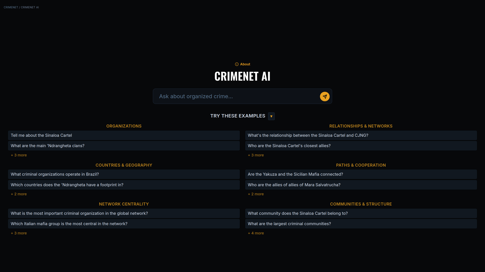
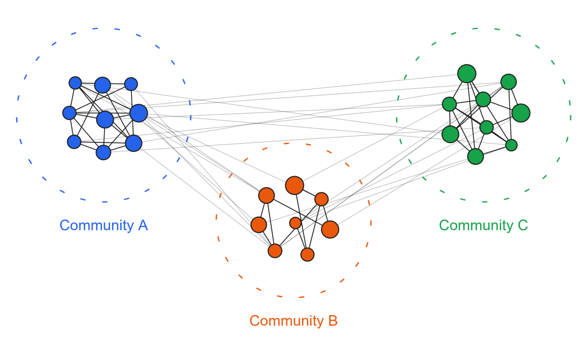
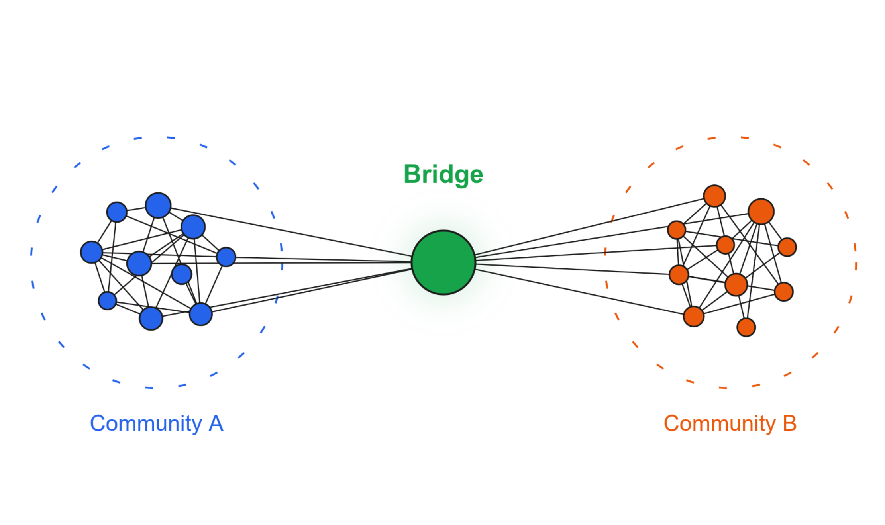
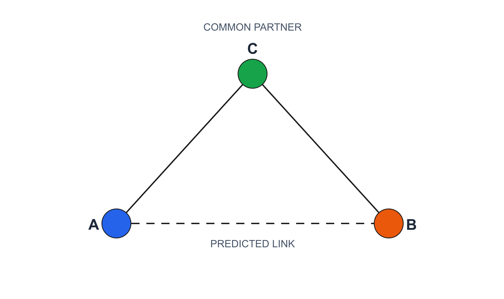
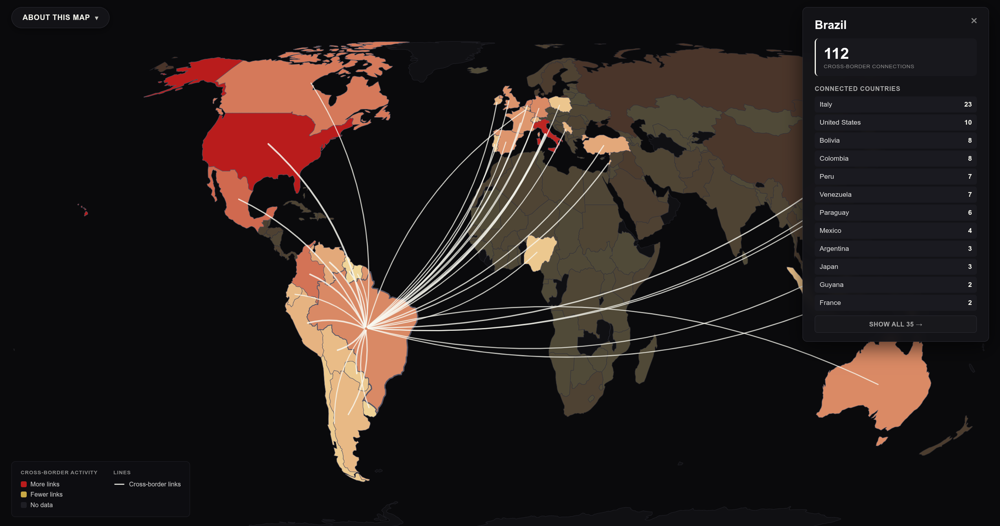
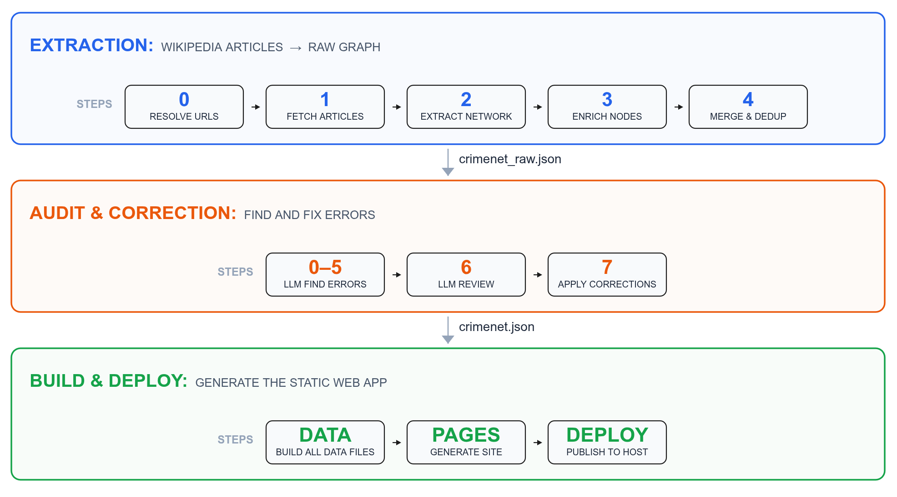

Six months ago I published the first version of CRIMENET, a knowledge graph of criminal organizations and their connections: 1,857 organizations and 3,338 relationships extracted from 771 Wikipedia articles. It proved the idea worked. Now I have rebuilt it into a much larger system, with an audit pipeline that catches extraction errors and an advanced AI system that answer complex questions about the global organized crime network.

 

The new version is built with a three-layer pipeline. The extraction layer reads 1,418 Wikipedia articles about criminal organizations across four languages (English, Italian, Portuguese, and Spanish), walks the HTML to pull out clean body text and infobox tables, and sends it to DeepSeek. The model extracts organizations and relationships across three types: **cooperation**, **conflict**, and **other** (structural links, sub-units, splinters, truces, and unspecified connections). Each extracted entity gets profiled from its own Wikipedia article. The audit layer targets the errors LLMs inevitably make: wrong merges, missed merges, spurious edges, and non-criminal entities. The build layer generates a static web app that runs entirely in the browser. The full pipeline, step by step, is described <a href="#how-the-knowledge-graph-is-built">at the end of this post</a>.

 

The result is a knowledge graph of **4,505 criminal organizations** and **10,935 relationships** (4,907 cooperation, 3,731 conflict, 2,297 other) across **80 origin countries** and **163 footprint countries**.[^5] Every edge carries a verbatim evidence quote, a description, a versioned Wikipedia URL, and a time period when the source provides one. On top of the graph sits a **GraphRAG AI** that answers natural language questions by calling tools against the data and citing its sources. This post walks through everything it can do: the dashboard, the connection finder, the AI, communities, bridges, triadic signals, centrality, paths, countries, the 3D graph, and the world footprints map.

 

Everything is open source. The [full pipeline](https://github.com/alvarofrancomartins/CRIMENET) is on GitHub, and the [live app](https://www.alvarofrancomartins.com/crimenet) runs entirely in your browser.

[^5]: Of the 4,505 organizations, 1,032 are profiled from their own Wikipedia article (with full descriptions, aliases, country of origin, country footprints, time periods, and defunct status), 3,473 are mention-only (they appear in other orgs' articles but have no dedicated Wikipedia page), and 317 are flagged as defunct. 3,521 organizations (78%) are connected to at least one other; 984 (22%) are isolated.

# The entire catalog

 

The home page is a dashboard. The left panel toggles between Organizations and Countries. It lists all the 4,505 organizations. Click any name and its full profile renders in the right panel: description, aliases, country of origin, time period, and country footprints each with its own evidence quote. Or you can also see the organizations based in a given country. Open the <a href="https://www.alvarofrancomartins.com/crimenet/">live dashboard</a> to explore it.

 

If you prefer to see the exact connections between two orgs found in CRIMENET, the <a href="https://www.alvarofrancomartins.com/crimenet/browse.html">connection finder</a> lets you pick any two organizations and see exactly how they relate. It loads evidence from sharded data files, so the browser fetches tens of kilobytes, not the full dataset.[^6] Every edge comes with Source, Time, and Quote pills. The evidence quote is the verbatim Wikipedia sentence; the source URL points to the exact article revision.

[^6]: Evidence shards are keyed by FNV-1a hash of the organization name, split across 128 files. The browser only fetches the shard that contains the requested org. The connection finder also loads a pre-built LLM paragraph (Relationship Summary) synthesizing the full interaction between the two organizations, built offline.

# CRIMENET AI

<figure>

<figcaption>Figure 1: CRIMENET AI. Ask a question in plain English, get an evidence-backed answer with citations to specific Wikipedia sentences.</figcaption>
</figure>

 

The dashboard and the connection finder are powerful, but they require you to know what you are looking for. What if you could just ask a question? Which Mexican cartels have a presence in Colombia? Trace the cooperation network between Italian mafias and South American cartels. Which motorcycle clubs are the most central in the rivalry network? Are there organizations that bridge Russian and Chinese criminal networks? Who might the 'Ndrangheta be secretly allied with, based on shared connections?

 

A standard chatbot would hallucinate the answers: its training data does not contain a structured database of criminal organizations with source-verified relationships.

 

I built **CRIMENET AI**, a GraphRAG system that answers questions by tool calling against the knowledge graph.[^7] The language model decides which tools to call, the browser executes the tools against static JSON files, and the model synthesizes the results. The facts come from the graph. The model reasons; the graph provides the evidence. Every answer carries two automatically generated sections the AI does not write: **Evidence** (every edge used, with Source, Time, Quote pills) and **Sources** (every Wikipedia URL that appeared in any tool result, rendered as clickable pills).[^8]

 

Here is what it can do.

[^7]: GraphRAG stands for Graph Retrieval-Augmented Generation. A standard RAG system retrieves relevant text chunks and asks the model to reason over them. A GraphRAG system retrieves structured data from a knowledge graph by calling tools that traverse nodes, edges, communities, and paths.

[^8]: The 13 tools: `get_organization` (profile by name or alias, with centrality ranks); `find_by_type` (filter by category); `get_connections` (all edges for an org, or all edges between two orgs); `get_relationship_summary` (pre-written LLM paragraph for any pair); `find_by_country` / `find_by_countries` (single or multi-country footprint lookup); `find_paths` (BFS shortest path up to 5 hops with evidence at each step); `find_cooperation_routes` (cooperation-only paths); `get_network_neighborhood` (first and second degree connections); `get_community` / `find_communities_by_keyword` (browse all 224 communities); `get_triadic_signals` (candidate pairs for any org); `get_bridges` (ranked cross-community bridge list); `get_centrality` (degree, betweenness, PageRank). The agent loop runs entirely in the browser up to 8 iterations. Only the DeepSeek API call goes through a Netlify Function proxy to keep the API key server-side.

## Communities

<strong style="color:#2563eb; text-transform:uppercase; font-size:0.85em; letter-spacing:0.5px;">Before CRIMENET</strong> 
If someone asked "How do criminal organizations group together around the world?" the honest answer was: nobody knew. The question was too big to answer. Now it has an answer: 224 communities, named and described.

<figure>

<figcaption>Figure 2: Communities. Infomap community detection reveals 224 clusters of cooperating organizations. Each community is titled and summarized by DeepSeek.</figcaption>
</figure>

 

A community is a group of nodes more tightly connected to each other than to the rest of the network. I ran Infomap community detection on the cooperation graph only. Mixing edge types would not make sense: communities are built from positive ties (alliances, joint operations, commercial dealings), not from conflict or structural links.[^10] The result is **224 communities** of criminal organizations worldwide, each titled and summarized by DeepSeek.[^11] Here are the top 10.

 

<table style="display:block; overflow:hidden; max-width:100%; margin:0 auto;">
<thead>
<tr style="border-bottom:2px solid #cbd5e1;"><th style="text-align:left; padding:8px;">Community</th><th style="text-align:left; padding:8px;">Description</th><th style="text-align:right; padding:8px;">Members</th></tr>
</thead>
<tbody>
<tr style="border-bottom:1px solid #e2e8f0;"><td style="padding:8px; vertical-align:top;"><strong>Mexican and Colombian Cartel Alliance Network</strong></td><td style="padding:8px; vertical-align:top;">A dense network of Mexican and Colombian cartels, paramilitaries, and street gangs cooperating in drug trafficking and shifting alliances.</td><td style="padding:8px; text-align:right; font-weight:700; vertical-align:top;">88</td></tr>
<tr style="border-bottom:1px solid #e2e8f0;"><td style="padding:8px; vertical-align:top;"><strong>Global Jihadist Network and Allies</strong></td><td style="padding:8px; vertical-align:top;">A global jihadist network uniting al-Qaeda, Taliban, and allied militant groups across Asia, Africa, and the Middle East.</td><td style="padding:8px; text-align:right; font-weight:700; vertical-align:top;">81</td></tr>
<tr style="border-bottom:1px solid #e2e8f0;"><td style="padding:8px; vertical-align:top;"><strong>American Mafia Network</strong></td><td style="padding:8px; vertical-align:top;">A dense network of Italian-American Mafia families and allied gangs cooperating across the U.S. in traditional organized crime.</td><td style="padding:8px; text-align:right; font-weight:700; vertical-align:top;">76</td></tr>
<tr style="border-bottom:1px solid #e2e8f0;"><td style="padding:8px; vertical-align:top;"><strong>Nuova Famiglia Camorra Alliance</strong></td><td style="padding:8px; vertical-align:top;">A Camorra alliance of clans united against the Nuova Camorra Organizzata, dominating Campania through drug trafficking and violence.</td><td style="padding:8px; text-align:right; font-weight:700; vertical-align:top;">53</td></tr>
<tr style="border-bottom:1px solid #e2e8f0;"><td style="padding:8px; vertical-align:top;"><strong>Hells Angels and Allied Outlaw Gangs</strong></td><td style="padding:8px; vertical-align:top;">A Hells Angels-led network of outlaw biker gangs and Canadian organized crime groups cooperating in drug trafficking and violence.</td><td style="padding:8px; text-align:right; font-weight:700; vertical-align:top;">49</td></tr>
<tr style="border-bottom:1px solid #e2e8f0;"><td style="padding:8px; vertical-align:top;"><strong>Calabrian 'Ndrangheta Clans Network</strong></td><td style="padding:8px; vertical-align:top;">A network of Calabrian 'Ndrangheta clans cooperating in international drug trafficking, money laundering, and extortion across Europe and beyond.</td><td style="padding:8px; text-align:right; font-weight:700; vertical-align:top;">42</td></tr>
<tr style="border-bottom:1px solid #e2e8f0;"><td style="padding:8px; vertical-align:top;"><strong>Brazilian PCC-Led Criminal Alliance Network</strong></td><td style="padding:8px; vertical-align:top;">A PCC-centered network of Brazilian criminal factions and international allies cooperating in drug trafficking and prison control.</td><td style="padding:8px; text-align:right; font-weight:700; vertical-align:top;">36</td></tr>
<tr style="border-bottom:1px solid #e2e8f0;"><td style="padding:8px; vertical-align:top;"><strong>US Street and Prison Gang Alliances</strong></td><td style="padding:8px; vertical-align:top;">A network of US street and prison gangs, centered on the People Nation alliance, cooperating in drug trafficking and violence.</td><td style="padding:8px; text-align:right; font-weight:700; vertical-align:top;">34</td></tr>
<tr style="border-bottom:1px solid #e2e8f0;"><td style="padding:8px; vertical-align:top;"><strong>Sicilian Mafia Corleonesi Alliance Network</strong></td><td style="padding:8px; vertical-align:top;">A coalition of Sicilian Mafia families led by the Corleonesi, united through drug trafficking, extortion, and violent power consolidation.</td><td style="padding:8px; text-align:right; font-weight:700; vertical-align:top;">34</td></tr>
<tr style="border-bottom:1px solid #e2e8f0;"><td style="padding:8px; vertical-align:top;"><strong>Cutro-based 'Ndrangheta Clans Alliance</strong></td><td style="padding:8px; vertical-align:top;">A network of Cutro-based 'Ndrangheta clans cooperating in drug trafficking, extortion, and money laundering across Italy and Europe.</td><td style="padding:8px; text-align:right; font-weight:700; vertical-align:top;">31</td></tr>
</tbody>
</table>

Table 1: The top 10 communities by membership, titled and described by DeepSeek.

See all 224 communities in the <a href="https://www.alvarofrancomartins.com/crimenet/browse.html">Community Browser</a> (select the Communities tab).

 

> What community does the Sinaloa Cartel belong to?

The AI finds the **Mexican and Colombian Cartel Alliance Network** (88 members, the largest) and tells you the Sinaloa Cartel sits at its core alongside CJNG, Los Zetas, Gulf Cartel, and the Beltrán-Leyva Organization.

 

Some communities are smaller but tell a sharper story. The **Neo-Nazi Terror Network** (26 members) connects Atomwaffen Division, Hammerskins, Feuerkrieg Division, The Base, and Blood & Honour. The **Canadian Outlaw Motorcycle Gangs Alliance** (23 members) is a coalition united against the Hells Angels: Rock Machine, Satan's Choice, Popeye Moto Club, and Devil's Disciples. The **PKK-Led Revolutionary Alliance Network** (17 members) links the Kurdistan Workers' Party with Armenian, Palestinian, and Turkish leftist militant groups.

 

Show me communities related to motorcycle clubs. Find communities with "mafia" in the title.

 

The AI filters by keyword, surfacing the relevant networks.

[^10]: Infomap simulates a random walk across the cooperation network. The walker tends to get trapped inside dense clusters of cooperating organizations and only occasionally jumps between them. Compressing a description of where the walker goes naturally reveals community structure: organizations that cooperate with each other more than with outsiders form a cluster.

[^11]: The first run calls the DeepSeek API. Subsequent rebuilds cache by the exact membership set (frozenset of org names), so re-running when the partition is unchanged costs zero API calls.

## Bridges

<strong style="color:#2563eb; text-transform:uppercase; font-size:0.85em; letter-spacing:0.5px;">Before CRIMENET</strong> 
If someone asked "Which criminal organizations connect different communities?" the honest answer was: nobody knew. The question was too big to answer. Now it has an answer: every bridge organization, ranked by how many communities it connects, with the evidence for each cross-community edge.

<figure>

<figcaption>Figure 3: Bridges. Organizations that cooperate across community boundaries, connecting otherwise isolated criminal ecosystems.</figcaption>
</figure>

 

Some organizations cooperate across community boundaries. A bridge is a node that connects different communities, sitting at the intersection of criminal ecosystems that share little other common ground.

 

<table style="display:inline-table; overflow:hidden; text-align:left; width:auto; max-width:900px;">
<thead>
<tr style="border-bottom:2px solid #cbd5e1;"><th style="text-align:left; padding:8px;">Organization</th><th style="text-align:left; padding:8px; white-space:nowrap;">Top communities bridged (top 3 shown)</th><th style="text-align:right; padding:8px; white-space:nowrap;">Cross-community edges</th><th style="text-align:right; padding:8px; white-space:nowrap;">Communities spanned</th></tr>
</thead>
<tbody>
<tr style="border-bottom:1px solid #e2e8f0;"><td style="padding:8px; vertical-align:top;"><strong>Hells Angels Motorcycle Club</strong></td><td style="padding:8px; vertical-align:top;">Mexican and Colombian Cartel Alliance Network, American Mafia Network, Calabrian 'Ndrangheta Clans Network</td><td style="padding:8px; text-align:right; font-weight:700; vertical-align:top;">88</td><td style="padding:8px; text-align:right; font-weight:700; vertical-align:top;">27</td></tr>
<tr style="border-bottom:1px solid #e2e8f0;"><td style="padding:8px; vertical-align:top;"><strong>American Mafia</strong></td><td style="padding:8px; vertical-align:top;">Mexican and Colombian Cartel Alliance Network, American Mafia Network, Nuova Famiglia Camorra Alliance</td><td style="padding:8px; text-align:right; font-weight:700; vertical-align:top;">84</td><td style="padding:8px; text-align:right; font-weight:700; vertical-align:top;">22</td></tr>
<tr style="border-bottom:1px solid #e2e8f0;"><td style="padding:8px; vertical-align:top;"><strong>'Ndrangheta</strong></td><td style="padding:8px; vertical-align:top;">Mexican and Colombian Cartel Alliance Network, American Mafia Network, Nuova Famiglia Camorra Alliance</td><td style="padding:8px; text-align:right; font-weight:700; vertical-align:top;">83</td><td style="padding:8px; text-align:right; font-weight:700; vertical-align:top;">28</td></tr>
<tr style="border-bottom:1px solid #e2e8f0;"><td style="padding:8px; vertical-align:top;"><strong>Sinaloa Cartel</strong></td><td style="padding:8px; vertical-align:top;">Hells Angels and Allied Outlaw Gangs, US Street and Prison Gang Alliances, Italian Mafia Alliances and Offshoots</td><td style="padding:8px; text-align:right; font-weight:700; vertical-align:top;">72</td><td style="padding:8px; text-align:right; font-weight:700; vertical-align:top;">20</td></tr>
<tr style="border-bottom:1px solid #e2e8f0;"><td style="padding:8px; vertical-align:top;"><strong>Camorra</strong></td><td style="padding:8px; vertical-align:top;">Mexican and Colombian Cartel Alliance Network, Global Jihadist Network and Allies, Sicilian Mafia Corleonesi Alliance Network</td><td style="padding:8px; text-align:right; font-weight:700; vertical-align:top;">52</td><td style="padding:8px; text-align:right; font-weight:700; vertical-align:top;">16</td></tr>
<tr style="border-bottom:1px solid #e2e8f0;"><td style="padding:8px; vertical-align:top;"><strong>Outlaws Motorcycle Club</strong></td><td style="padding:8px; vertical-align:top;">American Mafia Network, Neo-Nazi Terror Network, Canadian Outlaw Motorcycle Gangs Alliance</td><td style="padding:8px; text-align:right; font-weight:700; vertical-align:top;">52</td><td style="padding:8px; text-align:right; font-weight:700; vertical-align:top;">10</td></tr>
<tr style="border-bottom:1px solid #e2e8f0;"><td style="padding:8px; vertical-align:top;"><strong>Sicilian Mafia</strong></td><td style="padding:8px; vertical-align:top;">Mexican and Colombian Cartel Alliance Network, American Mafia Network, Nuova Famiglia Camorra Alliance</td><td style="padding:8px; text-align:right; font-weight:700; vertical-align:top;">48</td><td style="padding:8px; text-align:right; font-weight:700; vertical-align:top;">14</td></tr>
<tr style="border-bottom:1px solid #e2e8f0;"><td style="padding:8px; vertical-align:top;"><strong>Mexican Mafia</strong></td><td style="padding:8px; vertical-align:top;">Mexican and Colombian Cartel Alliance Network, American Mafia Network, Hells Angels and Allied Outlaw Gangs</td><td style="padding:8px; text-align:right; font-weight:700; vertical-align:top;">44</td><td style="padding:8px; text-align:right; font-weight:700; vertical-align:top;">9</td></tr>
<tr style="border-bottom:1px solid #e2e8f0;"><td style="padding:8px; vertical-align:top;"><strong>'Ndrina Mancuso</strong></td><td style="padding:8px; vertical-align:top;">Mexican and Colombian Cartel Alliance Network, Nuova Famiglia Camorra Alliance, Calabrian 'Ndrangheta Clans Network</td><td style="padding:8px; text-align:right; font-weight:700; vertical-align:top;">43</td><td style="padding:8px; text-align:right; font-weight:700; vertical-align:top;">11</td></tr>
<tr style="border-bottom:1px solid #e2e8f0;"><td style="padding:8px; vertical-align:top;"><strong>Gambino crime family</strong></td><td style="padding:8px; vertical-align:top;">Nuova Famiglia Camorra Alliance, Hells Angels and Allied Outlaw Gangs, Calabrian 'Ndrangheta Clans Network</td><td style="padding:8px; text-align:right; font-weight:700; vertical-align:top;">32</td><td style="padding:8px; text-align:right; font-weight:700; vertical-align:top;">12</td></tr>
</tbody>
</table>

Table 2: The top 10 bridge organizations, ranked by cross-community cooperation edges.

 

> Which organizations bridge the most communities?

The **Hells Angels Motorcycle Club** is the top bridge, with 88 cross-community edges spanning 27 communities. It connects the cartel network, the American Mafia, the 'Ndrangheta clans, Italian mafia alliances, and Canadian outlaw biker gangs: five worlds that share little other common ground. The **American Mafia** follows with 84 cross-community edges across 22 communities, linking Mexican cartels, Camorra clans, the Hells Angels network, and US street gangs. The **'Ndrangheta** bridges 28 communities with 83 cross edges, the most communities reached of any organization. The **Sinaloa Cartel** spans 20 communities with 72 cross edges. The **Mexican Mafia** spans only 9 communities but bridges the cartel network, the American Mafia, the Hells Angels, the Brazilian PCC network, and white supremacist prison gangs: five ecosystems that share almost no other common ground.

<strong style="color:#ea580c; text-transform:uppercase; font-size:0.85em; letter-spacing:0.5px;">Key insight</strong> 
A bridge is structurally important not because it has many connections, but because its connections reach into different worlds. The Mexican Mafia connects ecosystems that otherwise never touch.

> What communities does the 'Ndrangheta bridge?

The AI lists all 28.

## Triadic signals

<figure>

<figcaption>Figure 4: Triadic signals. Missing relationships inferred from graph topology: common partners, common adversaries, or both.</figcaption>
</figure>

 

The graph has 10,935 documented relationships, but those are only the relationships Wikipedia happens to record. Many real-world connections are undocumented.

 

We can infer some of these missing links from the structure of the graph itself. If two organizations share many of the same partners, or the same enemies, it is likely they have a relationship with each other, even if nobody has written it down. This is triadic closure. There are three kinds of signal:[^12]

 

**Common cooperation partners.** Friends of friends might be friends.

 

**Common adversaries.** Enemies of enemies might be friends.

 

**Both.** The two signals combine. An organization pair that shares both cooperation partners and adversaries. This is the strongest signal, because two independent structural patterns point to the same missing relationship.

 

I computed all three across the entire graph. The result is **2,561 candidate pairs**, each scored by how many common partners and adversaries they share, weighted by the strength of those connections.

 

> Who might the 'Ndrangheta be secretly allied with?

The AI returns candidate pairs ranked by signal strength.

 

The strongest signal in the entire dataset comes from the **Cleveland crime family** and the **Patriarca crime family**. They share 8 cooperation partners (Bufalino, Chicago Outfit, DeCavalcante, Detroit Partnership, Gambino, Genovese, Hells Angels, and Los Angeles crime family) yet have no documented direct edge.

<strong style="color:#16a34a; text-transform:uppercase; font-size:0.85em; letter-spacing:0.5px;">Strongest signal found</strong> 
Two American Mafia families share 8 cooperation partners with no direct edge between them. The graph says they are connected. Wikipedia just hasn't written it down.

 The **New Orleans crime family** and the **Patriarca crime family** share 6 partners. The **Gambino crime family** and the **Rizzuto crime family** share 4 cooperation partners plus a common adversary (the Bonanno crime family): a "Both" signal.

 

Some signals come purely from shared enemies. The **Mongols MC** and the **Rebels Motorcycle Club** share two common adversaries (Bandidos and Hells Angels) with no direct edge. The **Comanchero Motorcycle Club** and the **Rebels Motorcycle Club** share three (Bandidos, Hells Angels, and Rock Machine Motorcycle Club). Inside the Mexican cartel system, the **Cártel de Santa Rosa de Lima** and the **Knights Templar Cartel** share both cooperation partners (Gulf Cartel, Los Viagras, Sinaloa Cartel) and common adversaries (CJNG, Los Zetas). **La Familia Michoacana** and the **Nueva Plaza Cartel** share the Sinaloa Cartel as a common partner and CJNG as a common adversary.

 

> What potential rivalries does the Sinaloa Cartel have based on shared adversaries?

The AI filters for the adversary-only signal and returns candidate pairs.

 

What makes this powerful is that it uses only the topology. No new data. No additional LLM calls. The graph's structure alone encodes information about relationships that have not been explicitly recorded.

[^12]: Common cooperation partners: two organizations that share at least 3 cooperation partners but have no direct edge between them. Common adversaries: two organizations that share at least 2 common adversaries but have no direct edge between them. The "Both" signal requires both conditions simultaneously.

## Centrality

Centrality measures how important a node is in the network. Not all nodes are equal. Some are hubs with many connections. Others sit on the shortest paths between many pairs, controlling the flow of information. The centrality tools give the AI access to degree, betweenness, and PageRank rankings across all 3,521 connected organizations, computed on the full graph and separately on the cooperation and conflict subgraphs.

 

> What is the most important criminal organization in the global network?

The AI consults the centrality rankings and answers with context: which metrics drive the ranking, how the top organizations compare, and what the edges that give them their position actually represent.

 

> Which Mexican cartels have the most network influence?

> How does the Sinaloa Cartel rank in network importance, and how does it compare to the American Mafia?

The AI cross-references centrality rankings with Mexican organizations, retrieves both profiles with their centrality ranks, and produces a comparison grounded in the numbers.

## Paths

A path is a chain of relationships connecting two organizations through intermediaries. If A cooperates with B and B cooperates with C, then A and C are connected by a path of length two, even if they have no direct relationship.

> Are the Yakuza and the Sicilian Mafia connected?

The AI runs BFS across the graph up to 5 hops. It returns the shortest path with the evidence quote at each step and walks you through the chain of intermediaries, citing the specific relationship at each link.

 

> Does the Sinaloa Cartel cooperate with the Sicilian Mafia?

The AI searches for cooperation-only paths. If one exists, it traces the route. If not, it tells you there is no documented cooperation path and may suggest alternatives: a conflict relationship, a shorter path through any relationship type, or a shared third party.

 

> Who are the allies of allies of Mara Salvatrucha?

The AI returns first-degree and second-degree connections, grouped by relationship type.

## Countries

Every profiled organization carries a list of countries where Wikipedia documents its presence, each backed by a verbatim evidence quote. The AI can query this data directly.

 

> What criminal organizations operate in Brazil?

The AI returns every organization with a documented footprint.

> Which countries does the 'Ndrangheta have a footprint in?

The AI lists all documented country footprints with evidence.

> Which criminal organizations operate in both Colombia and Venezuela?

The multi-country intersection returns only organizations that appear in both lists.

> Compare organized crime in Mexico and Colombia.

The AI retrieves organizations from both countries, examines their types and connections, and produces a comparative analysis.

 

Every country footprint is backed by a verbatim evidence quote from Wikipedia. When the AI says an organization operates in a country, you can open the source and read the exact sentence that documents it.

# 3D knowledge graph

The full network is viewable as an [interactive 3D force-directed graph](https://www.alvarofrancomartins.com/crimenet/knowledge_graph.html) built with three.js. Nodes are colored by organization type, edges by relationship type. You can rotate, zoom, click any node to see its details, and filter by relationship type.

 

The 3D view does something a 2D layout cannot: it uses the third dimension to disentangle dense clusters. In a 2D force layout, highly connected hubs pull everything into a hairball. In 3D, you can rotate around a cluster and see its internal structure.

<figure>

<figcaption>Figure 5: The 3D knowledge graph in motion. Nodes are criminal organizations; edges are colored by relationship type. The third dimension disentangles dense clusters that would collapse into a hairball in 2D.</figcaption>
</figure>

# World footprints map

The [footprints map](https://www.alvarofrancomartins.com/crimenet/footprints.html) shows country-to-country operational presence on a D3.js world map. Each organization's country of origin and its documented footprints create arcs across the map.[^13] The underlying data comes from the pipeline's country footprint pass: each link is backed by a verbatim evidence quote from Wikipedia documenting the organization's presence in that country. Not a statistical guess. A specific sentence.

[^13]: The map is on [footprints.html](https://www.alvarofrancomartins.com/crimenet/footprints.html). Each arc represents an organization's footprint from its country of origin to a country where it operates.

<figure>

<figcaption>Figure 6: The footprints world map showing country-to-country operational presence arcs.</figcaption>
</figure>

# What this enables

There is, to my knowledge, no larger directory of criminal organizations anywhere. Wikipedia's own <a href="https://en.wikipedia.org/wiki/List_of_criminal_enterprises,_gangs,_and_syndicates">list of criminal enterprises, gangs, and syndicates</a> covers a few hundred groups. CRIMENET comes closer than anything else: nearly 5,000 organizations mapped across nearly 11,000 relationships, each backed by a specific Wikipedia source.

 

<table style="display:inline-table; overflow:hidden; text-align:left; width:auto; max-width:400px;">
<thead>
<tr style="border-bottom:2px solid #cbd5e1;"><th style="text-align:left; padding:8px;">Metric</th><th style="text-align:right; padding:8px;">Count</th></tr>
</thead>
<tbody>
<tr style="border-bottom:1px solid #e2e8f0;"><td style="padding:8px; vertical-align:top;">Organizations</td><td style="padding:8px; text-align:right; font-weight:700; vertical-align:top;">4,505</td></tr>
<tr style="border-bottom:1px solid #e2e8f0;"><td style="padding:8px; vertical-align:top;">Relationships</td><td style="padding:8px; text-align:right; font-weight:700; vertical-align:top;">10,935</td></tr>
<tr style="border-bottom:1px solid #e2e8f0;"><td style="padding:8px; vertical-align:top;">Origin countries</td><td style="padding:8px; text-align:right; font-weight:700; vertical-align:top;">80</td></tr>
<tr style="border-bottom:1px solid #e2e8f0;"><td style="padding:8px; vertical-align:top;">Footprint countries</td><td style="padding:8px; text-align:right; font-weight:700; vertical-align:top;">163</td></tr>
<tr style="border-bottom:1px solid #e2e8f0;"><td style="padding:8px; vertical-align:top;">Profiled organizations</td><td style="padding:8px; text-align:right; font-weight:700; vertical-align:top;">1,032</td></tr>
<tr style="border-bottom:1px solid #e2e8f0;"><td style="padding:8px; vertical-align:top;">Communities</td><td style="padding:8px; text-align:right; font-weight:700; vertical-align:top;">224</td></tr>
<tr style="border-bottom:1px solid #e2e8f0;"><td style="padding:8px; vertical-align:top;">Triadic signals</td><td style="padding:8px; text-align:right; font-weight:700; vertical-align:top;">2,561</td></tr>
<tr style="border-bottom:1px solid #e2e8f0;"><td style="padding:8px; vertical-align:top;">Wikipedia articles</td><td style="padding:8px; text-align:right; font-weight:700; vertical-align:top;">1,418</td></tr>
<tr style="border-bottom:1px solid #e2e8f0;"><td style="padding:8px; vertical-align:top;">AI tools</td><td style="padding:8px; text-align:right; font-weight:700; vertical-align:top;">13</td></tr>
</tbody>
</table>

Table 3: What is in the CRIMENET knowledge graph.

 

This was an accidental achievement. The goal was to build a knowledge graph of how criminal organizations relate to each other, not to catalog every group mentioned on Wikipedia. But because the LLM pipeline reads nearly 1,500 articles across four languages and extracts every organization mentioned in each one, it ended up capturing the vast majority of criminal organizations documented on English, Italian, Portuguese, and Spanish Wikipedia. CRIMENET became the comprehensive list that did not exist.

 

Before CRIMENET, if you wanted to know which criminal organizations operate in a given country, or how two specific groups relate to each other, or which organizations bridge different criminal ecosystems, you had to read hundreds of Wikipedia articles and piece it together yourself. The information existed but was not structured.

 

Now you can ask any question in plain English and get an evidence-backed answer that cites specific Wikipedia sentences. You can trace the exact relationship between any two organizations with verbatim evidence quotes. You can browse 224 communities of organizations that cooperate with each other. You can identify which organizations bridge different criminal ecosystems. You can discover 2,561 candidate relationships that likely exist but have not been documented, inferred purely from the structure of the graph.

 

Because every edge carries a versioned Wikipedia URL, any claim can be verified in under thirty seconds: open the link, search for the quote, confirm it is there.

# How the knowledge graph is built

The raw material is 1,418 Wikipedia articles about criminal organizations across English, Italian, Portuguese, and Spanish Wikipedia. The extraction pipeline fetches each article, walks the HTML to extract clean body text and infobox tables, then sends it to DeepSeek to extract nodes and edges.[^1] The taxonomy has three types: **cooperation**, **conflict**, and **other**.[^2] The pipeline then profiles each organization from its own Wikipedia article (description, country of origin, time period, defunct status, and country footprints, each with its own evidence quote) and merges everything into a single graph, folding variant names across languages so the Sinaloa Cartel and the Cártel de Sinaloa become one node.[^3]

 

An LLM extraction pipeline produces errors: it conflates names, misses duplicates, invents edges between orgs that were merely mentioned in the same paragraph, and sometimes pulls in non-criminal entities. I built an audit pipeline that targets each class of error, one audit per error type.[^4] The correction loop is designed to be iterative: spot an error, add one line to the corrections file, re-run the apply step. Manual overrides always win over auto-suggestions.

<figure>

<figcaption>Figure 7: The three-layer architecture. Extraction (Wikipedia to raw graph), audit and correction (find and fix errors), build and deploy (generate the static web app).</figcaption>
</figure>

[^1]: The pipeline proceeds in five steps, each independently re-runnable: (0) resolve plain Wikipedia URLs to versioned URLs with `oldid`; (1) fetch HTML via the MediaWiki API and extract clean body text with infobox tables; (2) send the text to DeepSeek, chunked at ~2500 words with the infobox appended to every chunk, to extract organizations and relationships; (3) DeepSeek enriches each profiled organization with description, aliases, country, time period, defunct status, and country footprints; (4) merge all fragments, auto-dedup via fuzzy matching and containment, attach org profiles, and normalize country names.

[^2]: Cooperation covers alliances, joint operations, and commercial dealings. Conflict covers fighting, war, and clashes. Other covers structural ties (sub-units, splinters), truces, and unspecified links.

[^3]: The name folding handles the common case where an organization appears under different names in different language Wikipedias. A single canonical name is chosen for the merged node, with all variant forms preserved as aliases.

[^4]: Seven steps in total. Audits 0 through 5 find wrong merges, missed merges, spurious edges, unsupported country links, umbrella terms, and non-criminal entities. Audit 6 provides an LLM second opinion that can veto identity corrections. A confident-but-wrong split or merge is the most damaging error class. Audit 7 applies all corrections, with manual overrides from a curated file (`curated_corrections.py`) always winning over auto-suggestions.

# Limitations

Wikipedia coverage skews toward English-language and Western sources. The pipeline processes four languages (English, Italian, Portuguese, and Spanish), which is better than one but still leaves gaps. Because the data comes from Wikipedia, the graph inherits the biases and gaps of its source material.

 

Relationships are aggregated across time. Every edge carries its own time period, so the data is there, but the graph view flattens time into a single snapshot.

 

The graph models organizations and their relationships, not individuals or cyber criminal groups. Both are out of scope for now.

 

None of this is fatal. The architecture is designed for iteration: add more languages, widen the scope, add temporal weights, promote individuals to nodes. Each is a pipeline extension, not a rewrite.

# Open source

Everything is open source. The full pipeline (extraction, audit, build, app) is on [GitHub](https://github.com/alvarofrancomartins/CRIMENET). The [live app](https://www.alvarofrancomartins.com/crimenet) runs entirely in your browser.

 

The project is designed to be extended. The pipeline is modular: each step reads from and writes to a distinct place. The audit pipeline is modular: each audit targets one class of error. The build scripts are independent: add a new data file by writing one Python script and one JS consumer.

 

If you find an error, want to add a Wikipedia article, or have ideas for new features, open an issue or pull request on GitHub.

 

If you have questions or ideas, get in touch.
