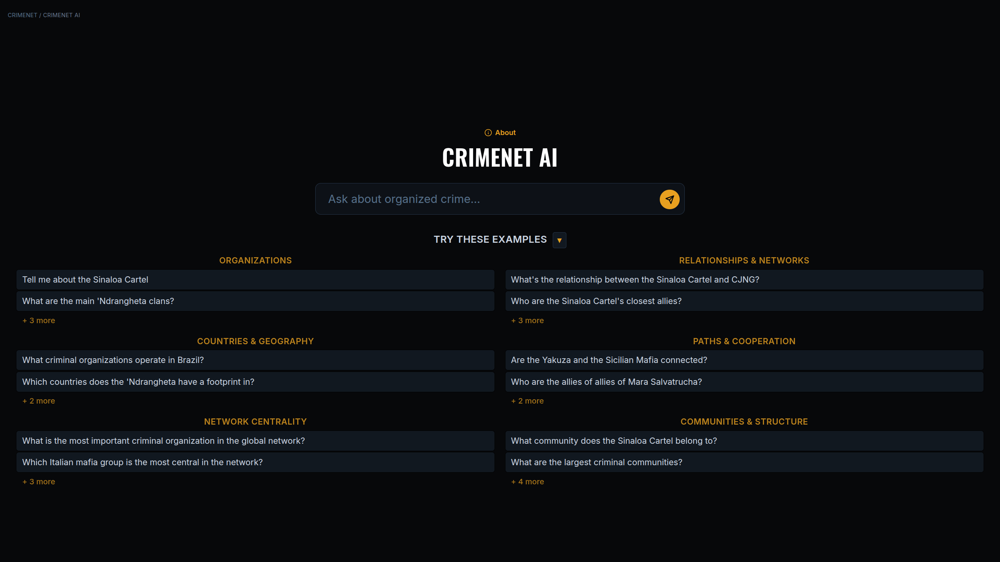
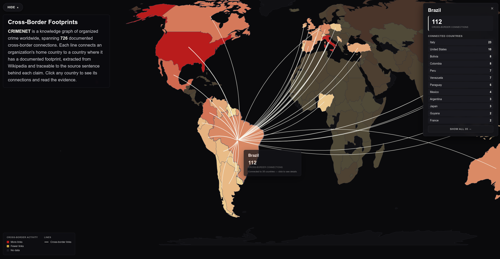
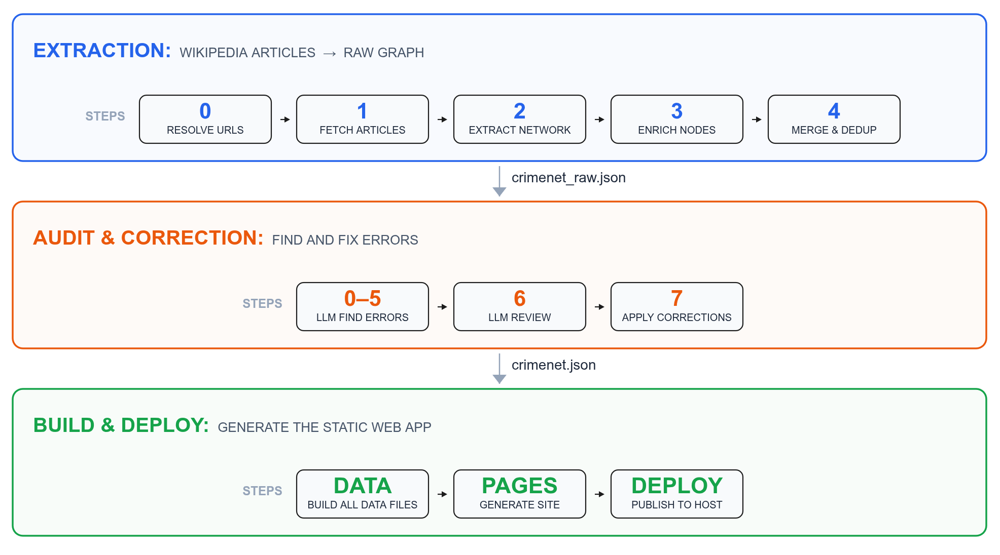

<a href="https://www.alvarofrancomartins.com/post/crimenet_1.0/" target="_blank">A few months ago</a>, I created a network of criminal organizations and how they connect to each other. I applied an LLM to read hundreds of Wikipedia articles, extracting every criminal organization mentioned and every relationship between them. The result was CRIMENET: the first open-source knowledge graph of criminal organizations.  

 

I have now significantly expanded it: <a href="https://www.alvarofrancomartins.com/crimenet/" target="_blank"> 4,504 organizations and 10,935 relationships</a> extracted from 1,418 Wikipedia articles[^wiki_articles] across four languages. For each profiled organization[^profiled], the graph captures its description, country of origin, activity period, founding year, footprints in other countries, and defunct status. Every edge carries a verbatim evidence quote, a description, a versioned Wikipedia URL, and a time period when the source provides one. The three edge types are cooperation, conflict, and other[^other_edge].

[^wiki_articles]: Most of these articles are about criminal organizations themselves. The rest cover: individual criminals, events, law enforcement agencies, and other topics that mention criminal groups but are not about a specific organization.

[^profiled]: Of the 4,504 organizations, 1,032 are profiled from their own Wikipedia article (with full descriptions, aliases, country of origin, country footprints, time periods, and defunct status), 3,472 are mention-only (they appear in other orgs' articles but have no dedicated Wikipedia page). Some of these mention-only organizations are referenced in many articles. You can see them in this <a href="https://github.com/alvarofrancomartins/CRIMENET/blob/main/tools/data/coverage_statistics.json" target="_blank">json file</a>.

[^other_edge]: The type 'other' is when the relationship between two orgs is genuinely not cooperation nor conflict. Most of these fall into a structural category, such as subgroups.

 

In this new version I also created an AI assistant that answers natural language questions by querying the graph. I will start there, since it covers all the new findings.

# CRIMENET AI

<figure>

<figcaption style="margin:8px 0 24px 0; text-align:center; font-weight:600; font-size:0.95em;">Figure 1: GraphRAG user interface. </figcaption>
</figure>

Answering a question such as "What is the most connected criminal organization?" is just a matter of running a single computation on the graph. However, answering questions such as "Which motorcycle clubs have direct ties to Italian mafia organizations?" or "What potential rivalries does the Sinaloa Cartel have based on shared adversaries?" require combining information from across the graph. 

 

A standard LLM would guess at the answers. However, give it tools to query the graph and it can combine results to synthesize a response. Not only that, a LLM able to reason over the graph can try answering more subjetive questions, such as "What is the community containing the most unlikely criminal organizations cooperating?" 

 

Based on all of that, I created <a href="https://www.alvarofrancomartins.com/crimenet/ask.html" target="_blank">CRIMENET AI</a>, a GraphRAG[^graph_rag] system I built from scratch. A practical note: answers can take a few seconds, because the AI may run several steps before responding. The following sections walk you through the kinds of questions this AI can answer. 

[^graph_rag]: GraphRAG stands for Graph Retrieval-Augmented Generation. A standard RAG system retrieves text chunks and asks the model to reason over them. A GraphRAG system retrieves structured data from a knowledge graph by calling tools that traverse nodes, edges, communities, and paths. I gave it 13 tools: functions that look up organizations, find connections, search by country, trace paths. The model decides which function to call, the code runs it against static data files, and the results feed back to the model, which can call another function or synthesize an answer. Every Wikipedia URL and edge from the tool results is collected and appended below the answer as Sources and Evidence. The tools are documented in the <a href="https://github.com/alvarofrancomartins/CRIMENET">GitHub repository</a>.

## Centrality

In the entire network, only 984 (22%) nodes are isolated. All the other 3,520 organizations are pretty much connected. For them, I computed three centrality measures (degree, betweenness, and PageRank) across. Here are the top 10 ranked by betweenness.

 

<table style="display:inline-table; overflow:hidden; text-align:left; width:auto; max-width:900px; max-width:100%;">
<thead>
<tr style="border-bottom:2px solid #cbd5e1;"><th style="text-align:left; padding:8px;">Organization</th><th style="text-align:right; padding:8px;">Degree rank</th><th style="text-align:right; padding:8px;">Betweenness rank</th><th style="text-align:right; padding:8px;">PageRank rank</th></tr>
</thead>
<tbody>
<tr style="border-bottom:1px solid #e2e8f0;"><td style="padding:8px;">'Ndrangheta</td><td style="padding:8px; text-align:right;">2</td><td style="padding:8px; text-align:right;">1</td><td style="padding:8px; text-align:right;">2</td></tr>
<tr style="border-bottom:1px solid #e2e8f0;"><td style="padding:8px;">Hells Angels Motorcycle Club</td><td style="padding:8px; text-align:right;">1</td><td style="padding:8px; text-align:right;">2</td><td style="padding:8px; text-align:right;">1</td></tr>
<tr style="border-bottom:1px solid #e2e8f0;"><td style="padding:8px;">Camorra</td><td style="padding:8px; text-align:right;">7</td><td style="padding:8px; text-align:right;">3</td><td style="padding:8px; text-align:right;">9</td></tr>
<tr style="border-bottom:1px solid #e2e8f0;"><td style="padding:8px;">American Mafia</td><td style="padding:8px; text-align:right;">5</td><td style="padding:8px; text-align:right;">4</td><td style="padding:8px; text-align:right;">8</td></tr>
<tr style="border-bottom:1px solid #e2e8f0;"><td style="padding:8px;">Sinaloa Cartel</td><td style="padding:8px; text-align:right;">3</td><td style="padding:8px; text-align:right;">5</td><td style="padding:8px; text-align:right;">4</td></tr>
<tr style="border-bottom:1px solid #e2e8f0;"><td style="padding:8px;">Al-Qaeda</td><td style="padding:8px; text-align:right;">17</td><td style="padding:8px; text-align:right;">6</td><td style="padding:8px; text-align:right;">10</td></tr>
<tr style="border-bottom:1px solid #e2e8f0;"><td style="padding:8px;">Islamic State</td><td style="padding:8px; text-align:right;">10</td><td style="padding:8px; text-align:right;">7</td><td style="padding:8px; text-align:right;">5</td></tr>
<tr style="border-bottom:1px solid #e2e8f0;"><td style="padding:8px;">Gambino crime family</td><td style="padding:8px; text-align:right;">13</td><td style="padding:8px; text-align:right;">8</td><td style="padding:8px; text-align:right;">19</td></tr>
<tr style="border-bottom:1px solid #e2e8f0;"><td style="padding:8px;">Hezbollah</td><td style="padding:8px; text-align:right;">52</td><td style="padding:8px; text-align:right;">9</td><td style="padding:8px; text-align:right;">36</td></tr>
<tr style="border-bottom:1px solid #e2e8f0;"><td style="padding:8px;">Outlaws Motorcycle Club</td><td style="padding:8px; text-align:right;">8</td><td style="padding:8px; text-align:right;">10</td><td style="padding:8px; text-align:right;">6</td></tr>
</tbody>
</table>

Table 1: Top 10 organizations by betweenness centrality.

  
Try asking <a href="https://www.alvarofrancomartins.com/crimenet/ask.html" target="_blank">CRIMENET AI</a>

  <ul style="margin:0; padding-left:18px; color:#334155;">
    <li style="margin-bottom:4px;">Which Mexican cartels have the most network influence?</li>
    <li style="margin-bottom:4px;">How does the Sinaloa Cartel's network importance compare to the American Mafia?</li>
  </ul>

## Communities

Communities are groups of nodes more connected to each other than to the rest of the network. I ran a community algorithm[^infomap_algorithm] on the cooperation graph and it returned 229 communities. Each is now named and described.

[^infomap_algorithm]: The algorithm is <a href="https://mapequation.org/infomap/" target="_blank">Infomap</a>, which finds communities by detecting where random walks tend to stay. 

 

I fed each community's member organizations, their descriptions, and their relationships to DeepSeek to generate a title and a summary. You can browse all communities with their full descriptions and member lists in the <a href="https://www.alvarofrancomartins.com/crimenet/browse.html" target="_blank">Community Browser</a> (select the Communities tab). Here are the top 10.

 

<table style="display:block; overflow:hidden; max-width:100%; margin:0 auto;">
<thead>
<tr style="border-bottom:2px solid #cbd5e1;"><th style="text-align:left; padding:8px;">Community</th><th style="text-align:left; padding:8px;">Short description</th><th style="text-align:right; padding:8px;">Members</th></tr>
</thead>
<tbody>
<tr style="border-bottom:1px solid #e2e8f0;"><td style="padding:8px; vertical-align:top;">Global Jihadist Network and Allies</td><td style="padding:8px; vertical-align:top;">A global jihadist network uniting al-Qaeda, Taliban, and allied militant groups across Asia, Africa, and the Middle East.</td><td style="padding:8px; text-align:right; vertical-align:top;">81</td></tr>
<tr style="border-bottom:1px solid #e2e8f0;"><td style="padding:8px; vertical-align:top;">American Mafia Network</td><td style="padding:8px; vertical-align:top;">A dense network of Italian-American Mafia families and allied gangs cooperating across the U.S. in traditional organized crime.</td><td style="padding:8px; text-align:right; vertical-align:top;">76</td></tr>
<tr style="border-bottom:1px solid #e2e8f0;"><td style="padding:8px; vertical-align:top;">Mexican Cartel Alliance Network</td><td style="padding:8px; vertical-align:top;">A web of Mexican cartels and allied gangs, often uniting against the Sinaloa Cartel, with shifting alliances for drug trafficking and territorial control.</td><td style="padding:8px; text-align:right; vertical-align:top;">72</td></tr>
<tr style="border-bottom:1px solid #e2e8f0;"><td style="padding:8px; vertical-align:top;">Nuova Famiglia Camorra Alliance</td><td style="padding:8px; vertical-align:top;">A coalition of Neapolitan Camorra clans united against Cutolo's NCO, engaging in drug trafficking and violent power struggles.</td><td style="padding:8px; text-align:right; vertical-align:top;">51</td></tr>
<tr style="border-bottom:1px solid #e2e8f0;"><td style="padding:8px; vertical-align:top;">Calabrian 'Ndrangheta Clans Network</td><td style="padding:8px; vertical-align:top;">A network of Calabrian 'Ndrangheta clans cooperating in international drug trafficking, money laundering, and extortion across Europe and beyond.</td><td style="padding:8px; text-align:right; vertical-align:top;">42</td></tr>
<tr style="border-bottom:1px solid #e2e8f0;"><td style="padding:8px; vertical-align:top;">Neapolitan Camorra Alliance Network</td><td style="padding:8px; vertical-align:top;">A web of Naples-based Camorra clans, led by the Secondigliano Alliance, cooperating in drug trafficking and territorial control.</td><td style="padding:8px; text-align:right; vertical-align:top;">37</td></tr>
<tr style="border-bottom:1px solid #e2e8f0;"><td style="padding:8px; vertical-align:top;">Hells Angels Support Network</td><td style="padding:8px; vertical-align:top;">A global network of outlaw motorcycle clubs allied with or supporting the Hells Angels, engaged in drug trafficking and violence.</td><td style="padding:8px; text-align:right; vertical-align:top;">37</td></tr>
<tr style="border-bottom:1px solid #e2e8f0;"><td style="padding:8px; vertical-align:top;">Brazilian PCC-Led Criminal Alliance Network</td><td style="padding:8px; vertical-align:top;">A PCC-centered network of Brazilian criminal factions and international allies cooperating in drug trafficking and prison control.</td><td style="padding:8px; text-align:right; vertical-align:top;">36</td></tr>
<tr style="border-bottom:1px solid #e2e8f0;"><td style="padding:8px; vertical-align:top;">Sicilian Mafia Corleonesi Alliance Network</td><td style="padding:8px; vertical-align:top;">A coalition of Sicilian Mafia families led by the Corleonesi, united through drug trafficking, extortion, and violent power consolidation.</td><td style="padding:8px; text-align:right; vertical-align:top;">34</td></tr>
<tr style="border-bottom:1px solid #e2e8f0;"><td style="padding:8px; vertical-align:top;">Calabrian 'Ndrangheta Alliance Network</td><td style="padding:8px; vertical-align:top;">A network of Calabrian 'Ndrangheta clans, centered on Grande Aracri, cooperating in drug trafficking and other crimes across Italy.</td><td style="padding:8px; text-align:right; vertical-align:top;">32</td></tr>
</tbody>
</table>

Table 2: The top 10 communities by membership, titled and described by DeepSeek.

 

  
Try asking <a href="https://www.alvarofrancomartins.com/crimenet/ask.html" target="_blank">CRIMENET AI</a>

  <ul style="margin:0; padding-left:18px; color:#334155;">
    <li style="margin-bottom:4px;">What community does the Sinaloa Cartel belong to?</li>
    <li style="margin-bottom:4px;">Find communities related to the mafia</li>
    <li style="margin-bottom:4px;">Which communities span the most countries?</li>
  </ul>

## Bridges

Some organizations cooperate across community boundaries. I call them bridges. Before CRIMENET, if someone asked "Which criminal organizations connect different communities?" the honest answer was: nobody knew. The question was too big to answer. Now it has an answer (incomplete, but an answer nonetheless): every bridging organization, ranked by how many communities it connects.

 

<table style="display:inline-table; overflow:hidden; text-align:left; width:auto; max-width:900px; max-width:100%;">
<thead>
<tr style="border-bottom:2px solid #cbd5e1;"><th style="text-align:left; padding:8px;">Organization</th><th style="text-align:left; padding:8px; white-space:nowrap;">Top communities bridged (top 3 shown)</th><th style="text-align:right; padding:8px; white-space:nowrap;">Cross-community edges</th><th style="text-align:right; padding:8px; white-space:nowrap;">Communities spanned</th></tr>
</thead>
<tbody>
<tr style="border-bottom:1px solid #e2e8f0;"><td style="padding:8px; vertical-align:top;">Hells Angels Motorcycle Club</td><td style="padding:8px; vertical-align:top;">American Mafia Network, Mexican Cartel Alliance Network, Calabrian 'Ndrangheta Clans Network</td><td style="padding:8px; text-align:right; vertical-align:top;">101</td><td style="padding:8px; text-align:right; vertical-align:top;">25</td></tr>
<tr style="border-bottom:1px solid #e2e8f0;"><td style="padding:8px; vertical-align:top;">American Mafia</td><td style="padding:8px; vertical-align:top;">American Mafia Network, Mexican Cartel Alliance Network, Nuova Famiglia Camorra Alliance</td><td style="padding:8px; text-align:right; vertical-align:top;">84</td><td style="padding:8px; text-align:right; vertical-align:top;">24</td></tr>
<tr style="border-bottom:1px solid #e2e8f0;"><td style="padding:8px; vertical-align:top;">'Ndrangheta</td><td style="padding:8px; vertical-align:top;">American Mafia Network, Mexican Cartel Alliance Network, Nuova Famiglia Camorra Alliance</td><td style="padding:8px; text-align:right; vertical-align:top;">83</td><td style="padding:8px; text-align:right; vertical-align:top;">30</td></tr>
<tr style="border-bottom:1px solid #e2e8f0;"><td style="padding:8px; vertical-align:top;">Sinaloa Cartel</td><td style="padding:8px; vertical-align:top;">Hells Angels Support Network, Italian Mafia Alliances and Offshoots, US Prison and Street Gang Alliances</td><td style="padding:8px; text-align:right; vertical-align:top;">78</td><td style="padding:8px; text-align:right; vertical-align:top;">20</td></tr>
<tr style="border-bottom:1px solid #e2e8f0;"><td style="padding:8px; vertical-align:top;">Camorra</td><td style="padding:8px; vertical-align:top;">Global Jihadist Network and Allies, Mexican Cartel Alliance Network, Sicilian Mafia Corleonesi Alliance Network</td><td style="padding:8px; text-align:right; vertical-align:top;">52</td><td style="padding:8px; text-align:right; vertical-align:top;">16</td></tr>
<tr style="border-bottom:1px solid #e2e8f0;"><td style="padding:8px; vertical-align:top;">Outlaws Motorcycle Club</td><td style="padding:8px; vertical-align:top;">American Mafia Network, Neo-Nazi Terror Network, White Supremacist Prison and Street Gang Network</td><td style="padding:8px; text-align:right; vertical-align:top;">52</td><td style="padding:8px; text-align:right; vertical-align:top;">11</td></tr>
<tr style="border-bottom:1px solid #e2e8f0;"><td style="padding:8px; vertical-align:top;">Sicilian Mafia</td><td style="padding:8px; vertical-align:top;">American Mafia Network, Mexican Cartel Alliance Network, Nuova Famiglia Camorra Alliance</td><td style="padding:8px; text-align:right; vertical-align:top;">48</td><td style="padding:8px; text-align:right; vertical-align:top;">15</td></tr>
<tr style="border-bottom:1px solid #e2e8f0;"><td style="padding:8px; vertical-align:top;">Mexican Mafia</td><td style="padding:8px; vertical-align:top;">American Mafia Network, Mexican Cartel Alliance Network, Hells Angels Support Network</td><td style="padding:8px; text-align:right; vertical-align:top;">48</td><td style="padding:8px; text-align:right; vertical-align:top;">10</td></tr>
<tr style="border-bottom:1px solid #e2e8f0;"><td style="padding:8px; vertical-align:top;">'Ndrina Mancuso</td><td style="padding:8px; vertical-align:top;">Nuova Famiglia Camorra Alliance, Calabrian 'Ndrangheta Clans Network, Calabrian 'Ndrangheta Alliance Network</td><td style="padding:8px; text-align:right; vertical-align:top;">43</td><td style="padding:8px; text-align:right; vertical-align:top;">11</td></tr>
<tr style="border-bottom:1px solid #e2e8f0;"><td style="padding:8px; vertical-align:top;">Gambino crime family</td><td style="padding:8px; vertical-align:top;">Nuova Famiglia Camorra Alliance, Calabrian 'Ndrangheta Clans Network, Hells Angels Support Network</td><td style="padding:8px; text-align:right; vertical-align:top;">32</td><td style="padding:8px; text-align:right; vertical-align:top;">12</td></tr>
</tbody>
</table>

Table 3: The top 10 bridge organizations, ranked by cross-community cooperation edges.

 

  
Try asking <a href="https://www.alvarofrancomartins.com/crimenet/ask.html" target="_blank">CRIMENET AI</a>

  <ul style="margin:0; padding-left:18px; color:#334155;">
    <li style="margin-bottom:4px;">Which Mexican organizations bridge the most communities?</li>
    <li>Which organizations bridge Latin American and European criminal networks?</li>
  </ul>

## Paths

A path connects two organizations through documented relationships. A direct edge is a path of length one. If no direct edge exists, the path might run through intermediaries. Each step carries its own evidence quote. The AI can search across all relationship types (cooperation and conflict), or restrict the path to cooperation only.

 

  
Try asking <a href="https://www.alvarofrancomartins.com/crimenet/ask.html" target="_blank">CRIMENET AI</a>

  <ul style="margin:0; padding-left:18px; color:#334155;">
    <li style="margin-bottom:4px;">Are the Yakuza and the Sicilian Mafia connected?</li>
    <li style="margin-bottom:4px;">Who are the allies of allies of Mara Salvatrucha?</li>
    <li style="margin-bottom:4px;">Is there a cooperation-only route between the PCC and the Camorra?</li>
  </ul>

## Missing links

The graph has 10,935 documented relationships drawn from the 1,418 articles I processed. However, most real-world connections are never written down at all. Others are documented elsewhere, outside Wikipedia. 

 

A step towards filling this gap is to infer missing links from the structure of the graph itself. If two organizations share many of the same partners, or the same enemies, they might have a relationship with each other, even if nobody has written it down. The analysis could also return pairs of organizations that occupy structurally similar roles in the network.

 

I computed three types of signals (inspired by the concept of <a href="https://en.wikipedia.org/wiki/Triadic_closure" target="_blank">Triadic Closure</a>). Common cooperation partners: Friends of friends might be friends. Common adversaries: Enemies of enemies might be friends. Both: A pair that shares both cooperation partners and adversaries. The result is 2,561 pairs, all of them listed in the <a href="https://www.alvarofrancomartins.com/crimenet/browse.html" target="_blank">Triadic Signals tab</a>. Table 4 shows some examples of each kind of signal.

 

<table style="display:inline-table; overflow:hidden; text-align:left; width:auto; max-width:900px; max-width:100%;">
<thead>
<tr style="border-bottom:2px solid #cbd5e1;"><th style="text-align:left; padding:8px;">Organization A</th><th style="text-align:left; padding:8px;">Organization B</th><th style="text-align:left; padding:8px;">Signal</th><th style="text-align:right; padding:8px;">Shared partners</th><th style="text-align:right; padding:8px;">Shared adversaries</th></tr>
</thead>
<tbody>
<tr style="border-bottom:1px solid #e2e8f0;"><td style="padding:8px; vertical-align:top;">Gambino crime family</td><td style="padding:8px; vertical-align:top;">Rizzuto crime family</td><td style="padding:8px; vertical-align:top;">Both</td><td style="padding:8px; text-align:right; vertical-align:top;">4</td><td style="padding:8px; text-align:right; vertical-align:top;">1</td></tr>
<tr style="border-bottom:1px solid #e2e8f0;"><td style="padding:8px; vertical-align:top;">Cártel de Santa Rosa de Lima</td><td style="padding:8px; vertical-align:top;">Knights Templar Cartel</td><td style="padding:8px; vertical-align:top;">Both</td><td style="padding:8px; text-align:right; vertical-align:top;">3</td><td style="padding:8px; text-align:right; vertical-align:top;">2</td></tr>
<tr style="border-bottom:1px solid #e2e8f0;"><td style="padding:8px; vertical-align:top;">Sacra Corona Unita</td><td style="padding:8px; vertical-align:top;">Sicilian Mafia</td><td style="padding:8px; vertical-align:top;">Both</td><td style="padding:8px; text-align:right; vertical-align:top;">4</td><td style="padding:8px; text-align:right; vertical-align:top;">1</td></tr>
<tr style="border-bottom:1px solid #e2e8f0;"><td style="padding:8px; vertical-align:top;">La Familia Michoacana</td><td style="padding:8px; vertical-align:top;">Nueva Plaza Cartel</td><td style="padding:8px; vertical-align:top;">Both</td><td style="padding:8px; text-align:right; vertical-align:top;">1</td><td style="padding:8px; text-align:right; vertical-align:top;">1</td></tr>
<tr style="border-bottom:1px solid #e2e8f0;"><td style="padding:8px; vertical-align:top;">Cleveland crime family</td><td style="padding:8px; vertical-align:top;">Patriarca crime family</td><td style="padding:8px; vertical-align:top;">Only Common Partners</td><td style="padding:8px; text-align:right; vertical-align:top;">8</td><td style="padding:8px; text-align:right; vertical-align:top;">-</td></tr>
<tr style="border-bottom:1px solid #e2e8f0;"><td style="padding:8px; vertical-align:top;">New Orleans crime family</td><td style="padding:8px; vertical-align:top;">Patriarca crime family</td><td style="padding:8px; vertical-align:top;">Only Common Partners</td><td style="padding:8px; text-align:right; vertical-align:top;">6</td><td style="padding:8px; text-align:right; vertical-align:top;">-</td></tr>
<tr style="border-bottom:1px solid #e2e8f0;"><td style="padding:8px; vertical-align:top;">'Ndrina Bellocco</td><td style="padding:8px; vertical-align:top;">'Ndrina Mancuso</td><td style="padding:8px; vertical-align:top;">Only Common Partners</td><td style="padding:8px; text-align:right; vertical-align:top;">4</td><td style="padding:8px; text-align:right; vertical-align:top;">-</td></tr>
<tr style="border-bottom:1px solid #e2e8f0;"><td style="padding:8px; vertical-align:top;">Mongols MC</td><td style="padding:8px; vertical-align:top;">Rebels Motorcycle Club</td><td style="padding:8px; vertical-align:top;">Only Common Adversaries</td><td style="padding:8px; text-align:right; vertical-align:top;">-</td><td style="padding:8px; text-align:right; vertical-align:top;">2</td></tr>
<tr style="border-bottom:1px solid #e2e8f0;"><td style="padding:8px; vertical-align:top;">Nuestra Familia</td><td style="padding:8px; vertical-align:top;">Texas Syndicate</td><td style="padding:8px; vertical-align:top;">Only Common Adversaries</td><td style="padding:8px; text-align:right; vertical-align:top;">-</td><td style="padding:8px; text-align:right; vertical-align:top;">3</td></tr>
<tr style="border-bottom:1px solid #e2e8f0;"><td style="padding:8px; vertical-align:top;">Comanchero Motorcycle Club</td><td style="padding:8px; vertical-align:top;">Rebels Motorcycle Club</td><td style="padding:8px; vertical-align:top;">Only Common Adversaries</td><td style="padding:8px; text-align:right; vertical-align:top;">-</td><td style="padding:8px; text-align:right; vertical-align:top;">3</td></tr>
</tbody>
</table>

Table 4: The strongest signals for each type, scored by weighted common partners and adversaries.

 

An important note. We have to take these results with a grain of salt. I do not check whether the two organizations in each pair are operating in the same timeline, so the results may link groups from different periods. Nor do I limit the pairs to organizations in the same country. Ultimately, these calculations serve more as a basis for asking complex questions in CRIMENET AI.

 

  
Try asking <a href="https://www.alvarofrancomartins.com/crimenet/ask.html" target="_blank">CRIMENET AI</a>

  <ul style="margin:0; padding-left:18px; color:#334155;">
    <li style="margin-bottom:4px;">Find two criminal organizations based in Brazil that share allies and rivals but whose partnership is not documented. Both must still be active, with overlapping activity periods.</li>
  </ul>

## Countries

Most profiled organization carries its country of origin and each accumulate footprints in other countries (that is to say, countries where one or more Wikipedia articles document its presence). Here are the top 10 countries by how many organizations are based there.

 

<table style="display:inline-table; overflow:hidden; text-align:left; width:auto; max-width:900px; max-width:100%;">
<thead>
<tr style="border-bottom:2px solid #cbd5e1;"><th style="text-align:left; padding:8px;">Country</th><th style="text-align:right; padding:8px;">Organizations based here</th></tr>
</thead>
<tbody>
<tr style="border-bottom:1px solid #e2e8f0;"><td style="padding:8px;">United States</td><td style="padding:8px; text-align:right;">337</td></tr>
<tr style="border-bottom:1px solid #e2e8f0;"><td style="padding:8px;">Italy</td><td style="padding:8px; text-align:right;">229</td></tr>
<tr style="border-bottom:1px solid #e2e8f0;"><td style="padding:8px;">Mexico</td><td style="padding:8px; text-align:right;">54</td></tr>
<tr style="border-bottom:1px solid #e2e8f0;"><td style="padding:8px;">Canada</td><td style="padding:8px; text-align:right;">47</td></tr>
<tr style="border-bottom:1px solid #e2e8f0;"><td style="padding:8px;">United Kingdom</td><td style="padding:8px; text-align:right;">46</td></tr>
<tr style="border-bottom:1px solid #e2e8f0;"><td style="padding:8px;">Japan</td><td style="padding:8px; text-align:right;">37</td></tr>
<tr style="border-bottom:1px solid #e2e8f0;"><td style="padding:8px;">Colombia</td><td style="padding:8px; text-align:right;">29</td></tr>
<tr style="border-bottom:1px solid #e2e8f0;"><td style="padding:8px;">Brazil</td><td style="padding:8px; text-align:right;">21</td></tr>
<tr style="border-bottom:1px solid #e2e8f0;"><td style="padding:8px;">Australia</td><td style="padding:8px; text-align:right;">14</td></tr>
<tr style="border-bottom:1px solid #e2e8f0;"><td style="padding:8px;">Russia</td><td style="padding:8px; text-align:right;">14</td></tr>
</tbody>
</table>

Table 5: The 10 countries where the most criminal organizations are based.

 

Table 5 stops at ten. For any country in the graph, the <a href="https://www.alvarofrancomartins.com/crimenet/index.html" target="_blank">dashboard</a> has the rest: switch the left panel to Countries and pick one. For instance, Japan gives you both the organizations based there and the foreign groups with a documented footprint in the country. It is also possible to just skip the browsing and ask CRIMENET AI.

 

You can also visualize footprints of orgs in each country through this nice <a href="https://www.alvarofrancomartins.com/crimenet/footprints.html" target="_blank">interactive world map</a>. Each organization's country of origin and its documented footprints create arcs across the map. 

<figure>

<figcaption style="font-size: 0.9em;">Figure 2: Each arc traces an organization's footprint from its country of origin to a country where it operates.</figcaption>
</figure>

  
Try asking <a href="https://www.alvarofrancomartins.com/crimenet/ask.html" target="_blank">CRIMENET AI</a>

  <ul style="margin:0; padding-left:18px; color:#334155;">
    <li style="margin-bottom:4px;">Which countries does the 'Ndrangheta have a footprint in?</li>
    <li style="margin-bottom:4px;">Which criminal organizations operate in both Colombia and Venezuela?</li>
  </ul>

# Building the graph

The raw material is 1,418 manually curated Wikipedia articles about criminal organizations across 4 languages (English, Italian, Portuguese, and Spanish). The extraction pipeline fetches each article, cleans the HTML into plain text, then sends it to DeepSeek to identify organizations and the relationships between them: cooperation, conflict, and other.[^edge_types] The pipeline then profiles each organization from its own Wikipedia article (canonical name, aliases, description, country of origin, time period, founded and dissolved years, defunct status, and country footprints, each backed by a verbatim evidence quote) and merges everything into a single graph, folding variant names across languages so that Sinaloa Cartel and the Cártel de Sinaloa become one node.

 

An LLM extraction pipeline produces errors: it conflates names, misses duplicates, invents edges between orgs that were merely mentioned in the same paragraph, and sometimes pulls in non-criminal entities. In order to fix these problems, I built an audit pipeline that targets each class of error, one audit per error type.[^audit_pipeline] The correction loop is designed to be iterative: spot an error, add one line to a corrections file, re-run the apply step. Manual overrides always win over auto-suggestions. 
<figure>

<figcaption style="font-size: 0.9em;">Figure 3: The three-layer architecture. Extraction (Wikipedia to raw graph), audit and correction (find and fix errors), build and deploy (generate the static web app). Every detail is documented on <a href="https://github.com/alvarofrancomartins/CRIMENET" target="_blank">GitHub</a>.
 </figcaption>
</figure>

[^edge_types]: Cooperation covers alliances, joint operations, and commercial dealings. Conflict covers fighting, war, and clashes. Other covers structural ties (sub-units, splinters), truces, and unspecified links. 

[^audit_pipeline]: Seven steps in total. Audits 0 through 5 find wrong merges, missed merges, spurious edges, unsupported country links, umbrella terms, and non-criminal entities. Audit 6 provides an LLM second opinion. Audit 7 applies all corrections, with manual overrides from a curated file always winning over auto-suggestions. Full details in the <a href="https://github.com/alvarofrancomartins/CRIMENET" target="_blank">GitHub repository</a>.

CRIMENET's <a href="https://www.alvarofrancomartins.com/crimenet/" target="_blank">home page</a> is a dashboard with two panels where you can browse all organizations. Moreover, <a href="https://www.alvarofrancomartins.com/crimenet/browse.html" target="_blank">connection finder</a> page lets you pick any two organizations to see if and how they are connected. The other tabs in <a href="https://www.alvarofrancomartins.com/crimenet/browse.html" target="_blank">Browse the network</a> cover communities, bridges, and triadic signals.

# Closing thoughts

There is, to my knowledge, no publicly larger directory of criminal organizations. Wikipedia’s most <a href="https://en.wikipedia.org/wiki/List_of_criminal_enterprises,_gangs,_and_syndicates" target="_blank">extensive list</a> of criminal enterprises, gangs, and syndicates covers a few hundred groups. And it only mentions organizations, not their relationships. 

 

This was honestly an accidental achievement. The goal was to build a knowledge graph of how criminal organizations relate to each other. But because the pipeline reads nearly 1,500 articles across four languages and extracts every organization mentioned in each one, it ended up capturing many criminal organizations documented on English, Italian, Portuguese, and Spanish Wikipedia.

<figure>

<figcaption style="font-size: 0.9em;">Figure 4: The full network is viewable as an <a href="https://www.alvarofrancomartins.com/crimenet/knowledge_graph.html">interactive 3D force-directed graph</a> built with three.js. Nodes are organizations and edges are colored by relationship type (green for cooperation and red for conflict). You can rotate, zoom, click any node to see its details, and filter by relationship type. In 3D, you can rotate around a cluster and see its internal structure, something impossible in a flat 2D view.</figcaption>
</figure>

# Limitations

There are some relevant considerations worth mentioning:

 

- Wikipedia coverage skews toward English-language and Western sources. The pipeline processes four languages (English, Italian, Portuguese, and Spanish), which is better than one but still leaves gaps. Because the data comes from Wikipedia, the graph inherits the biases and gaps of its source material.
- Relationships are aggregated across time. Every edge carries its own time period, so the data is there, but the graph view flattens time into a single snapshot.
- The current graph models organizations and their relationships, not individuals or cyber criminal groups. This means we lose some information about criminal organizations built around a single person.
- CRIMENET AI will not work for long, at least publicly. It is spending my personal tokens so once my balance hits zero I do not plan to recharge it.
- Not every organization retrieved in the process is necessarily a criminal organization. Some state forces, political parties, or other non-criminal entities may have slipped in. The LLM pipeline is not perfect and occasionally misses a connection or misclassifies one.

If you have questions or ideas, get in touch.