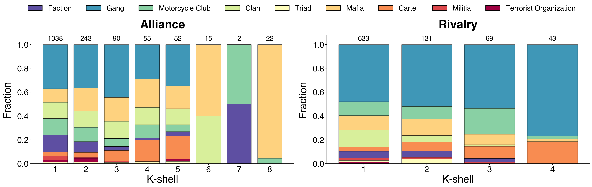
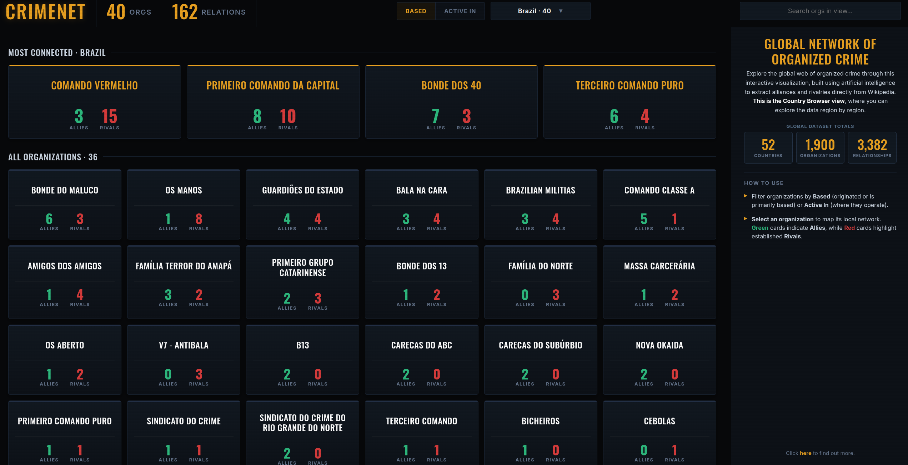

There is no map of the world's criminal organizations and how they connect to each other. The pieces exist, scattered across thousands of Wikipedia articles and news reports, but no one has assembled them into a single, structured network.
 
 

LLMs change that. I used DeepSeek to read 771 Wikipedia articles and extract every criminal organization mentioned and every relationship between them. The result is **CRIMENET**: the first open-source global map of criminal organizations and the alliances and rivalries between them, with 1,890 organizations connected by 3,354 relationships. Every node and edge is traceable back to a Wikipedia source. The full [interactive visualization](/crimenet/) is live[^viz] on this site, and the entire pipeline is [open-source on GitHub](https://github.com/alvarofrancomartins/CRIMENET).
 
[^viz]: Search any organization to see its profile, allies, and rivals. Click any node to read the Wikipedia source behind it. Filter by relationship type, isolate any node and its neighbors, and explore the network.

# Alliance and rivalry are different networks
 
Built as two separate networks, one for alliances and one for rivalries:

<figure>

<figcaption>Figure 1: Alliance (left, blue) and rivalry (right, red) networks shown separately.</figcaption>
</figure>

 

The alliance network is bigger and more cohesive. It has 1,517 active organizations and 2,293 edges, and its largest connected component covers 85% of them. Cooperation reaches almost everyone.

 

The rivalry network is smaller and more fragmented. It has 876 active organizations and 1,061 edges, with the largest component covering only 55%. Conflict tends to happen in dense local clusters rather than across the whole network. The rivalry component is locally denser than the alliance one (0.0065 vs 0.0026).

 

The two layers also differ in who fights whom. Type assortativity is 0.64 for rivalries and 0.48 for alliances. Organizations fight within their own type more often than they cooperate within it. Gangs fight gangs, cartels fight cartels, motorcycle clubs fight motorcycle clubs. Alliances cross type lines more easily.

# Who sits at the center

One organization tops every centrality ranking in both networks: the **Hells Angels**. No one else does. They have 134 alliances and 53 rivalries. The next most-connected organization, the Sinaloa Cartel, has 66 alliances. Hells Angels are the structural backbone of global organized crime as recorded on Wikipedia.

 

Beyond Hells Angels, the alliance side is dominated by mafias: 'Ndrangheta, Cosa Nostra, Camorra, Mexican Mafia, and the major American Mafia families (Gambino, Bonanno, Chicago Outfit). On the rivalry side, motorcycle clubs and gangs take over: Bandidos, Outlaws, Crips, Bloods, Latin Kings, Mara Salvatrucha. Cartels stay relevant in both layers.

# Mafias cooperate, gangs fight

Each organizational type has a clear cooperation-conflict signature. Mafias are overwhelmingly cooperative: 86% of their edges are alliances. Terrorist organizations, factions, and clans also lean strongly cooperative (above 75%). Cartels and motorcycle clubs sit in the middle (66% and 64%). Gangs come last at 55%, the most conflict-heavy type in the dataset.

 

This dichotomy shows up everywhere I looked. Decomposing each network into k-shells (the largest subgraph in which every node has at least k neighbors) makes it visible:

<figure>

<figcaption>Figure 2: Type composition of k-core shells for the alliance (left) and rivalry (right) networks. Numbers above bars indicate shell size.</figcaption>
</figure>

 

The alliance network reaches k = 8 and its deepest shell is populated almost entirely by mafias, including the major American crime families, plus Hells Angels. The rivalry network only reaches k = 4 and its deepest shells are populated almost entirely by gangs. The same pattern holds for cross-layer brokers: among organizations active in both networks, those that broker rivalries without brokering alliances are 9-out-of-10 gangs (many of them Los Angeles street gangs); those that broker alliances without brokering rivalries are type-mixed (mafias, clans, terrorist organizations, and gangs alike).

 

Mafias build alliances. Gangs fight. Everyone else falls between them.

# The full report

If you want the full methodology, the extended analysis, and every table that did not make it into this post, the technical report is embedded below. You can also [download it](crimenet.pdf) directly.

<figure>
<iframe src="crimenet.pdf" width="100%" height="800px" style="border: 1px solid #ccc;">
  
Your browser does not support embedded PDFs. <a href="crimenet.pdf">Download the report</a>.

</iframe>
</figure>

# [update] Browse by country

The interactive network is dense, and not everyone wants to read a force-directed graph. To make CRIMENET easier to explore, I built a [Country Browser](/crimenet_countries/) view that breaks the data down country by country.

<figure>

<figcaption>Figure 3: The Country Browser view, here showing the 40 organizations based in Brazil, ranked by how connected they are.</figcaption>
</figure>

 

Pick any of the 52 countries in the dataset and you get every organization based there or active there, ranked by how connected it is. Each card shows its allies and rivals counts. Two modes are possible: **Based** lists organizations that originated or are primarily based in a given country, **Active In** lists organizations that operate there regardless of origin.

# Open source, and where to next

Everything is open source. The full pipeline (source URLs, extraction code, cleanup logic, deduplication dictionaries, analysis scripts, and the interactive visualization) is on [GitHub](https://github.com/alvarofrancomartins/CRIMENET).

 

CRIMENET has limitations worth flagging. Wikipedia coverage skews English-language and Western, so well-documented organizations look more connected than they really are. Relationships are aggregated across time, so a 1970s alliance and a 2020 alliance count the same. The boundary between "cartel" and "militia", or "gang" and "faction", is sometimes fuzzy. None of this is fatal, but all of it is worth keeping in mind when reading the network.

 

Because the project is open source, anyone can extend it: add non-English Wikipedia editions, plug in other sources, refine the type taxonomy, add temporal weights to the edges. If you find an error or want to contribute, open an issue or pull request on GitHub.

 

If you have questions or ideas, get in touch.

