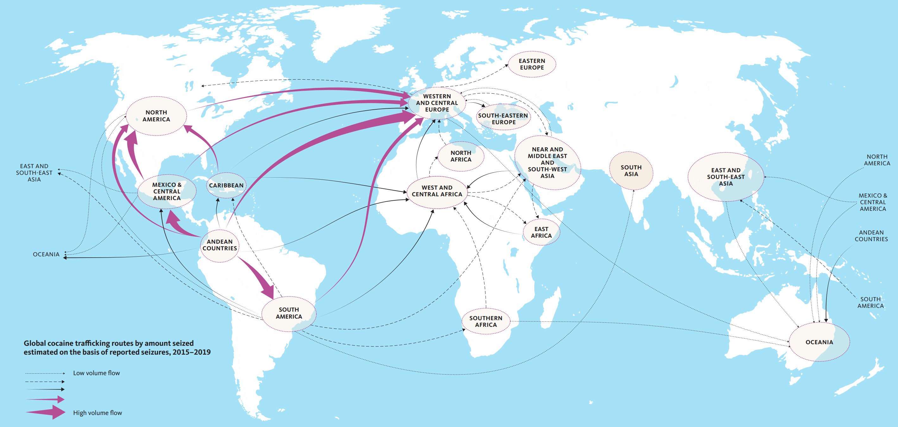
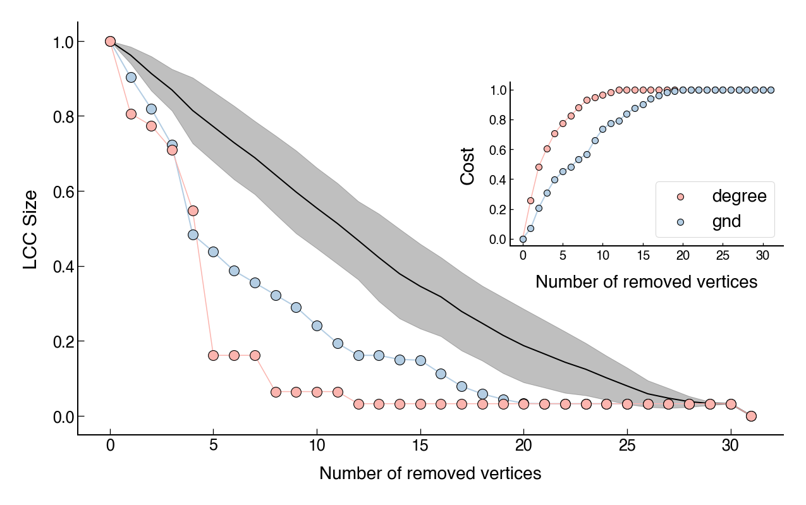
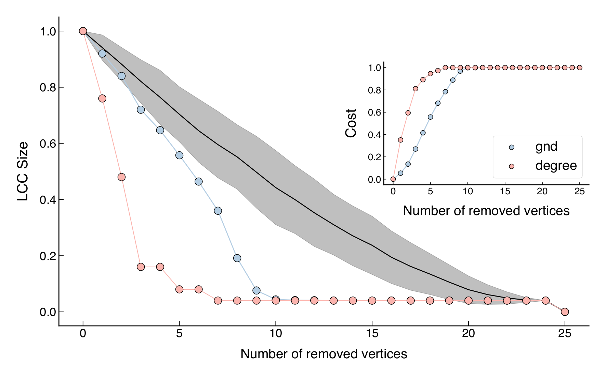
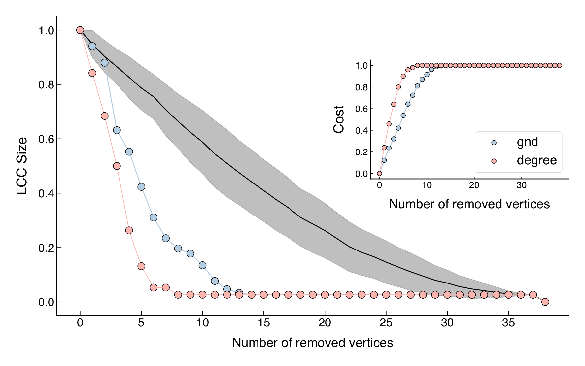
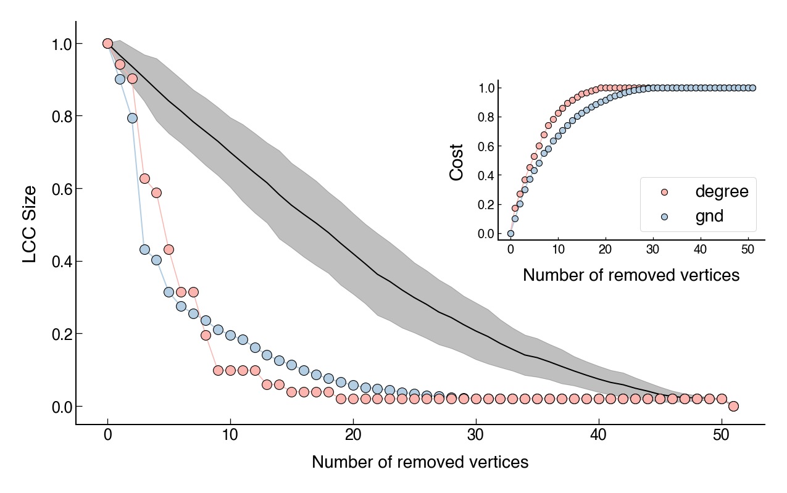

<script type="text/javascript" src="https://d3js.org/d3.v6.min.js"></script>
<!-- <script type="text/javascript" src="js/formatter.js"> </script> -->
<link rel="stylesheet" type="text/css" href="css/style.css">

Criminal networks are a major and ubiquitous problem in modern societies. However, effective and general approaches to interrupt their functioning are still an open problem. In this post, I will apply a method of network dismantling on four cocaine smuggling networks. These networks are the result of operations from 2006 to 2009 and include countries such as Brazil, Colombia, Mexico, Spain and Uruguay. Additionally, by the end of this post, I will suggest that these networks can be modeled using an extension of the Barabási-Albert model.

<!-- [^1]: The data used here was downloaded from the [UCINET](https://sites.google.com/site/ucinetsoftware/home?authuser=0) covert datasets. -->

<br>

The United Nations Office on Drugs and Crime (UNODC) [defines](https://www.unodc.org/unodc/en/drug-trafficking/index.html) drug trafficking as "a global illicit trade involving the cultivation, manufacture, distribution and sale of substances which are subject to drug prohibition laws". A 2021 [report](https://www.unodc.org/documents/data-and-analysis/cocaine/Cocaine_Insights_2021.pdf) indicates that the amount of cocaine seized globally reached record levels in 2019, with the majority of cocaine continuing to be seized in the Americas. Despite immense and increasing efforts to interrupt these activities, counterdrug interdictions appear to be [making the situation worse](https://doi.org/10.1073/pnas.1812459116). Drug trafficking networks are [flexible, fluid structures](https://doi.org/10.1080/17440572.2013.787927) and can respond instantly to attacks. For example, it has been suggested that [some](https://doi.org/10.1038/srep04238) networks can become even more efficient after targeted attacks.

<figure>
    
    <figcaption><b>Figure 1</b>: Main cocaine trafficking flows, 2015–2019. Source: UNODC, World Drug Report 2021.</figcaption>
</figure>

In terms of network dismantling, a naive approach for attacking criminal networks is to target the most connected people (those with high degree centrality). But realistically, this does not work. It turns out that the cost of targeting these individuals can be substantially greater than attacking other criminals in the network. Moreover, in times of conflict these positions are often replaceable by other criminals. The resilience of a criminal network also depends on its level of [redundancy](https://doi.org/10.1371/journal.pone.0236476), that is, how easily the invididuals are repleacable. These characteristics make dismantling criminal networks an arduous task.

<br>

Several approaches have been proposed for the purpose of dismantling networks. These approaches are divided into either link or node removal. [Here](https://www.nature.com/articles/s41598-018-31902-8) you can see a comparative analysis of the main methods currently used in scientific research. In particular, I will be applying, on four [Cocaine Smuggling Networks](https://sites.google.com/site/ucinetsoftware/datasets/covert-networks/cocaine-smuggling?authuser=0), a dismantling method proposed in a PNAS paper ([Generalized Network Dismantling](https://doi.org/10.1073/pnas.1806108116)). The advantage of this method is that it takes into account the cost of attacking the vertices. The cost of removing a vertex is its degree centrality and the algorithm finds a set of nodes whose removal results in the fragmentation of the network at minimal overall cost.

<br>

To perform the dismatling analysis, I adapted Petter Holme's [implementation](https://github.com/pholme/gnd/blob/master/gnd.py). Thanks to him, the method proposed in the paper was converted from [C++](https://github.com/renxiaolong/Generalized-Network-Dismantling) to Python 2. I then converted it to Python 3 and applied it to the networks. 

<br>


Ultimately, my main goals in this post are

<br>


- Present the GND method by examining its effectiveness and comparing the costs when the simplest dismantling approach (removing the high degree vertices) is applied. 
- Suggest that cocaine smuggling networks can be modeled via an extension of the Barabási-Albert model.

<br>

# Cocaine trafficking groups

<br>

The [dataset](https://sites.google.com/site/ucinetsoftware/datasets/covert-networks/cocaine-smuggling?authuser=0) contains information collected during police investigations of four groups involved in cocaine trafficking. These groups form networks in which the vertices represent the individuals and the links indicate their communications. The networks are shown below, with the size of each node proportional to its degree.

<br>

Operation **MAMBO**: The investigation started in 2006 and involved Colombian citizens that were introducing 50 kg of cocaine to be adulterated and distributed in Madrid (Spain). Ultimately, the group was involved in smuggling cocaine from Colombia through Brazil and Uruguay to be distributed in Spain. This is a typical Spanish middle cocaine group acting as wholesale supplier between a South American importer group and retailers in Madrid.

<div id="cocaine_smuggling_1"></div>
<script type="text/javascript" src="js/cocaine_smuggling_1.js"> </script>
<p style="text-align: center"><b>Mambo network</b>: 31 vertices and 58 edges.<p/><br>

Operation **ACERO**: This investigation started in 2007 and involved a smaller family-based group. The group was composed mainly of members of a same family and was led by a female. They distributed cocaine in Madrid (Spain) that was provided to them by other groups based in a northwest region of the country, one of the most active areas in the provision of cocaine from the countries of origin. The group also had their own procedures to launder money.

<div id="cocaine_smuggling_2"></div>
<script type="text/javascript" src="js/cocaine_smuggling_2.js"> </script>
<p style="text-align: center"><b>Acero network</b>: 25 vertices and 37 edges.<p/><br>

Operation **JAKE**: In 2008, the group investigated was operating as a wholesale supplier and retail distributor of cocaine and heroin in a large distribution zone located in Madrid (Spain), where gypsy clans traditionally carry out similar activities. The group was in charge of acquiring, manipulating and selling the drugs in the gypsy quarter.

<div id="cocaine_smuggling_3"></div>
<script type="text/javascript" src="js/cocaine_smuggling_3.js"> </script>
<p style="text-align: center"><b>Jake network</b>: 38 vertices and 50 edges.<p/><br>

Operation **JUANES**: In 2009, the police investigation detected a group involved in the smuggling of cocaine from Mexico to be distributed in Madrid (Spain). In this case, the group operated in close cooperation with another organization that was laundering the illegal income from drug distribution from this and other groups. The cocaine traffickers earned an estimated EUR 60 million.

<div id="cocaine_smuggling_4"></div>
<script type="text/javascript" src="js/cocaine_smuggling_4.js"> </script>
<p style="text-align: center"><b>Juanes network</b>: 51 vertices and 93 edges.<p/><br >

In terms of network metrics, these networks exhibit low [density](https://bookdown.org/omarlizardo/_main/2-9-density.html) (i.e, they are sparse), negative [assortativity](https://en.wikipedia.org/wiki/Assortativity) (which means that high degree nodes have a slight tendency to connect to low degree nodes), and relatively low [average clustering](https://en.wikipedia.org/wiki/Clustering_coefficient). Since these networks are relatively small in size, an analysis of the [degree distribution](https://en.wikipedia.org/wiki/Degree_distribution) would not be so informative. However, a brief preliminary calculation using [Powerlaw](https://pypi.org/project/powerlaw/)’s Python package showed that power law distributions were in better agreement compared to the exponential distributions. The community structure analysis was also not very helpful. Although I used [Infomap](https://www.mapequation.org/infomap/) to color the nodes according to each module, I was unable to find community structures using the [Bayesian SBM](https://graph-tool.skewed.de/static/doc/demos/inference/inference.html). Below are some of the main metrics I calculated for these networks.

<br>


```py
smuggling_networks_density

0.125 # Mambo
0.123 # Acero
0.071 # Jake
0.073 # Juanes
```



```py
smuggling_networks_assortativity

-0.088 # Mambo
-0.160 # Acero
-0.173 # Jake 
-0.081 # Juanes
```



```py
smuggling_networks_average_clustering

0.442 # Mambo
0.268 # Acero
0.110 # Jake
0.364 # Juanes
```



```py
smuggling_networks_global_efficiency

0.473 # Mambo
0.481 # Acero
0.420 # Jake
0.373 # Juanes
```



```py
smuggling_networks_average_shortest_path

2.473 # Mambo
2.413 # Acero
2.705 # Jake
3.308 # Juanes
```



```py
smuggling_networks_global_efficiency

4.0 # Mambo
5.0 # Acero
4.0 # Jake
7.0 # Juanes
```


<br>

# Network dismantling

The following video demonstrates a simple dismantling simulation of the Juanes network. For a better visualization, I have applied the basic approach based on degree. The purpose of this video is to show the network changing while the high degree nodes are being removed.

<br>



<br>

In the following figures, I show the (normalized) size of the largest connected component (LCC) as a function of the number of nodes removed. In each figure, pale pink represents the degree-based approach and pale blue represents the GND method[^1]. Since Petter Holme's implementation comes with a randomness to make the ouput independent of the labeling of nodes, I have used average values. Moreover, in order to have a baseline, the black line shows the average of a random node removal approach and the shaded region represents the standard deviation. The insets present the cumulative cost (i.e, the sum of the degrees) of removing the vertices. 

[^1]: The GND method uses a cascading approach for dismantling, meaning that measurements are updated after each deletion. For this reason, the same procedure was applied for the removal of the nodes with high degrees. The alternative approach, where the nodes to be removed are obtained only once, is known as [simultaneous attack](https://www.nature.com/articles/srep37954).  

<figure>
    
    <figcaption><b>Figure 2</b>: Mambo network dismantling.</figcaption>
</figure>

<figure>
    
    <figcaption><b>Figure 3</b>: Acero network dismantling.</figcaption>
</figure>

<figure>
    
    <figcaption><b>Figure 4</b>: Jake network dismantling.</figcaption>
</figure>

<figure>
    
    <figcaption><b>Figure 5</b>: Juanes network dismantling.</figcaption>
</figure>

While both methods are better than random node removal, the degree-based dismantling seems to work better. However, this comes at a greater cost. As we can see, although the degree-based dismantling outperforms the GND method, the cost is always higher. Interestingly, we have a slightly different scenario for the Juanes network (<b>Figure 4</b>). In this case, the GND cost is still lower, but both aproachs seem to perform equally well. 

<br>

Overall, these two approachs can also be useful as baselines. Costs curves from other approachs could be compared against these two and this comparison may present an additional analysis for further consideration between costs and effectiveness.

<br>

# Network modeling

<br>

Network models represent useful frameworks in which we can study complex real-world networks. Some random graph models and their extensions have been capable of reproducing the evolution and function of real systems and some of their main features. See [here](https://arxiv.org/abs/cond-mat/0303516) a dated but essential review of developments in this field.

<br>

Looking more closely at these cocaine smuggling networks, they seem to be based on preferential attachment. Some nodes have many connections to other nodes which, in turn, are not very well connected. This is an indication of preferential attachment, a core property of free scale networks. Although I have not concluded that their distributions are adequately described by power laws, we could try to simulate these networks with a free scale model.

<br>

As a first guess, we could try using the well-known [Barabási–Albert model](https://barabasi.com/f/622.pdf), since it is also able to generate networks with negative assortativity, low average clustering and low density. In this model, a network of size $n$ is grown by attaching new nodes each with $m$ edges that are preferentially attached to existing nodes with high degree. However, if $m = 1$ the model networks have clustering coefficient equals to zero. But the smuggling networks have nonzero average clustering coefficients. We can try setting $m = 2$, but the graphs would (at least visually) clearly differ from the empirical networks. Click <a href="images/barabasi.png" target="_blank">here</a> to see an example of this model for three different values of $m$.

<br>

After some searching, I found a version of the barabasi model called [dual Barabási–Albert model](https://arxiv.org/abs/1810.10538) (DBA), implemented in [NetworkX](https://networkx.org/documentation/stable/reference/generated/networkx.generators.random_graphs.dual_barabasi_albert_graph.html). This model has two parameters that control the attachment probabilities of new nodes, described as follows. A graph of $n$ nodes is grown by attaching new nodes each with either $m_1$ edges (with probability $p$) or $m_2$ edges (with probability $1-p$), which are preferentially attached to existing nodes with high degree. Moreover, as the authors of the paper explain, "the DBA model is not guaranteed to (and will likely not) yield power-law degree distributions". Therefore, our ignorance regading the degree distributions of the empirical networks is not of great concern. 

<br>

The network below is an example of a random network generated by this model. The visual similarity is surprising. If we look closely, we can see some of the connection patterns seen in the empirical networks. 

<br>

<div id="teste"></div>
<script type="text/javascript" src="js/teste.js"> </script>
<p style="text-align: center"><b>Random network</b>: A random network ($n = 38$, $m_1 = 1$, $m_2 = 5$ and $p = 0.7$) generated using the dual Barabási–Albert preferential attachment model. The resulting graph has 65 edges.<p/><br>

<br>

Of course, this is just one example with specifics parameters. We obviously have a lot of room for parameter tuning here. However, in order to obtain the similar pattern of a high degree node connecting to many other nodes that themselves have just one connection, either $m_1$ or $m_2$ must be set equal to 1. The other parameters ($m_2$ and $p$) were chosen arbitrarily. 

<br>

Naturally, we can examine whether the model networks also reproduce similar metrics to those calculated for the empirical ones. The following values are averages, for every metric, of 1,000 networks grown using the model. Each one of these have the same size as the empirical smuggling networks. Also, in all calculations I have set $m_1 = 1$, $m_2 = 5$ and $p = 0.7$ fixed. Ultimately, I could vary these parameters and possibly get better results by tuning them. However, as we can see below, the results are surprisingly good. 

<br>


```py
smuggling_networks_density

0.125 # Mambo 
0.130 # Model

0.123 # Acero
0.156 # Model

0.071 # Jake
0.110 # Model

0.073 # Juanes
0.081 # Model
```



```py
smuggling_networks_assortativity

-0.088 # Mambo
-0.090 # Model 

-0.160 # Acero
-0.108 # Model 

-0.173 # Jake 
-0.082 # Model 

-0.081 # Juanes
-0.067 # Model 

```



```py
smuggling_networks_average_clustering

0.442 # Mambo
0.207 # Model 

0.268 # Acero
0.240 # Model 

0.110 # Jake
0.180 # Model 

0.364 # Juanes
0.151 # Model 
```



```py
smuggling_networks_global_efficiency

0.473 # Mambo
0.473 # Model 

0.481 # Acero
0.500 # Model 

0.420 # Jake
0.425 # Model 

0.373 # Juanes
0.424 # Model 
```



```py
smuggling_networks_average_shortest_path

2.473 # Mambo
2.479 # Model 

2.413 # Acero
2.372 # Model 

2.705 # Jake
2.601 # Model 

3.308 # Juanes
2.740 # Model 
```



```py
smuggling_networks_global_efficiency

4.0 # Mambo
4.9 # Model 

5.0 # Acero
4.7 # Model 

4.0 # Jake
5.2 # Model 

7.0 # Juanes
5.6 # Model 
```


Obviously, even though the metrics are quite close, only six coefficients plus the visual aspect are not enough to conclude that this model is an appropriate fit for smuggling networks. Also, we must remember that we only have four networks of this type. When more data of this type are available, we may be able to better support or refute this idea.

<br>

## What's next?

<br>

I also performed a link prediction analysis using [Node2Vec](https://snap.stanford.edu/node2vec/) and a [Random Forest Classifier](https://scikit-learn.org/stable/modules/generated/sklearn.ensemble.RandomForestClassifier.html). Since there is no information about the evolution of these networks over time, I tried to recreate a graph that might have existed at a previous point in time. To do this, I removed some links that would not completely affect the structure of the graphs. This gave me two snapshots of the networks and allowed me to test the link prediction. In the end, I got an AUC score greater than $0.7$ for all networks. I have not completed this analysis yet, so I may post the details in the future.