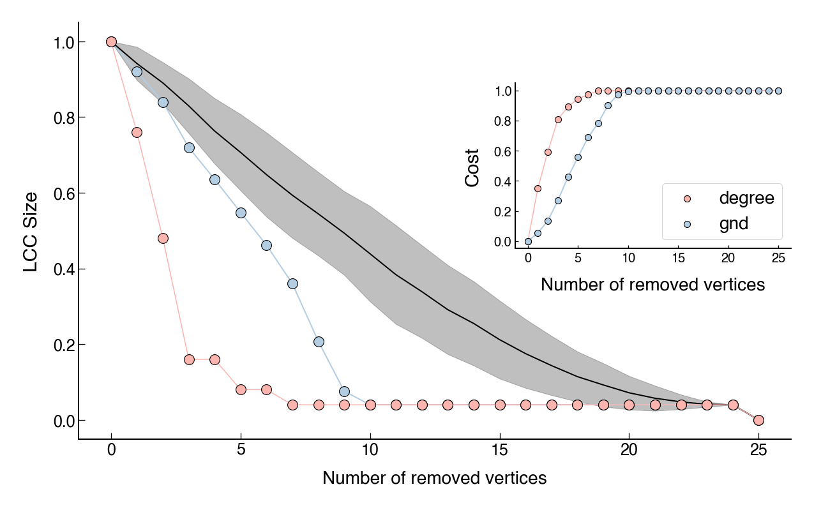
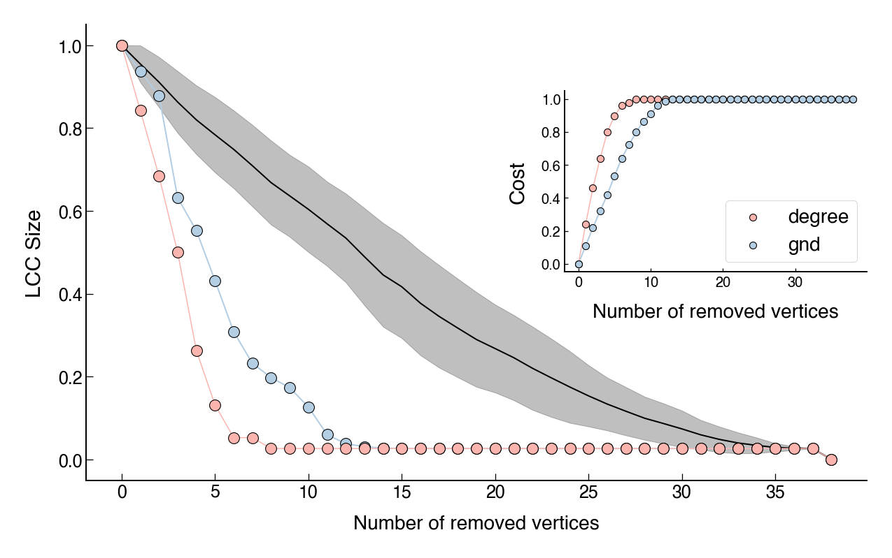

<script type="text/javascript" src="https://d3js.org/d3.v6.min.js"></script>
<!-- <script type="text/javascript" src="js/formatter.js"> </script> -->
<link rel="stylesheet" type="text/css" href="css/style.css">


# POST IN PROGRESS...

Criminal networks are a huge and ubiquitous problem in modern societies. However, effective and general approaches to interrupt the functioning of these networks are still an open problem. In this post, I will be applying a method of network dismantling in four cocaine smuggling networks resulting from 2006-2009 operations in Brazil, Colombia, Mexico, Spain and Uruguay.

<br>

In general, criminal networks are shaped by an efficiency/security trade-off. The 2006 seminal [paper](https://doi.org/10.1016/j.socnet.2006.05.001) by Morselli _et al._ have shown that the network's objective is crucial for determining which side of the trade-off is prioritized. They argue that even though concealment is essential for any criminal activity, these networks are often limited in time-to-task. In this sense, a shorter time-to-task requires a greater efficiency but not as much security, and a longer time-to-task can give the network a greater security but not as much efficiency. The latter is the case of terrorist networks and, on the other side, criminal enterprise networks are examples of the former.

<br>

The efficiency and secrecy can be both easily measured in networks. [Network efficiency](https://en.wikipedia.org/wiki/Efficiency_(network_science)) is related to how well the vertices in a network are able to communicate with each other. On the other hand, the secrecy of a criminal network can be measured using its [network density](https://bookdown.org/omarlizardo/_main/2-9-density.html). As Duijn _et al._ [explains](https://doi.org/10.1038/srep04238), "This measurement is intended to give a sense of how well communication pathways in the network are capable of getting information out to the network's participants". Also, high density means more efficiency since there exist more connections in the network. However, this also represents less security because few people can provide information about a lot of other individuals.  

<br>

When it comes to drug trafficking, the United Nations Office on Drugs and Crime [defines](https://www.unodc.org/unodc/en/drug-trafficking/index.html) drug trafficking as "a global illicit trade involving the cultivation, manufacture, distribution and sale of substances which are subject to drug prohibition laws". From a network perspective, despite immense and increasingly efforts to mitigate and dismantle them, counterdrug interdictions seems to make things [even worse](https://doi.org/10.1073/pnas.1812459116). These types of networks are very adaptive and can respond immediately to attacks. It has been argued, for example, that [some](https://doi.org/10.1038/srep04238) networks might even become more efficient after targeted attacks.

<figure>
    
    <figcaption><b>Figure 1</b>: Main global cocaine flows, 2008. Source: UNODC, World Drug Report 2009.</figcaption>
</figure>

In terms of network dismantling, a naive approach one can imagine for attacking criminal networks is to target the high ranking individuals or the most connected people (highest degree). Technically speaking, this may represent an efficient attack. However, it turns out that the cost of targeting these individuals are substantially greater than attacking the other criminals in the network. Moreover, in times of conflicts these positions are often replaceable by another criminals. These flexibilities in criminal networks makes the efforts of dismantling an arduous task.

<br>

Several approaches have been proposed for the purpose of dismantling networks. These approaches are divided in either link or node removal. [Here](https://www.nature.com/articles/s41598-018-31902-8) you can see a comparative analysis of the main methods currently used in scientific research. In particular, I will be applying a dismantling method proposed in a PNAS paper ([Generalized network dismantling](https://doi.org/10.1073/pnas.1806108116)) on four [Cocaine Smuggling Networks](https://sites.google.com/site/ucinetsoftware/datasets/covert-networks/cocaine-smuggling?authuser=0). The advantage of this method is that it takes into account the cost of attacking the vertices. More specifically, the cost of removing a vertex is its degree centrality.

<br>

The code I used is Petter Holme's [implementation](https://github.com/pholme/gnd/blob/master/gnd.py). Thanks to him, the method proposed by the paper was converted from [C++](https://github.com/renxiaolong/Generalized-Network-Dismantling) to Python 2. I then converted to Python 3 and applied on the networks. My goal here is to examine the dismantling effectiveness of this method on the four networks, comparing the cost when the simplest dismantling approach (removing the highest degree vertices) is applied. 

<br>

# The four operations

The data used here was downloaded from [UCINET](https://sites.google.com/site/ucinetsoftware/home?authuser=0) covert datasets. It contain details about four operations from 2006 to 2009 that resulted in the networks shown below. The short description of each operation was taken from [here](https://sites.google.com/site/ucinetsoftware/datasets/covert-networks/cocaine-smuggling?authuser=0). Unfortunately, I could not find more details about the operations. The networks are shown below[^1].

[^1]: The network visualizations were made using [d3js](https://d3js.org) and the size of each node is proportional to its degree.

<br>

Operation **MAMBO**: The investigation started in 2006 and involved Colombian citizens that were introducing 50 kg of cocaine to be adulterated and distributed in Madrid (Spain). Ultimately, the group was involved in smuggling cocaine from Colombia through Brazil and Uruguay to be distributed in Spain. This is a typical Spanish middle cocaine group acting as wholesale supplier between a South American importer group and retailers in Madrid.

<div id="cocaine_smuggling_1"></div>
<script type="text/javascript" src="js/cocaine_smuggling_1.js"> </script>
<p style="text-align: center"><b>Mambo network</b>: 31 vertices and 58 edges.<p/><br>

Operation **ACERO**: This investigation started in 2007 and involved a smaller family-based group. The group was composed mainly of members of a same family and was led by a female. They distributed cocaine in Madrid (Spain) that was provided to them by other groups based in a northwest region of the country, one of the most active areas in the provision of cocaine from the countries of origin. The group also had their own procedures to launder money.

<div id="cocaine_smuggling_2"></div>
<script type="text/javascript" src="js/cocaine_smuggling_2.js"> </script>
<p style="text-align: center"><b>Acero network</b>: 25 vertices and 37 edges.<p/><br>

Operation **JAKE**: In 2008, the group investigated was operating as a wholesale supplier and retail distributor of cocaine and heroin in a large distribution zone located in Madrid (Spain), where gypsy clans traditionally carry out similar activities. The group was in charge of acquiring, manipulating and selling the drugs in the gypsy quarter.

<div id="cocaine_smuggling_3"></div>
<script type="text/javascript" src="js/cocaine_smuggling_3.js"> </script>
<p style="text-align: center"><b>Jake network</b>: 38 vertices and 50 edges.<p/><br>

Operation **JUANES**: In 2009, the police investigation detected a group involved in the smuggling of cocaine from Mexico to be distributed in Madrid (Spain). In this case, the group operated in close cooperation with another organization that was laundering the illegal income from drug distribution from this and other groups. The cocaine traffickers earned an estimated EUR 60 million.

<div id="cocaine_smuggling_4"></div>
<script type="text/javascript" src="js/cocaine_smuggling_4.js"> </script>
<p style="text-align: center"><b>Juanes network</b>: 51 vertices and 93 edges.<p/><br >

In terms of network metrics, these networks have relatively low [average clustering](https://en.wikipedia.org/wiki/Clustering_coefficient), negative [assortativity](https://en.wikipedia.org/wiki/Assortativity) (which means that high degree nodes have a slight tendency to connect with low degree nodes) and low [density](https://bookdown.org/omarlizardo/_main/2-9-density.html) (which means they are sparse). Because of the size of these networks, a [degree distribution](https://en.wikipedia.org/wiki/Degree_distribution) analysis would not be so meaningful. However, a short preliminary analysis have shown more accordance with free scale distributions when compared to exponential distributions. The community structure analysis was also not very helpful. I have used [infomap](https://www.mapequation.org/infomap/) for coloring the nodes according to each module found in the visualizations above. However, I was not able to find the modules using the [Bayesian SBM](https://graph-tool.skewed.de/static/doc/demos/inference/inference.html).

## Network metrics


```py
smuggling_networks_density

0.125 # Mambo
0.123 # Acero
0.071 # Jake
0.073 # Juanes
```



```py
smuggling_networks_assortativity

-0.088 # Mambo
-0.160 # Acero
-0.173 # Jake 
-0.081 # Juanes
```



```py
smuggling_networks_global_efficiency

0.473 # Mambo
0.481 # Acero
0.420 # Jake
0.373 # Juanes

```



```py
smuggling_networks_average_clustering

0.442 # Mambo
0.268 # Acero
0.110 # Jake
0.364 # Juanes
```


# Network dismantling

Cras hendrerit feugiat ipsum et mattis. Integer eu aliquet sapien. Ut sed elit id neque mollis cursus. Proin vel odio volutpat, hendrerit turpis ut, posuere dolor. Nam non nibh sapien. Proin id dapibus sapien. Nunc venenatis mauris id orci suscipit, a sagittis nunc eleifend. Vestibulum vitae rhoncus urna. Sed non lacus massa.

<br>



<br>

Proin posuere lacus in faucibus rhoncus. Praesent vel mollis arcu. Sed elementum elementum dictum. Fusce interdum massa cursus nisi pellentesque iaculis. Donec pulvinar lacus non dui ultrices, id lobortis mauris dictum. Suspendisse magna sapien, faucibus aliquam posuere sit amet, porttitor vel mi. Quisque pretium molestie dui ut lobortis. Nunc sed arcu dolor. Pellentesque faucibus dolor ut urna eleifend tempus. Etiam egestas sapien sit amet felis vehicula congue. Nullam laoreet semper ligula, at feugiat ligula interdum eget.

## Mambo network

Cras hendrerit feugiat ipsum et mattis. Integer eu aliquet sapien. Ut sed elit id neque mollis cursus. Proin vel odio volutpat, hendrerit turpis ut, posuere dolor. Nam non nibh sapien. Proin id dapibus sapien. Nunc venenatis mauris id orci suscipit, a sagittis nunc eleifend. Vestibulum vitae rhoncus urna. Sed non lacus massa.

<figure>
    
    <figcaption><b>Figure 2</b>: Mambo network dismantling.</figcaption>
</figure>

## Acero network

Cras hendrerit feugiat ipsum et mattis. Integer eu aliquet sapien. Ut sed elit id neque mollis cursus. Proin vel odio volutpat, hendrerit turpis ut, posuere dolor. Nam non nibh sapien. Proin id dapibus sapien. Nunc venenatis mauris id orci suscipit, a sagittis nunc eleifend. Vestibulum vitae rhoncus urna. Sed non lacus massa.

<figure>
    
    <figcaption><b>Figure 3</b>: Acero network dismantling.</figcaption>
</figure>

## Jake network

Cras hendrerit feugiat ipsum et mattis. Integer eu aliquet sapien. Ut sed elit id neque mollis cursus. Proin vel odio volutpat, hendrerit turpis ut, posuere dolor. Nam non nibh sapien. Proin id dapibus sapien. Nunc venenatis mauris id orci suscipit, a sagittis nunc eleifend. Vestibulum vitae rhoncus urna. Sed non lacus massa.

<figure>
    
    <figcaption><b>Figure 4</b>: Jake network dismantling.</figcaption>
</figure>

## Juanes network

Cras hendrerit feugiat ipsum et mattis. Integer eu aliquet sapien. Ut sed elit id neque mollis cursus. Proin vel odio volutpat, hendrerit turpis ut, posuere dolor. Nam non nibh sapien. Proin id dapibus sapien. Nunc venenatis mauris id orci suscipit, a sagittis nunc eleifend. Vestibulum vitae rhoncus urna. Sed non lacus massa.

<figure>
    
    <figcaption><b>Figure 5</b>: Juanes network dismantling</figcaption>
</figure>

I have also studied several other properties of these networks, such as degree distribution. I think i could be able to model these networks using the dual_barabasi_albert_graph model implemented in NetworkX. This is because, even though I haven't proved the networks are scale free, they are closer to it than to exponential distributions, they also have shown negative assortativity, low average clustering e low density. The network below is an example of a random network generated by the dual_barabasi_albert_graph model. You can see the visual similarity. This is something that I could further do more analysis on it, because I think there's something interesting in it.

<br>



<figure>
    
    <figcaption><b>Figure 5</b>: Juanes network dismantling</figcaption>
</figure>
