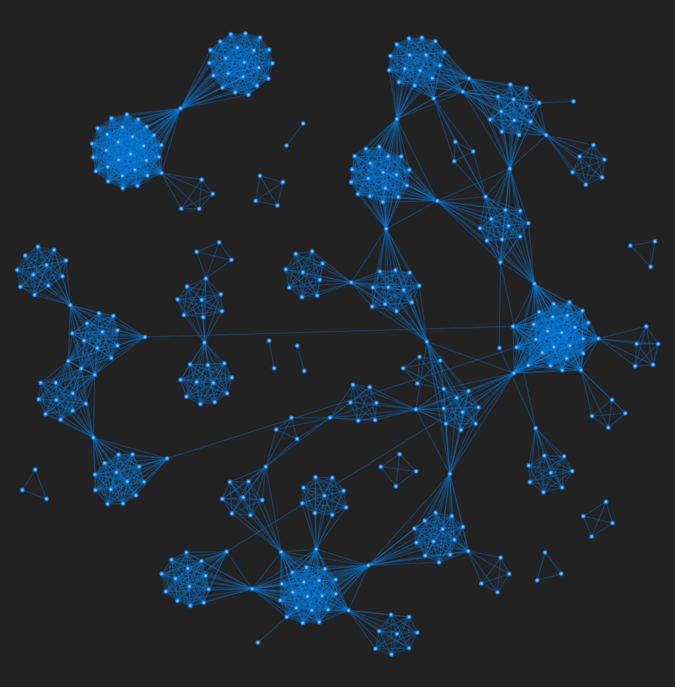

<!--  -->

In this post, I will briefly describe our computational model of political corruption networks. I also present an interactive version of the model and show the code in Python. This model is extensively described and studied in our [publication](https://www.google.com) in Journal X. I also made a [post](https://www.alvarofrancomartins.com/post/corruption-networks) of our main findings on the political corruption networks of Brazil and Spain. If you just want to play with the model networks, skip to [here](#play).

# The model

In summary, we have proposed a model based on two of our main findings about political corruption networks. The first finding is that the **number of people per scandal** is reasonably well described by an exponential distribution with a characteristic number of $1/\lambda \approx 7$ people per scandal. This result was found in both Brazilian and Spanish datasets on corruption scandals.

<br>

The second finding is that the number of **repeat offenders** can be modeled by the following equation.

$$r(n) = \alpha n + \beta,$$
 
where $n$ is the total number of people. The parameters are

- $\alpha$: The recidivism rate (number of repeat offenders / total number of offenders). $\in \[0, 1\]$.
- $\beta$: The regression coefficient. It controls when the repeat offenders starts to appear in the network. $\in \[-\infty, 0\)$.

The networks in our model grows by the addition of "scandals" or [complete graphs](https://en.wikipedia.org/wiki/Complete_graph). The complete graphs (sampled by the exponential distribution with $1/\lambda$) simulate the scandals in the same way that, in a scandal, all individuals involved are connected. As the number of vertices $n$ grows, the number of repeat offenders $r(n)$ also grows and they start to connect different parts of the network. In this sense, the recidivism rate plays an important role on the evolution, structure and dynamics of corruption networks. Therefore, depending on the value of $\alpha$, we get different network structures[^1]. Moreover, since the model is stochastic, every network will be different. 

<br>

And that is basically it [^2]. If you want to see in detail how the model was written, skip to the [algorithm](#algorithm). 

[^1]: The recidivism rate controls, for instance, whether the networks are more or less densely connected.

[^2]: In order to make our model more precise, we also take into account the fraction of repeat offenders that re-offend in more than two cases. Represented as $p_a$, our empirical results show that $p_a \approx 0.024$ in both Brazilian and Spanish corruption networks. 

# Play with the model {#play}

Below you can grow artificial networks generated by our model[^3] and see how it evolves as you keep adding the scandals[^4]. First click in **Start new network** and then keep clicking on **Add new scandal**. You will note that, in the beginning, only complete graphs appear. After a while, however, the repeat offenders will show up and then connect different parts of the network. If eventually the visualization starts to lag, just click in **Start new network** again.

<br>

[^3]: The default $\alpha = 0.142$ is the empirical recidivism rate found in the Brazilian corruption network. The recidivism rate found in the Spanish corruption network is $\alpha = 0.09$. 

[^4]: Keep in mind that, depending on the value of $\alpha$, you will have to add enough complete graphs for the repeat offenders appear and start to connect to the other nodes in the network. That is, if $\alpha \to 1$ then the repeat offenders will appear quickly. On the other hand, when $\alpha \to 0$ you will need to add more complete graphs.



This interactive visualization was made using [visjs](https://visjs.org/), a browser based visualization library. Below you can see a visual comparison between the Brazilian corruption network (Figure 1) and an artificial network generated using our model and the Brazilian recidivism rate (Figure 2).

<div class="parent" style = "display:flex">
<figure>

<figcaption>Figure 1: The Brazilian political corruption network. </figcaption>
</figure>

<figure>

<figcaption >Figure 2: An artificial network generated using our model. </figcaption>
</figure>
</div>

# The model algorithm in Python {#algorithm}

First of all, we need the following packages. 

```py
import numpy          as np
import graph_tool.all as gt

from itertools import combinations
```

After importing these modules, we can then write the model function:

<br>


```py
def generate_net_links(tmax = 100, lambda_ = 7.33, a = 0.09, b = -11.5, proba = 0.024):
    """
    Generate a corruption network based on our model.
    
    Parameters
    ---------

    tmax : int
           Number of iteration steps (default: 100).
    lambda_ : float
           Characteristic number of people per scandal (default: 7.33).
    a, b : float
           Parameters defining the number of repeated agents (nr) as a function
           of total number of agents (n): nr = a*n + b (default: 0.09, -11.5).
    proba : float
            Probability of selecting a repeated agent that was already involved in
            another scandal (default: 0.024091841863485983).

    Returns
    -------
    links_list : list
                 A list of edge lists where each element correspond to
                 a particular iteration step.
    """
    
    t                          = 0
    links                      = []
    links_list                 = []
    agent_names                = set()
    last_agent_index           = 0
    repeated_agent_names       = set()
    total_repeated_agents      = 0
    
    while t < tmax:
        n_new_agents = int(np.round(np.random.exponential(lambda_)))
            
        if n_new_agents > 1:
        
            new_agent_names     = [x for x in np.arange(last_agent_index, last_agent_index + n_new_agents)]
            last_agent_index   += n_new_agents
            
            new_repeated_agents = int(np.round((a*(len(agent_names)) + b - total_repeated_agents)))
            
            if new_repeated_agents > 0:
                for i in range(min(new_repeated_agents, len(new_agent_names))):

                    if (np.random.uniform() <= proba) & (len(repeated_agent_names) > 0):
                        #select from repeated_agent_names
                        repeated_agent = np.random.choice(list(repeated_agent_names))
                    else:
                        #select from agent_names
                        repeated_agent = np.random.choice(list(repeated_agent_names^agent_names))
                        total_repeated_agents += 1

                    new_agent_names[i] = repeated_agent
                    repeated_agent_names.add(repeated_agent)
                    
            for agent_ in new_agent_names:
                agent_names.add(agent_)
            
            new_links = list(combinations(new_agent_names, 2))
            
            links_list += [new_links]
            t          += 1

    return links_list
```


This function returns a list of edge lists where each element correspond to a particular iteration step.

```py
edge_lists = generate_net_links(tmax = 100, a = 0.142) # e.g, [[(0, 1), (0, 3), ... (5, 6)], [(7, 8), (7, 9) ... (14, 15)], ... ]
```

To create the network until step $t$ we need to concatenate these lists. 

```py
def network(t, edges_list):
    g           = gt.Graph(directed = False)
    edge_list_t = np.concatenate(edges_list[:t])
    
    g.add_edge_list(edge_list_t, hashed = True)

    # Since we have not yet dealt with self loops and parallel edges, we will remove them. 
    gt.remove_self_loops(g)
    gt.remove_parallel_edges(g)
    
    return g
```

Now we can finally generate the network until $t$ steps (100 in this case).

```py
final_network = network(100, edge_lists)
final_network
```

> _<Graph object, undirected, with 767 vertices and 4805 edges, at 0x7f2789007d60>_

For now I think that's about it. Please, do not hesitate to contact me in case you want to talk about my work. 