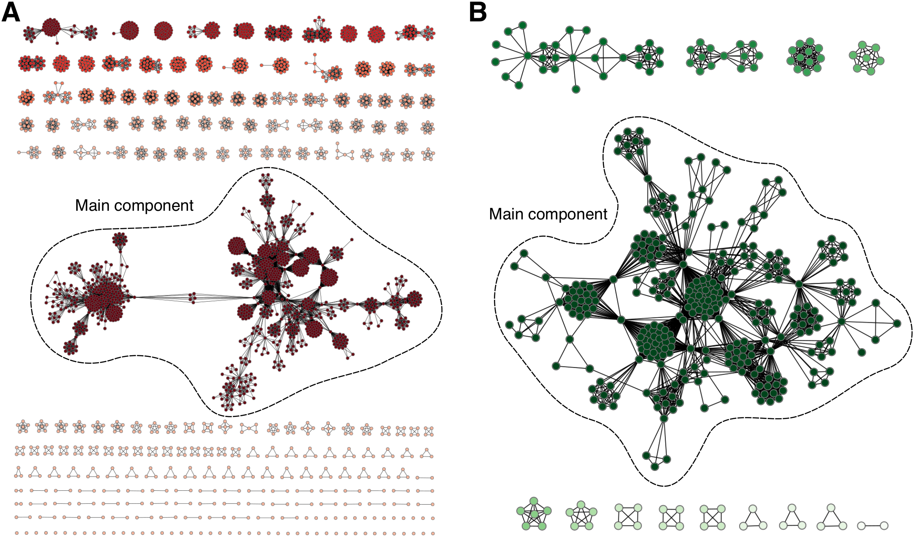
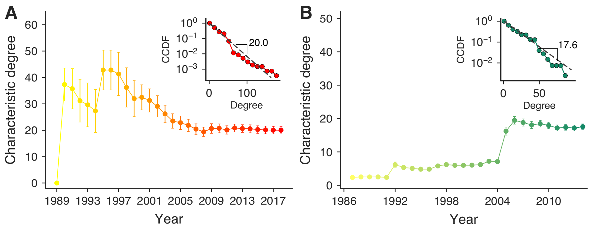

Political corruption is an inherent problem in our societies. Corrupt behavior is a multifaceted phenomenon responsible for a variety of socioeconomic limitations. In general, isolated agents engaged in criminal acts rarely pose a major threat to society. However, this scenario changes completely when we consider, for example, multiple corruption scandals.

 

Although the people involved in corruption obviously want to keep it in secrecy, they do not operate without leaving traces. A natural approach to consider this collective behavior can be taken from a combination of scientific fields, such as network science, complexity science, and data science.

 

Criminal networks are not simply social networks operating in criminal contexts. The interactions within these systems go beyond social norms and are often shaped by trade-offs between concealment and efficiency. Political corruption networks represent an additional layer of complexity. Frequently involving high ranking individuals, a great deal of polarization and many controversies, political corruption weakens democracy, damages political stability and spreads mistrust in the rule of law.

 

In our recent paper [Universality of political corruption networks](https://arxiv.org/abs/2204.05097), we used publicly available data from Brazil and Spain to reveal the underlying patterns of political corruption networks. Our work has revealed fascinating statistical similarities in the growth of these networks. This work include many results I obtained during my master's degree and ongoing PhD. Here I summarize our main findings:

 

1. We have found that, in both countries, the size of corruption scandals is approximately exponentially distributed. These distributions have, on average, roughly 7 people per scandal. Therefore, people tend to act in small groups when they are involved in corruption processes.

<figure>
    
    <figcaption>Figure 1: Complementary cumulative distribution of scandals sizes in (A) Spain and (B) Brazil.</figcaption>
</figure>

2. The networks consist of nodes representing people listed in the scandals and links indicating that two people were involved in the same corruption scandal. These networks share surprising features, such as high clustering coefficients, moderately high assortativity coefficients, and low average shortest path length. 

<figure>
    
    <figcaption>Figure 2: (A) Spanish and (B) Brazilian political corruption networks.</figcaption>
</figure>

3. The networks' degree distributions are well approximated by exponential distributions. Moreover, the characteristic degrees evolved to a similar plateau, roughly with the same average number of connections.

<figure>
    
    <figcaption>Figure 3: Changes in the characteristic degree over the years for (A) Spanish and (B) Brazilian corruption networks. The insets show the cumulative distributions of the vertex degree (on a log-linear scale) for the last year of the networks.</figcaption>
</figure>

4. The networks present community structures where the number of modules is linearly associated with the total number of scandals.

<figure>
    
    <figcaption>Figure 4: (A) Spanish and (B) Brazilian number of modules versus number of scandals.</figcaption>
</figure>

5. The time evolution of the networks are characterized by abrupt changes in the size of the largest connected component, which is due to the coalescence (or connection) of different network components. This process is caused by recidivists (_i.e._, individuals involved in at least two scandals). 

<figure>
    
    <figcaption>Figure 5: Coalescence processes observed in both political corruption networks.</figcaption>
</figure>

6. The number of recidivists is linearly associated with the total number of people. The recidivism rates (number of repeat offenders / total number of offenders) are 9% in Spain and 14.2% in Brazil.

<figure>
    
    <figcaption>Figure 7: Linear relationships between the number of repeat offenders and the total number of people.</figcaption>
</figure>

7. Recidivists are vertices that connect different parts of the network, functioning as brokers (they have the highest betweenness centrality values). In this sense, the recidivism rate plays an important role in the evolution, structure, and dynamics of corruption networks. 

<figure>
    
    <figcaption>Figure 7: Spanish political corruption network showing recidivists nodes in red.</figcaption>
</figure>

8. We have proposed a [computational model](/post/corruption-networks-model/) to simulate corruption networks. The model takes into account two results: the recidivists linear pattern and the size distribution of scandals. We can see below that our model generate networks visually similar to the empirical corruption networks.

<figure>
    
    <figcaption>Figure 8: (A) Spanish and (B) Brazilian political corruption networks. Model simulations of the empirical networks using (C) Spanish and (D) Brazilian recidivism rates. </figcaption>
</figure>

9. More importantly, we have verified that the model is capable of simulating networks with features very similar to those observed in the empirical data.

<figure>
    
    <figcaption>Figure 9: The model generates realistic networks that are able to reproduce the empirical network properties. The degree distributions of the model networks can be reasonably described by exponential degree distributions. Furthermore, the network simulations present a linear relationship between the number of modules and the number of complete graphs. </figcaption>
</figure>

Overall, we have presented a comprehensive investigation of corruption networks related to political scandals in Spain and Brazil over nearly three decades. It is important to remember that these countries have a long history of political corruption and are known worldwide for having huge corruption scandals. 

 

Our results show that corruption networks share universal characteristics that are independent of social and cultural differences among countries. Ultimately, this work emphasizes the influence of recidivists on organized crime, indicating its susceptibility to interventions targeting these criminals.

 

I believe that this work significantly improves the understanding of political corruption networks and organized crime. For more details, please do not hesitate to contact me. I would be happy to talk about my work.