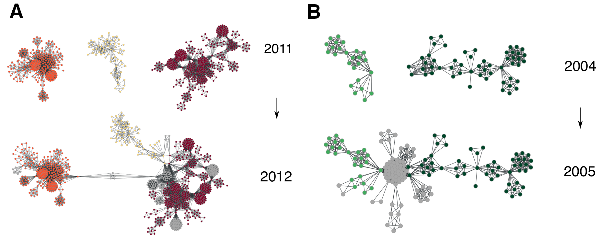
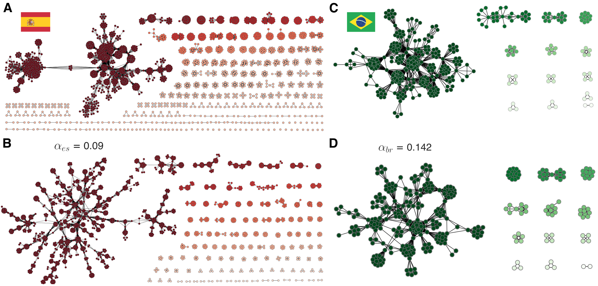

# Our main results

We have studied the corruption networks of Brazil and Spain. Here I present our main findings:

1. The countries have distributions of people per scandal with approximately the same characteristic number ($\approx$ 7 people). It seems, therefore, that people usually act in small groups when involved in corruption processes.

<figure>
    
    <figcaption>Figure 1: Complementary cumulative distribution for the number of people per corruption scandals in Spain (left) and Brazil (right).</figcaption>
</figure>

2. The networks display small-world properties (high clustering coefficient and low average path length). However, corruption agents have tried to increase their distance as these networks have evolved. This result indicates an agreement with the so-called [theory of secret societies](https://www.jstor.org/stable/2095954), in which the evolution of illegal networks is assumed to maximize concealment.

<figure>
    
    <figcaption>Figure 2: Spanish (left) and Brazilian (right) political corruption networks.</figcaption>
</figure>

3. The networks have degree distributions well described by exponential distributions. Moreover, their characteristic degrees have essentially the same evolving pattern.

<figure>
    
    <figcaption>Figure 3: Degree distributions and the characteristic degree evolving behavior.</figcaption>
</figure>

4. The networks present modular structures and the number of modules grows linearly with the number of scandals.

<figure>
    
    <figcaption>Figure 4: Number of modules versus number of scandals.</figcaption>
</figure>

5. The evolution of the networks are characterized by abrupt changes in the size of the largest connected component, which is due to the coalescence (or connection) of different network components. This process is caused by repeat offenders (i.e, individuals that are involved in at least two scandals). 

<figure>
    
    <figcaption>Figure 5: The coalescence processes observed in both political corruption networks.</figcaption>
</figure>

6. The countries have number of repeat offenders that grows linearly with the total number of offenders. The recidivism rates (number of repeat offenders / total number of offenders) are 9% for Spain and 14,2% for Brazil, and stay the same throughout the entire network growth. 

<figure>
    
    <figcaption>Figure 6: The linear relationships between the number of repeat offenders and the total number of people.</figcaption>
</figure>

7. The repeat offenders are able to connect different parts of the network and function as brokers. In this sense, the recidivism rate plays an important role on the evolution, structure and dynamics of corruption networks. The difference in the network metrics (such as density and average path length) are then explained by the difference in the recidivism rates. 

<figure>
    
    <figcaption>Figure 7: Spanish political corruption network with highlighted recidivists.</figcaption>
</figure>

8. We have proposed a model to grow networks that model corruption networks taking into account two simple elements presented above: the linear recidivism pattern and the distribution of people per scandal. 

<figure>
    
    <figcaption>Figure 8: The political corruption networks model behavior.</figcaption>
</figure>

9. Our model have not only produced visually strikingly similar networks to the empirical ones,

<figure>
    
    <figcaption>Figure 9: The model generate artificial networks that are able to reproduce the empirical network properties. </figcaption>
</figure>

10. but it was capable of describing all the evolving patterns (3, 4 and 5) discussed above.

<figure>
    
    <figcaption>Figure 9: The model generate artificial networks that are able to reproduce the empirical network properties. </figcaption>
</figure>

11. but it was capable of describing all the evolving patterns (3, 4 and 5) discussed above.

<figure>
    
    <figcaption>Figure 9: The model generate artificial networks that are able to reproduce the empirical network properties. </figcaption>
</figure>

12. but it was capable of describing all the evolving patterns (3, 4 and 5) discussed above.

<figure>
    
    <figcaption>Figure 9: The model generate artificial networks that are able to reproduce the empirical network properties. </figcaption>
</figure>

All our results are better described in our [publication](https://www.google.com) in the Journal X. Also, an interactive version of our model is available [here](https://alvarofrancomartins.com/post/corruption-networks-model/).