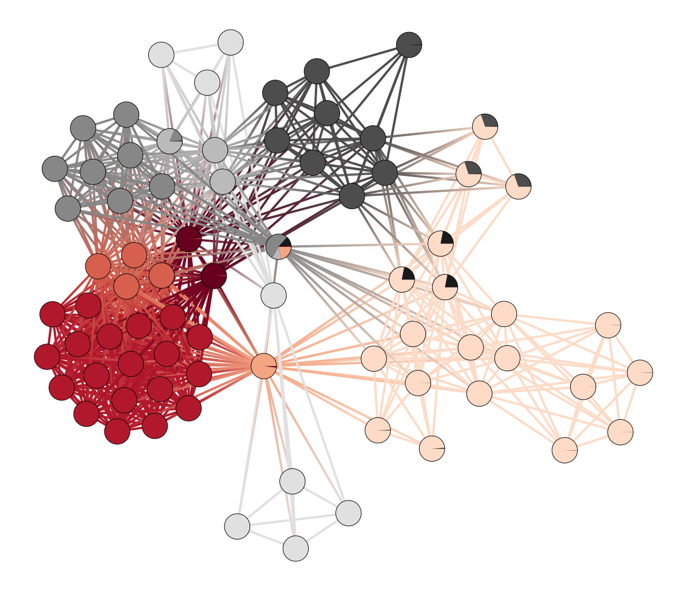

<!--  -->
<link rel="stylesheet" type="text/css" href="css/style.css">

Nessa postagem apresento uma perspectiva inédita para entender as relações entre os citados pela CPI da COVID-19. Essa comissão parlamentar de inquérito apresenta uma rede de supostos envolvidos em diversos crimes, entre eles _corrupção ativa_, _charlatanismo_, _prevaricação_ e _fraude_. Todas as informações são de público acesso e foram coletadas do [portal G1](https://g1.globo.com/politica/cpi-da-covid/noticia/2021/10/20/cpi-da-covid-crimes-atribuidos-lista.ghtml).

 

Nossa análise terá o enfoque da [ciência de redes](https://en.wikipedia.org/wiki/Network_science). A representação de dados em grafos fornece uma abordagem poderosa, capaz de revelar padrões e estruturas não triviais entre agentes que possuem alguma relação de conexão. A CPI da COVID apresenta **24 acusações** e **78 nomes** citados, resultando em um total de **695 conexões**. Por meio de ferramentas advindas da teoria dos grafos, elaboramos uma visualização dessa rede, calculamos algumas medidas de centralidade e mostramos que ela possui uma estrutura de comunidades.

# A rede da CPI da COVID

Uma rede (ou grafo) é composta por vértices (pessoas, no nosso caso) e ligações entre esses vértices. Aqui, a ligação entre duas pessoas ocorre se elas foram acusadas de um mesmo crime. Abaixo eu apresento uma visualização interativa dessa rede, com 75 nomes[^1] e 695 conexões. O tamanho de cada vértice é proporcional ao número de ligações e, passando o mouse sobre alguns dos vértices, você pode visualizar as suas quantidades de conexões e indiciações.

[^1]: Do total de 78 citados, três deles estão citados separadamente em três diferentes supostos crimes. Uma vez que esses vértices são isolados, não os incluímos na rede e, portanto, o número de vértices se reduz a 75.

<b>Rede da CPI da COVID</b>: 24 acusações, 75 vértices e 695 conexões.
 

# Medidas de Centralidade

## Grau

A centralidade de **grau** oferece uma das grandezas mais básicas de redes. O grau de um vértice representa simplesmente seu número de conexões. Valores mais altos dessa grandeza indicam **indivíduos populares** e que possuem uma **posição privilegiada** na rede.   

 

<b>Figura 1</b>: Dez vértices da rede que possuem os maiores valores de <b>grau</b>.
 

## Intermediação

A **intermediação** quantifica o número de vezes que um vértice age como ponte de comunicação entre dois vértices quaisquer da rede. Ou ainda, essa medida para um determinado vértice representa a quantidade de vezes que ele atua como intermediário das comunicações. Pessoas com alto valor de intermediação conseguem **transmitir informações com facilidade** e também têm tendência de serem **bem informados**. 

 

<b>Figura 2</b>: Dez vértices da rede que possuem os maiores valores de <b>intermediação</b>.
 

## Proximidade

A **proximidade** de um vértice quantifica sua distância média em relação a todas os outros vértices. Assim, pessoas com maiores valores de proximidade estão, em média, **mais perto de todas** as outras pessoas. Numa rede social, por exemplo, a pessoa com maior proximidade, assim como para intermediação, consegue **disseminar melhor as informações**.

  

<b>Figura 3</b>: Dez vértices da rede que possuem os maiores valores de <b>proximidade</b>.
 

Apesar de aparentarem serem medidas parecidas, a intermediação e a proximidade medem características diferentes: a intermediação fornece um quantitativo de **quantos caminhos** passam por determinado vértice durante a comunicação entre todos os vértices da rede; a proximidade, por outro lado, quantifica a **distância média** de um vértice em relação aos demais vértices. Podemos dizer que pessoas com maior intermediação (ou proximidade) possuem influência considerável na rede por virtude de seu **controle sobre a informação que circula**. 

 

# Estrutura de Comunidades

A estrutura de comunidades (ou módulos) é uma propriedade encontrada em diversos tipos de redes. De forma simplificada, esses módulos ou comunidades podem ser pensados como **grupos de vértices mais densamente conectados** entre si do que com outros grupos de vértices da rede. A detecção dessas estruturas pode fornecer informações importantes. Em geral, redes e organizações criminosas possuem a tendência de formar comunidades com a finalidade de reduzir o risco de vazamento de informações. 

 

Com o objetivo de encontrar a estrutura de comunidades da rede da CPI, utilizamos o modelo bayesiano de blocos estocásticos (SBM)[^2]. A <b>Figura 4</b> mostra a rede da CPI da COVID com sua estrutura modular em destaque. Nessa figura, as cores representam diferentes comunidades e os círculos dos vértices são divididos segundo a probabilidade de estar na comunidade associada à respectiva cor.

[^2]: [Inferring modular network structure](https://graph-tool.skewed.de/static/doc/demos/inference/inference.html).

<figure>
    
    <figcaption><b>Figura 4</b>: Visualização da estrutura modular da rede.</figcaption>
</figure>

De imediato, notamos que existe um número muito menor de comunidades do que de supostos crimes. A rede dessa figura possui 9 comunidades. Uma vez que estamos interessados no número de comunidades da rede, devemos saber que o modelo SBM é intrinsecamente aleatório e pode retornar números de comunidades ligeiramente diferentes a cada realização. Considerando esse aspecto, podemos fazer várias realizações do modelo[^3], obter a distribuição de probabilidade do número de módulos e usar sua média como indicador do número de módulos da rede. A <b>Figura 5</b> mostra essa distribuição.

[^3]: Essa distribuição foi obtida após 1000 realizações do SBM.

 
 

<b>Figura 5</b>: Probabilidade do número de módulos da rede da CPI.
 

 

Portanto, em média, foram encontradas **9 comunidades** para a rede da CPI da COVID. No entanto, o número de supostos crimes é quase o triplo disso, o que significa que vários desses poderiam ser considerados como um só.
 

Por último, deixo aqui, em forma de tabela, os dados completos que foram coletados para criar a rede da CPI. Abaixo você encontra duas tabelas para uma checagem rápida dos acusados e seus supostos crimes.

 

<h2 style="text-align: center;">Acusados e seus supostos crimes</h2>

 



 

<h2 style="text-align: center;">Acusados que compartilham as mesmas acusações</h2>

 



 

Dessa forma, fornecendo uma compreensão mais profunda sobre a relação entre os citados pela CPI.

What's next?