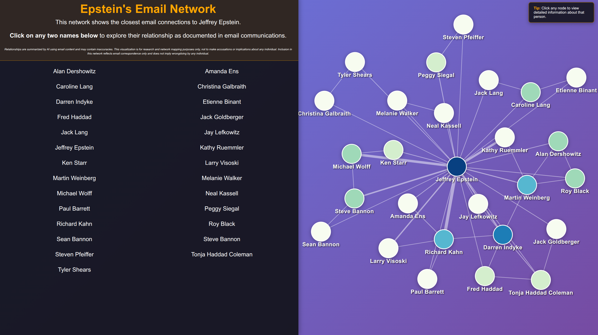

## Overview

This post combines advanced graph analysis with artificial intelligence to visualize and understand email communication networks. The visualization uses k-core decomposition to identify densely connected groups and leverages large language models to automatically generate relationship summaries from email content. <a href="https://alvarofrancomartins.com/post/epstein_email_network/network_undirected.html" target="_blank">Click here</a> to explore the network and its connections.

## Methodology

After (a lot of data cleaning) I created the entire directed network (connecting people where emails from to). Then I identified influential nodes and cohesive extracted using k-core[^1] graph algorithm. 

[^1]: K-core decomposition is a graph algorithm that identifies the most densely connected subgraph by iteratively removing nodes with fewer connections than a threshold k. This approach reveals the core group of individuals with the strongest communication ties, filtering out peripheral connections to focus on the most interconnected network members. The algorithm works by progressively peeling away outer layers of the network until only the densest core remains. This provides a natural way to identify influential nodes and cohesive subgroups within large communication networks.

 

The distinctive feature of this visualization is the integration of large language models to automatically generate relationship summaries between any two individuals. When selecting two people in the network, the system analyzes their complete email history and produces a natural language summary of their documented interactions.
This represents a novel application of AI to communication analysis. Rather than manually reading through potentially hundreds of emails, the LLM synthesizes the relationship dynamics, key topics discussed, and interaction patterns into concise summaries. This approach enables network analysis at scale while preserving qualitative insights from the correspondence.

 

Users can explore the network by selecting pairs of individuals to view their relationship details, or clicking individual nodes to access biographical information. The interface highlights connected nodes and edges dynamically, making it easy to understand local network structure around any person.

## Disclaimer

Inclusion in this network reflects email correspondence only and does not imply wrongdoing by any individual. Relationships are summarized by AI using email content and may contain inaccuracies. This visualization is for research and network mapping purposes only, not to make accusations or implications about any individual shown.