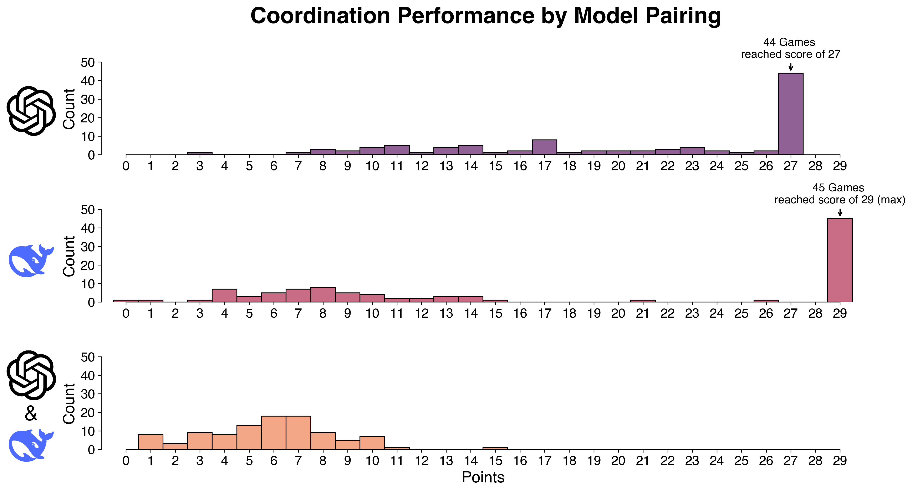
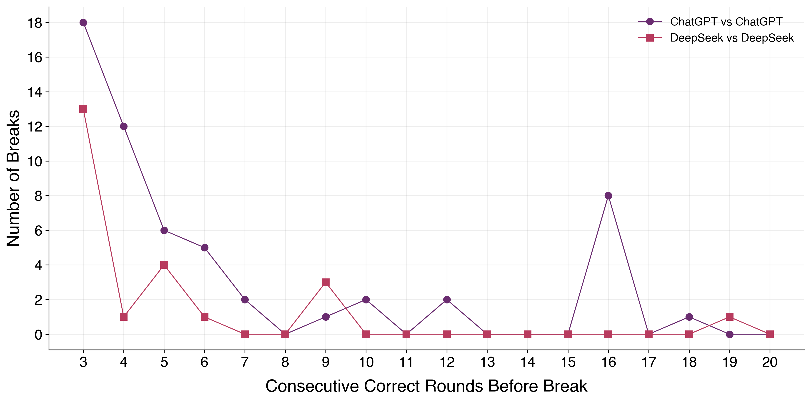

<link rel="stylesheet" type="text/css" href="css/style.css">

## Overview

This project evaluates the coordination capabilities of large language models (LLMs) through a simple game. Two AI agents must independently discover and maintain a two-color alternating sequence without any communication.

## Game Mechanics

**Rules**
- Two agents choose either red or blue each round;
- Agents cannot communicate or see each other's reasoning. Each agent only sees the history of color choices made by both players and minimal feedback: "Correct", "Wrong pattern", or "Waiting for next round" (if it's the first round).
 

Points are scored based on a simple color alternation pattern:

 

| Round | Player 1 | Player 2 | Feedback | Score |
|:-----:|:--------:|:--------:|:---------|:-----:|
| 1 | 🔵 | 🔵 | Waiting for next round to verify pattern | 0 |
| 2 | 🔴 | 🔴 | Correct! +1 point | 1 |
| 3 | 🔵 | 🔵 | Correct! +1 point | 2 |
| 4 | 🔴 | 🔴 | Correct! +1 point | 3 |

 

The first color does not matter, as long as agents chose the same and keep alternating them. More specifically, points are awarded when three conditions are met:

1. Previous round: both agents matched colors;
2. Current round: both agents matched colors;
3. Colors differ between the two rounds.
 

Another example:

 

| Round | Player 1 | Player 2 | Feedback | Score |
|:-----:|:--------:|:--------:|:---------|:-----:|
| 1 | 🔴 | 🔴 | Waiting for next round to verify pattern | 0 |
| 2 | 🔵 | 🔵 | Correct! +1 point | 1 |
| 3 | 🔵 | 🔵 | Wrong pattern | 1 |
| 4 | 🔴 | 🔴 | Correct! +1 point | 2 |

 

There is no communication between agents. Agents should infer the pattern from minimal feedback. In order to win the game, agents must excel at sustained coordination. That is to say, both choosing the same color and also switching colors together. 
 

## Methodology
 

I employed GPT-5.1 and DeepSeek (chat versions only, not reasoning models), using each model's default temperature. Three game modes were performed: ChatGPT versus ChatGPT, DeepSeek versus DeepSeek and Mixed (ChatGPT versus DeepSeek).

 

Each game ran for 30 rounds, giving a **maximum possible score** of 29 points because the first round has no previous round for comparison. I collected data from 100 games per mode. Therefore, each game mode could accumulate up to 2,900 points (100 games × 29 points).

 

I stored all game data in JSON files (one file per game) containing: the round number, both agents' color choices along with their reasoning (limited to 15 words), the current cumulative score, and each agent's identity (ChatGPT or DeepSeek). The reasoning is what the model returns in response to the following prompt: "Explain in 15 words or less why you chose that color based on the pattern". For more details, see `flag_game.py` in the [GitHub repository](https://github.com/alvarofrancomartins/LLMs-coordination).



## Results

### Summary Statistics Table
 

| Game Mode | Games | Median Score |Total Points | Total Points Percentage | Success Rate|
|:-----------:|:-------:|:--------------:|:--------------:|:-------------:| :-------------:|
| **ChatGPT vs ChatGPT** | 100 | 23.0 | 2,073 | 71% | 0% |
| **DeepSeek vs DeepSeek** | 100 | 14.0 |  1,769| 61%| 45% |
| **Mixed (GPT vs DeepSeek)** | 100 | 6.0 |  585 | 20%| 0% |

 

- Total Points represents the cumulative score across all 100 games;
- Total Points Percentage is the proportion of maximum achievable (2,900) points;
- Success Rate indicates the proportion of games that achieved a perfect score (29/29 points). 
 

### Histogram analysis
 
The graph below shows the scoring histograms for each game mode.

The differences are astounding! First, ChatGPT playing with itself never achieves a perfect score, reaching a maximum of 27 points in 44% of games. In contrast, DeepSeek reaches the maximum score of 29 points 45% of the time. 

 

However, ChatGPT versus itself is more consistent than DeepSeek. ChatGPT usually (in 60% of the games) guarantees scores of 20+ points, whereas DeepSeek's scoring distribution is bimodal: sometimes it finds the pattern and locks in perfectly, while other times it struggles a lot.

 

Finally, when ChatGPT and DeepSeek play together, they perform extremely poorly, reaching a maximum of only 15 points with an even lower median of 6 points. This is surprising because, even though they don't communicate, their choices (Red, Blue, etc.) still seem to capture how each model thinks. And as we're seeing, they can't find common ground or coordinate well. This suggests cross-model coordination isn't just difficult, it's fundamentally broken, with neither model able to adapt to the other's coordination style.

 

Overall, DeepSeek achieved more perfect scores, but ChatGPT's median (23.0) exceeds DeepSeek's (14.0), and its total points (2,073 vs 1,769) demonstrate that consistency beats occasional perfection in coordination tasks.

### Coordination breaks
 

The next graph reveals fundamental differences between the models' ability to maintain coordination once established. Analysis of consecutive correct rounds before coordination breaks shows that ChatGPT is less reliable than DeepSeek once it locks onto the correct pattern.

We can see that even after getting 3, 4 or more consecutive correct rounds, they still break the coordination. Most surprisingly, there are 8 distinct games where ChatGPT breaks the coordination after exactly 16 consecutive correct rounds. Overall, DeepSeek breaks the coordination fewer times than ChatGPT.

 

There's a trade-off, though. ChatGPT's questioning nature helps it recover from early mistakes (leading to higher median performance). DeepSeek's commitment yields perfection when correct but failure when wrong.

### Reasoning Pattern Analysis

Beyond the scores, examining how each model thinks about the problem reveals differences in their strategies.

#### ChatGPT's Reasoning: Structured Abstraction

ChatGPT is systematically testing hypotheses and formalizing the pattern as a two-round cycle. This methodical strategy leads to high consistency, allowing ChatGPT to converge on the correct pattern even when initial rounds fail. The model demonstrates gradual convergence (it never starts scoring at round 2), iteratively refining its hypothesis about the pattern through careful observation and adjustment. Even when struggling initially, ChatGPT eventually identifies the underlying structure, rarely experiencing complete failure.

 

ChatGPT's weakness stems from this tendency to overthink. Agents debate whether the rule demands single-round alternation (R, B, R, B...), paired repetition (RR, BB, RR, BB...), or round-number dependency (odd=Red, even=Blue). This internal debate causes desynchronization when partners interpret the pattern differently. For example, one agent might reason *"Pattern seems Red then Blue; last round started Red, so continue Red now"* while its partner concludes the opposite, breaking coordination despite both understanding the general structure.

#### DeepSeek's Reasoning: Binary Lock-On

DeepSeek takes a different approach through rapid hypothesis formation, committing immediately to the first plausible pattern interpretation. This decisive strategy produces extreme bimodality: the model either discovers the pattern instantly or rarely recovers from an incorrect initial guess. The results demonstrate a binary performance: 45 perfect games (29/29 points) contrasted against 53 failed games (0-15 points), with virtually no middle ground. Only 2 games scored between 16-28 points, highlighting the all-or-nothing nature of DeepSeek's coordination strategy.

 

DeepSeek exhibits two distinct cognitive modes with little recovery mechanism. In success mode (45% of games), it start scoring immediately at round 2 and locks onto the simplest pattern (*"alternating Red, Blue each round"*), maintaining perfect execution from round 2 onward with unwavering commitment. In failure mode (55% of games), sometimes it fixates on complex counting mechanisms (*"both Blue every third round"*) and never converges on the correct pattern. Once committed to an incorrect hypothesis, there is no recovery mechanism - the model continues exploring the wrong theory for all 30 rounds, with reasoning like *"Pattern scores every third round when both choose Blue"* persisting despite consistent negative feedback.

#### Cross-Model Coordination Fails Consistently

The mixed-model games reveal a fundamental incompatibility between the two coordination strategies. ChatGPT uses a gradual convergence strategy, building understanding through iterative refinement, while DeepSeek employs either immediate lock-on or seemingly random exploration. These incompatible approaches prevent alignment even when one model correctly understands the pattern - the other simply doesn't adapt to match its partner's coordination style.

 

The results reflect this breakdown: no game exceeded 15 points out of a possible 29. Neither model's individual strengths compensate for the coordination failure, suggesting that successful coordination requires not just pattern recognition, but shared cognitive processes that enable implicit synchronization.

 

Since agents only see actions (not reasoning), coordination should be model-agnostic. But results show strong model-pairing effects.

## Limitations

- Limited number of games: To properly validate the results, I would need to run many more games, but I stopped at 100 because ChatGPT API is relatively expensive;
- Single pattern: Only tested one specific coordination pattern;
- No communication: More sophisticated coordination might involve communication;
- Temperature settings: Used default temperature; performance may vary with explicit temperature control;
- Model versions: Results specific to GPT-5.1 and DeepSeek-V3 as of November 2025.
 

## Future Directions

- Increase the number of games and rounds;
- Use LLMs with reasoning (CoT) capabilities. This will likely improve their performance;
- Test other coordination patterns;
- Analyze reasoning quality using another LLM as evaluation;
- Compare performance at different temperature settings;
- Test with other leading models (Claude, Gemini, Kimi, etc.).
 

## Closing thoughts

This experiment demonstrates that LLM coordination capabilities vary significantly across models and even simple consecutive decisions such as choosing red or blue still carry their own biases.

- GPT-5.1 excels at reliable, consistent coordination;
- DeepSeek-V3 shows extreme bimodal performance with either perfect success or poor performance;
- Cross-model coordination remains broken.

Coordination is an emergent phenomena that current LLMs cannot execute reliably. Despite some success in same-model pairings, the complete failure of cross-model coordination and frequent breakdowns even after correct pattern identification suggest LLMs lack the underlying mechanisms necessary for robust coordinated behavior.

 

This project regards a specific kind of game with rather specific rules, but I reckon the main takeaway is that if you're deploying multiple agents for a given task, using the same model is preferable.

---
>  Project Date: November, 2025   
Models Tested: ChatGPT-5.1, DeepSeek-V3  
Total Games Analyzed: 300 games (9,000 rounds)  
Code: Python with OpenAI-compatible API