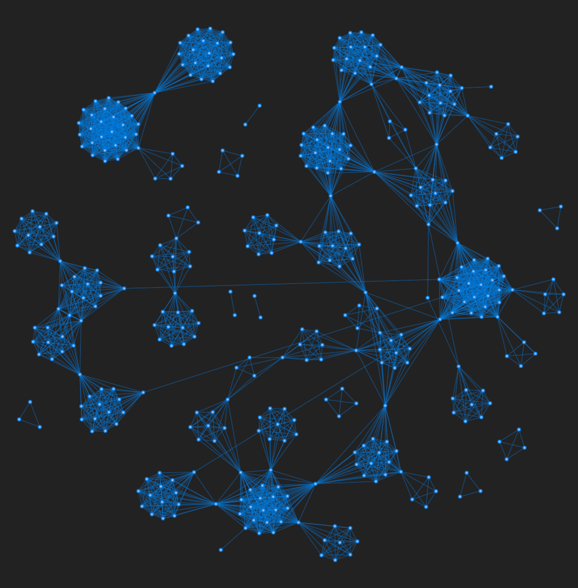

Nesse post irei brevemente descrever nosso modelo computacional de redes de corrupção política. Também apresentarei uma versão interativa do modelo e seu código em Python. Esse modelo foi descrito e estudado na nossa [publicação](https://www.google.com) no Journal X. Eu também fiz uma [postagem](https://www.alvarofrancomartins.com/post/corruption-networks) dos nossos principais resultados relacionados às redes de corrupção do Brasil e da Espanha. Caso você queira apenas interagir com o modelo, pule pra [cá](#play).

# O modelo computacional

De forma geral, propusemos um modelo baseado em dois dos nossos principais resultados sobre redes de corrupção política. A nossa primeira descoberta foi que o número de pessoas por escândalo pode ser razoavelmente bem descrito por uma distribui-ção exponencial com valor característico de aproximadamente 7 pessoas. Esse resultado foi encontrado em ambas as base de dados (brasileira e espanhola) sobre escândalos de corrupção.

Nosso segundo resultado é que o número de pessoas reincidentes em corrupção pode ser modelada pela seguinte equação.

$$r(n) = \alpha n + \beta,$$
 
onde $n$ é o número total de pessoas e os parâmetros acima são

- $\alpha$: Taxa de reincidência criminosa (número de reincidentes / número total de criminosos). $\in \[0, 1\]$.
- $\beta$: O coeficiente linear. Esse coeficiente controla quando os reincidentes começam a surgir na rede. $\in \[-\infty, 0\)$.

As redes no nosso modelo crescem com a adição de "escândalos" ou [grafos completos](https://en.wikipedia.org/wiki/Complete_graph). Os grafos completos (com tamanho amostrado pela distribuição exponencial do número de pessoas comentado acima) simulam escândalos de corrupção da mesma forma que, em um escândalo, todos seus envolvidos estão conectados. Ao passo que o número de vértices $n$ cresce, o número de reincidentes $r(n)$ também cresce. Esses reincidentes então conectam diferentes partes da rede. Dependendo do valor de $\alpha$, obtém-se diferentes estruturas de rede[^1]. Uma vez que o modelo é estocástico, cada nova rede gerada será diferente.

[^1]: Os envolvidos reincidentes são capazes de conectar diferentes partes da rede. Quanto maior a taxa de reincidência $\alpha$, mais densamente conectada será a rede. Por outro lado, se $\alpha$ é pequeno ($<0.065$) a rede será esparsamente conectada, com um número maior de componentes.

E é basicamente isso[^2]. Caso você queira saber em detalhes como o modelo foi escrito, pule para o [algoritmo](#algorithm). 

[^2]: Para deixar o modelo mais preciso, nós também levamos em conta a fração do número de reincidentes que reofendem em mais de dois casos. Representado como $p_a$, nossos resultados empíricos mostraram que $p_a \approx 0.024$ nas duas redes de corrupção brasileira e espanhola.

# Interaja com o modelo {#play}

Abaixo você pode crescer as redes artificiais geradas pelo modelo[^3] e ver como elas se desenvolvem ao passo que você adiciona novos escândalos[^4]. Primeiramente, clique em **Iniciar nova rede** e depois clique diversas vezes em **Adicionar novo escândalo**. Você vai notar que inicialmente surgem apenas grafos completos. No entanto, depois de um tempo, os reincidentes começarão a aparecer e então eles irão conectar diferentes partes da rede.  Se depois de um tempo a visualização começar a ficar lenta, clique novamente em **Iniciar nova rede**.

[^3]: O valor de $\alpha = 0.142$ é o valor empírico da taxa de reincidência para a rede de corrupção brasileira. A taxa de reincidência da rede de corrupção espanhola é $\alpha = 0.09$  

[^4]: Tenha em mente que dependendo do valor de $\alpha$, irá demorar um pouco para que os reincidentes comecem a surgir. Isto é, se $\alpha \to 1$ então os reincidentes irão aparecer logo no início. Por outro lado, quando $\alpha \to 0$, você precisará adicionar bastantes grafos completos até que eles apareçam.

<br>



Essa visualização interativa foi criada utilizando a biblioteca de Javascript [visjs](https://visjs.org/). Abaixo você pode ver uma comparação visual entre a verdadeira rede de corrupção brasileira (Figura 1) e uma simulação do nosso modelo utilizando o valor de reincidência empírico (Figura 2). 

<div class="parent" style = "display:flex">
<figure>

<figcaption>Figura 1: Rede brasileira de corrupção política. </figcaption>
</figure>

<figure>

<figcaption >Figura 2: Rede artificial gerada pelo nosso modelo usando a taxa de reincidência brasileira. </figcaption>
</figure>
</div>

# Código do modelo em Python {#algorithm}

Para escrever e usar o modelo, precisamos das seguintes bibliotecas. 

```py
import numpy          as np
import graph_tool.all as gt

from itertools import combinations
```

Depois de importá-las, podemos escrever a função que gera as redes do modelo:

<br>


```py
def generate_net_links(tmax = 100, lambda_ = 7.33, a = 0.09, b = -11.5, proba = 0.024):
    """
    Generate a corruption network based on our model.
    
    Parameters
    ---------

    tmax : int
           Number of iteration steps (default: 100).
    lambda_ : float
           Characteristic number of people per scandal (default: 7.33).
    a, b : float
           Parameters defining the number of repeated agents (nr) as a function
           of total number of agents (n): nr = a*n + b (default: 0.09, -11.5).
    proba : float
            Probability of selecting a repeated agent that was already involved in
            another scandal (default: 0.024091841863485983).

    Returns
    -------
    links_list : list
                 A list of edge lists where each element correspond to
                 a particular iteration step.
    """
    
    t                          = 0
    links                      = []
    links_list                 = []
    agent_names                = set()
    last_agent_index           = 0
    repeated_agent_names       = set()
    total_repeated_agents      = 0
    
    while t < tmax:
        n_new_agents = int(np.round(np.random.exponential(lambda_)))
            
        if n_new_agents > 1:
        
            new_agent_names     = [x for x in np.arange(last_agent_index, last_agent_index + n_new_agents)]
            last_agent_index   += n_new_agents
            
            new_repeated_agents = int(np.round((a*(len(agent_names)) + b - total_repeated_agents)))
            
            if new_repeated_agents > 0:
                for i in range(min(new_repeated_agents, len(new_agent_names))):

                    if (np.random.uniform() <= proba) & (len(repeated_agent_names) > 0):
                        #select from repeated_agent_names
                        repeated_agent = np.random.choice(list(repeated_agent_names))
                    else:
                        #select from agent_names
                        repeated_agent = np.random.choice(list(repeated_agent_names^agent_names))
                        total_repeated_agents += 1

                    new_agent_names[i] = repeated_agent
                    repeated_agent_names.add(repeated_agent)
                    
            for agent_ in new_agent_names:
                agent_names.add(agent_)
            
            new_links = list(combinations(new_agent_names, 2))
            
            links_list += [new_links]
            t          += 1

    return links_list
```


Esse função returna uma lista de listas de ligações onde cada elemento corresponde a uma determinada iteração. Por exemplo, 

```py
edge_lists = generate_net_links(tmax = 100, a = 0.142) # e.g, [[(0, 1), (0, 3), ... (5, 6)], [(7, 8), (7, 9) ... (14, 15)], ... ]
```

Para criar a rede até o passo $t$, precisamos concatenar essas listas:

```py
def network(t, edges_list):
    g           = gt.Graph(directed = False)
    edge_list_t = np.concatenate(edges_list[:t])
    
    g.add_edge_list(edge_list_t, hashed = True)

    # Since we have not yet dealt with self loops and parallel edges, we will remove them. 
    gt.remove_self_loops(g)
    gt.remove_parallel_edges(g)
    
    return g
```

Agora podemos finalmente gerar a rede até o passo $t$ (que nesse caso é igual a 100).

```py
final_network = network(100, edge_lists)
final_network
```

> _<Graph object, undirected, with 767 vertices and 4805 edges, at 0x7f2789007d60>_
