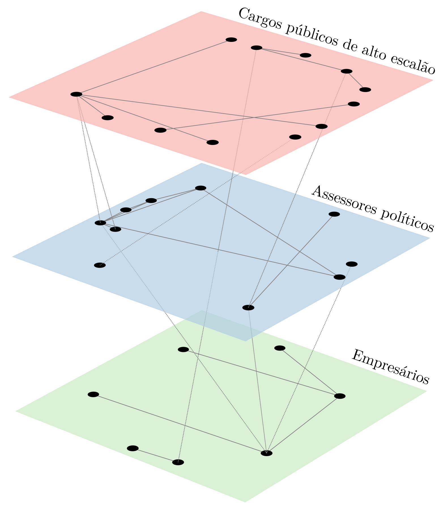

<!--  -->

From proteins interactions to global airlines routes, networks are ubiquitous. This type of structured data have shown to yield the [most interest](http://networksciencebook.com/chapter/1#forces-helped) framework in which we can study complex phenomena. In its most basic form, a network is composed of vertices and edges that represent some type of relationship between these vertices. But don't be fooled by its simplicity. Surprisingly [complex patterns](https://www.nature.com/articles/srep09450) can emerge from set of abstractions. 

<!-- There's a myriad of data analysis one could apply on network data. In addition, particularly when we consider the diversity of information that we can deal using network analysis, the study of these networks become too broad. -->

<!-- The subject of network data analysis is, in its essence, interdisciplinar. -->

 

Considering these aspects, in this post I will present the article [Nine quick tips for analyzing network data](https://journals.plos.org/ploscompbiol/article?id=10.1371/journal.pcbi.1007434), written by Vincent Miele _et al_. This paper points out several tips on how to better approach and analyze network data.  

# When to use networks

Donec egestas, sapien a cursus pretium, leo est ultrices ex, egestas aliquet metus elit nec magna. Donec hendrerit mi a leo maximus vehicula. Quisque justo purus, pellentesque sit amet augue vitae, molestie tempus orci. Orci varius natoque penatibus et magnis dis parturient montes, nascetur ridiculus mus. Integer faucibus justo sit amet faucibus egestas. Fusce elementum elementum congue. Aenean finibus magna ultricies nibh varius, elementum ornare lacus dignissim.

# Network data categorization

Ut faucibus odio quis blandit tempus. Donec non dolor a arcu luctus imperdiet eget non velit. Sed non lacinia mauris, ut lacinia turpis. Donec feugiat sapien sed feugiat malesuada. Proin semper cursus risus, ut malesuada mauris ullamcorper eu. Mauris ultrices neque magna, ut tincidunt mi aliquet in. Integer ut venenatis quam. Donec et porta augue. Fusce eleifend purus nec augue egestas, sit amet laoreet quam sodales. Mauris consequat pellentesque sapien, laoreet sollicitudin magna auctor eget.

# Network analysis tools

Donec vitae ante orci. Phasellus et sapien non ipsum fringilla mollis. Nunc sodales, dolor ut maximus congue, justo justo congue enim, in sodales dui metus eu lorem. Suspendisse mattis cursus ipsum, vel vehicula nunc efficitur id. Morbi vehicula eget sem quis ullamcorper. Vivamus elementum magna sed mauris ornare, eget mattis velit sagittis. Ut felis nibh, dignissim quis nibh nec, consequat cursus erat. Pellentesque nec ante sit amet ipsum aliquam dapibus at ac neque. Morbi et accumsan justo.

Vivamus aliquet tempor vestibulum. Suspendisse semper lobortis euismod. Integer convallis mi a justo ullamcorper porta. Ut hendrerit sodales placerat. Maecenas sodales sollicitudin dolor, sit amet dapibus est tincidunt ullamcorper. Aenean vehicula laoreet varius. Morbi vehicula et odio nec elementum. Suspendisse potenti. Nunc nisi diam, pretium eget sollicitudin in, pretium in eros. Etiam eget sapien elit.

# Careful with network visualizations

Aenean vel rutrum sapien, vel congue neque. Morbi non scelerisque orci. Cras in libero vitae eros feugiat dignissim. Sed vitae porttitor magna. Vestibulum tempor purus eget iaculis interdum. Quisque neque libero, posuere placerat mollis pharetra, egestas id urna. Vivamus tristique est vel nulla blandit, imperdiet molestie augue efficitur. Suspendisse rhoncus lorem sit amet erat posuere, sed mollis mauris cursus. Aliquam maximus ligula at enim suscipit, et ullamcorper magna vehicula. Morbi sagittis placerat dictum. Fusce ultricies felis et dapibus lacinia. Sed vehicula non ligula ac dignissim. Vestibulum quis odio nisl. Pellentesque vitae neque tortor.

# Correctly interpret your data analysis

Orci varius natoque penatibus et magnis dis parturient montes, nascetur ridiculus mus. Integer ullamcorper neque vulputate erat laoreet posuere. Donec viverra sapien non elit dapibus dictum. Aenean sagittis, risus sit amet gravida dictum, enim ante cursus ipsum, ornare iaculis tellus velit vitae ante. Donec maximus viverra sapien. Proin ullamcorper tempus quam, sit amet porttitor sapien rutrum at. Curabitur suscipit porta ante quis scelerisque. Cras ac eleifend justo. Mauris sit amet consectetur elit, at tincidunt ligula. In sit amet arcu cursus diam porttitor pharetra. Cras sed nulla vel magna luctus pellentesque quis non velit. Duis dictum pharetra leo et aliquam.

# Careful with unsupervised learning methods

Nullam vel sagittis velit. Etiam vestibulum convallis mi. Interdum et malesuada fames ac ante ipsum primis in faucibus. Vivamus a urna nisl. Pellentesque in dictum lectus. Donec malesuada at libero eget fermentum. Vestibulum tincidunt venenatis iaculis. Donec dignissim sapien nec justo consequat, non facilisis magna aliquam. Integer ultricies aliquet orci, finibus laoreet lacus venenatis eget. Integer eget risus malesuada, condimentum quam at, pharetra elit. Proin volutpat eros id tristique malesuada. Duis quis risus lectus.

# How to properly simulate networks

Nulla dictum nulla non mauris molestie congue. Nulla imperdiet ullamcorper felis non bibendum. Suspendisse pretium ante sed turpis bibendum, non congue metus ultricies. Vestibulum tempor quam eu nisi congue, quis finibus ligula tincidunt. Integer convallis in ipsum non pretium. Aenean ac diam odio. Etiam imperdiet libero dolor, egestas aliquet turpis pulvinar vel. Praesent nec ante tempus, auctor nunc ut, dignissim sapien. Ut orci eros, auctor non tincidunt ut, vestibulum sed purus. Nullam ac ligula quis felis congue commodo nec placerat augue.

# Consider multi-layers

Phasellus eleifend massa metus, eget commodo velit lacinia at. Etiam ante nunc, efficitur sit amet urna quis, facilisis commodo erat. Nulla facilisi. Integer sit amet euismod nisi, a venenatis libero. Nunc porttitor commodo tellus nec luctus. Nunc tempor sed est sit amet tristique. Phasellus sed odio ultrices, vehicula velit efficitur, tempus lacus. Pellentesque vel dapibus urna.

<figure>
    
    <figcaption>Figure 8: The political corruption networks model behavior.</figcaption>
</figure>

# Check out the literature before diving into your project

Vivamus maximus, orci et consequat sodales, lectus arcu dapibus enim, nec fringilla quam nunc ac tortor. Aliquam a urna vitae neque pharetra euismod. Praesent ligula magna, sodales quis sapien sed, lacinia porttitor nibh. Quisque sed augue sodales, ullamcorper mi eget, maximus sem. Nunc facilisis neque ex, eu suscipit mi laoreet ut. Duis ac nisl eu justo egestas sodales a eu nibh. Phasellus nec lacus et arcu lobortis commodo. Nulla quis neque consequat, ornare justo ac, tempor enim. Quisque eu metus sed odio maximus feugiat sit amet eu urna. Praesent porta, dolor ac dignissim venenatis, arcu nulla varius sem, sit amet convallis neque turpis non erat. Proin accumsan metus ac elit rutrum, sit amet lobortis ex pretium. Etiam a turpis a diam efficitur malesuada. All our results are better described in our [publication](https://www.google.com) in the Journal X. Also, an interactive version of our model is available [here](https://alvarofrancomartins.com/post/corruption-networks-model/).