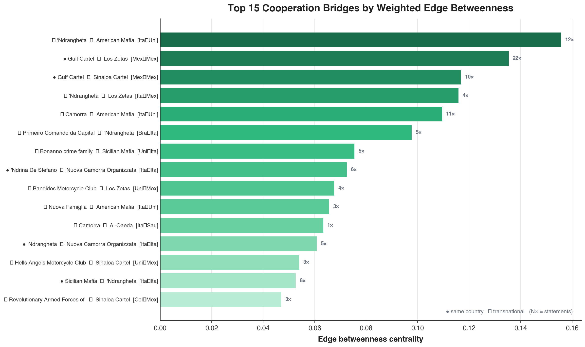
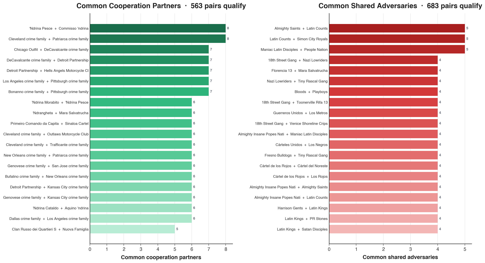
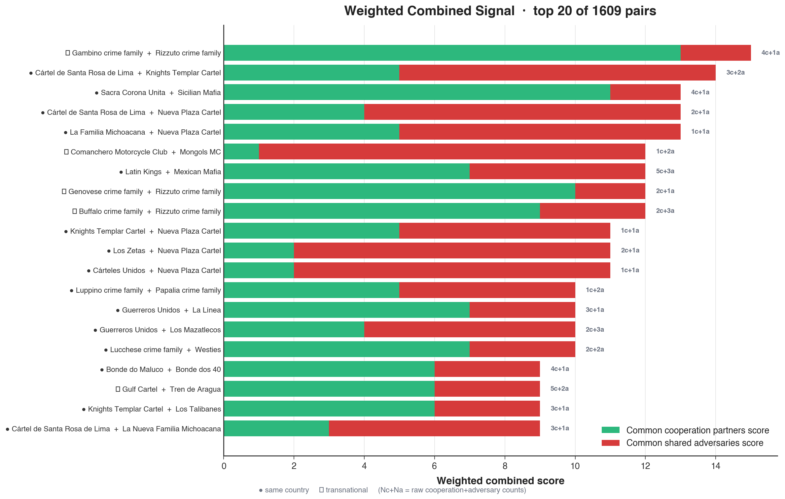
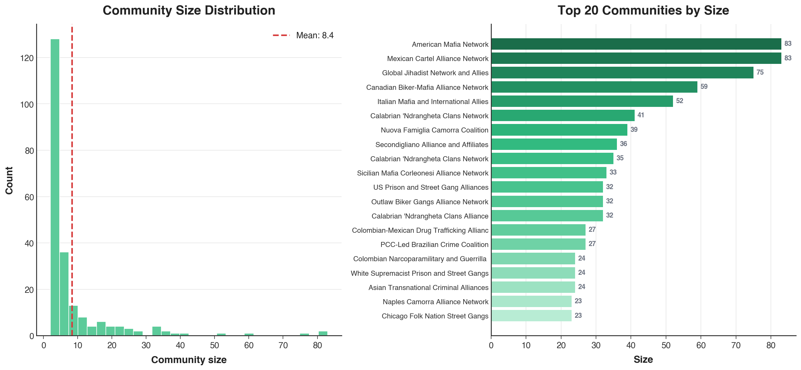

# CRIMENET Data Analysis Report

*Network analysis of global organized crime, June 2026*

Analysis of **CRIMENET**, a knowledge graph of 4,505 criminal organizations and 10,935 relationships extracted from multi-language Wikipedia. Every edge carries a verbatim evidence quote, a description, a time period, and a versioned source URL. Organizations are linked by cooperation or conflict relationships — not "friends" and "enemies" in the colloquial sense, but documented operational linkages.

Five analyses follow: triadic closure (candidate undocumented allies), evidence-weighted triadic closure, edge and node betweenness, Infomap community detection, and cross-community bridges. Every number is reproduced by an independent implementation in `validate_analysis.py` (102/102 checks pass).

---

## 1. Dataset

4,505 organizations and 10,935 edges. 316 are flagged defunct; they are included in all analyses (defunct groups like Los Zetas, Medellín Cartel, and Cali Cartel carry extensive historical connectivity). Only 1,032 organizations carry a country of origin; the other 3,473 are mention-only nodes with no profile.

| Metric | Cooperation | Conflict |
|---|---|---|
| Organizations with ≥1 edge | 1,847 | 1,822 |
| Unique pairs | 3,045 | 2,237 |
| Wikipedia statements | 4,907 | 3,731 |
| Pairs with >1 statement | 952 (31.3%) | 630 (28.2%) |

Cooperation has more unique pairs than conflict (3,045 vs 2,237) and about 10% more organizations carrying an edge (1,847 vs 1,822). About 31% of cooperation pairs and 28% of conflict pairs are documented in more than one Wikipedia article.

**Cooperation core.** 1,493 of the 4,505 organizations (33.1%) form the largest connected component (LCC) of the cooperation graph; the rest are isolated or in small fragments. Sections 4 to 6 analyze the LCC.

**Temporal note.** Each edge carries its own time period and the graph unions them, so a path can chain relationships from different decades. It is not a snapshot of simultaneous alliances.

---

## 2. Candidate Undocumented Allies: Triadic Signals

Pairs with no documented edge between them but many common cooperation partners or common adversaries are candidate undocumented alliance relationships.

### 2.1 Common Cooperation Partners

**Method.** For every pair A, B with no documented edge of any kind, count the organizations C that both A and B cooperate with. Pairs with ≥3 common partners qualify, minus pairs where more than one shared partner is also a documented adversary of one side.

**Results: 563 pairs.**

| Org A | Org B | Common partners | Same country |
|---|---|---|---|
| 'Ndrina Pesce | Commisso 'ndrina | 8 | Yes |
| Cleveland crime family | Patriarca crime family | 8 | Yes |
| Chicago Outfit | DeCavalcante crime family | 7 | Yes |
| DeCavalcante crime family | Detroit Partnership | 7 | Yes |
| Detroit Partnership | Hells Angels Motorcycle Club | 7 | Yes |
| Los Angeles crime family | Pittsburgh crime family | 7 | Yes |
| Bonanno crime family | Pittsburgh crime family | 7 | Yes |
| 'Ndrina Morabito | 'Ndrina Pesce | 6 | Yes |
| 'Ndrangheta | Mara Salvatrucha | 6 | No |
| Primeiro Comando da Capital | Sinaloa Cartel | 6 | No |
| Cleveland crime family | Outlaws Motorcycle Club | 6 | Yes |
| Cleveland crime family | Trafficante crime family | 6 | Yes |
| New Orleans crime family | Patriarca crime family | 6 | Yes |
| Genovese crime family | San Jose crime family | 6 | Yes |
| Bufalino crime family | New Orleans crime family | 6 | Yes |
| Detroit Partnership | Kansas City crime family | 6 | Yes |
| Genovese crime family | Kansas City crime family | 6 | Yes |
| 'Ndrina Cataldo | Aquino 'ndrina | 6 | Yes |
| Dallas crime family | Los Angeles crime family | 6 | Yes |
| Clan Russo dei Quartieri Spagnoli | Nuova Famiglia | 5 | Yes |

The top pairs are American Mafia families and Calabrian 'ndrine that cooperate with the same set of partners without a direct documented edge (structural equivalence). Transnational pairs appear further down: 'Ndrangheta/Mara Salvatrucha (6 partners) and PCC/Sinaloa Cartel (6 partners).

### 2.2 Common Adversaries

**Method.** Same logic over the conflict graph, threshold lowered to ≥2 (conflict degree is lower), minus pairs where a common adversary is cooperated with by one side.

**Results: 683 pairs.**

| Org A | Org B | Common adversaries | Same country |
|---|---|---|---|
| Almighty Saints | Latin Counts | 5 | Yes |
| Latin Counts | Simon City Royals | 5 | Yes |
| Maniac Latin Disciples | People Nation | 5 | Yes |
| 18th Street Gang | Nazi Lowriders | 4 | Yes |
| Florencia 13 | Mara Salvatrucha | 4 | Yes |
| Nazi Lowriders | Tiny Rascal Gang | 4 | Yes |
| Bloods | Playboys | 4 | No |
| 18th Street Gang | Toonerville Rifa 13 | 4 | Yes |
| Guerreros Unidos | Los Metros | 4 | Yes |
| 18th Street Gang | Venice Shoreline Crips | 4 | Yes |
| Almighty Insane Popes Nation | Maniac Latin Disciples | 4 | Yes |
| Cárteles Unidos | Los Negros | 4 | Yes |
| Fresno Bulldogs | Tiny Rascal Gang | 4 | Yes |
| Cártel de los Rojos | Cártel del Noreste | 4 | Yes |
| Cártel de los Rojos | Los Rojos | 4 | Yes |
| Almighty Insane Popes Nation | Almighty Saints | 4 | Yes |
| Almighty Insane Popes Nation | Latin Counts | 4 | Yes |
| Harrison Gents | Latin Kings | 4 | No |
| Latin Kings | PR Stones | 4 | No |
| Latin Kings | Satan Disciples | 4 | No |

Where common cooperation partners surface mafia clans, common adversaries surface US street gangs (Chicago People Nation and Folk Nation groups), outlaw motorcycle clubs, and Mexican cartel splinters that share the same rivals.

### 2.3 Combined (Both Signals)

**Method.** Pairs that appear in both signals, with ≥1 common cooperation partner AND ≥1 common adversary. The dual-signal condition is itself a strong filter, so threshold=1 per dimension is sufficient. The strict intersection (≥3 partners AND ≥2 adversaries) is only 13 pairs. Ranks are by sum of raw counts.

**Results: 1,609 pairs.**

| Org A | Org B | Coop partners | Adversaries | Total | Same country |
|---|---|---|---|---|---|
| Latin Kings | Mexican Mafia | 5 | 3 | 8 | Yes |
| Gulf Cartel | Tren de Aragua | 5 | 2 | 7 | No |
| Cartel del Norte del Valle | Revolutionary Armed Forces of Colombia | 5 | 1 | 6 | Yes |
| 'Ndrina De Stefano | 'Ndrina Morabito | 5 | 1 | 6 | Yes |
| Black Disciples | Crips | 4 | 2 | 6 | Yes |
| 'Ndrina Morabito | Commisso 'ndrina | 5 | 1 | 6 | Yes |
| Cartel del Norte del Valle | Oficina de Envigado | 5 | 1 | 6 | Yes |
| Almighty Black P. Stone Nation | Norteños | 4 | 2 | 6 | Yes |
| 18th Street Gang | Guerreros Unidos | 4 | 2 | 6 | No |
| Martinez Familia Sangeros | Sinaloa Cartel | 5 | 1 | 6 | No |
| Cártel de Santa Rosa de Lima | Knights Templar Cartel | 3 | 2 | 5 | Yes |
| Aryan Brotherhood | Mara Salvatrucha | 2 | 3 | 5 | Yes |
| Gambino crime family | Rizzuto crime family | 4 | 1 | 5 | No |
| Nazi Lowriders | OVS | 2 | 3 | 5 | Yes |
| Big Circle Gang | Mexican Mafia | 2 | 3 | 5 | No |
| Armenian Power | Sinaloa Cartel | 4 | 1 | 5 | No |
| Cártel de Caborca | La Familia Michoacana | 3 | 2 | 5 | Yes |
| Buffalo crime family | Rizzuto crime family | 2 | 3 | 5 | No |
| Cárteles Unidos | Los Negros | 1 | 4 | 5 | Yes |
| Latin Kings | Mickey Cobras | 3 | 2 | 5 | Yes |

Top pairs include both mafia and cartel alliances. The Latin Kings/Mexican Mafia pair is the highest-scoring on both dimensions in the top 20, with the Rizzuto crime family appearing multiple times against Cosa Nostra families.

---

## 3. Weighted Candidate Allies

**Method.** The same signals, but each shared partner C contributes `min(statements_A_C, statements_B_C)` to the score, so repeatedly-documented connections weigh more. The qualifying sets are unchanged (563, 683); only the ranking changes.

**Weighted common cooperation partners.**

| Org A | Org B | Partners | Weighted score | Same country |
|---|---|---|---|---|
| Cleveland crime family | Patriarca crime family | 8 | 20 | Yes |
| New Orleans crime family | Patriarca crime family | 6 | 15 | Yes |
| American Mafia | Banda della Magliana | 3 | 14 | No |
| 'Ndrina Pesce | Commisso 'ndrina | 8 | 14 | Yes |
| 'Ndrina Bellocco | 'Ndrina Mancuso | 4 | 14 | Yes |
| Cleveland crime family | Outlaws Motorcycle Club | 6 | 14 | Yes |
| Gambino crime family | Rizzuto crime family | 4 | 13 | No |
| Cleveland crime family | Trafficante crime family | 6 | 12 | Yes |
| DeCavalcante crime family | Detroit Partnership | 7 | 12 | Yes |
| DeCavalcante crime family | New Orleans crime family | 4 | 12 | Yes |
| Detroit Partnership | Hells Angels Motorcycle Club | 7 | 12 | Yes |
| Clan dei Casamonica | Nuova Camorra Organizzata | 3 | 12 | Yes |
| Bonanno crime family | Pittsburgh crime family | 7 | 12 | Yes |
| Los Angeles crime family | Outlaws Motorcycle Club | 5 | 12 | Yes |
| Sacra Corona Unita | Sicilian Mafia | 4 | 11 | Yes |
| Chicago Outfit | DeCavalcante crime family | 7 | 11 | Yes |
| Hells Angels Motorcycle Club | New Orleans crime family | 5 | 11 | Yes |
| Los Angeles crime family | Pittsburgh crime family | 7 | 11 | Yes |
| 'Ndrina Alvaro | 'Ndrina Bellocco | 4 | 11 | Yes |
| Buffalo crime family | DeCavalcante crime family | 4 | 11 | Yes |

**Weighted common adversaries.** The top of this list is dominated by outlaw motorcycle clubs (Comanchero, Mongols, Rebels, Finks, Vagos, Gypsy Joker).

| Org A | Org B | Adversaries | Weighted score | Same country |
|---|---|---|---|---|
| Comanchero Motorcycle Club | Mongols MC | 2 | 11 | No |
| Mongols MC | Rebels Motorcycle Club | 2 | 10 | No |
| Comanchero Motorcycle Club | Rebels Motorcycle Club | 3 | 9 | Yes |
| Nuestra Familia | Texas Syndicate | 3 | 9 | Yes |
| Cártel de Santa Rosa de Lima | Knights Templar Cartel | 2 | 9 | Yes |
| Comanchero Motorcycle Club | Vagos Motorcycle Club | 2 | 7 | No |
| Finks Motorcycle Club | Vagos Motorcycle Club | 3 | 7 | No |
| Gypsy Joker Motorcycle Club | Mongols MC | 3 | 7 | Yes |
| Guerreros Unidos | Los Metros | 4 | 7 | Yes |
| Latin Counts | Simon City Royals | 5 | 7 | Yes |
| Mongols MC | Red Devils Motorcycle Club | 2 | 6 | No |
| Comanchero Motorcycle Club | Gypsy Joker Motorcycle Club | 2 | 6 | No |
| Finks Motorcycle Club | Gypsy Joker Motorcycle Club | 2 | 6 | No |
| Finks Motorcycle Club | Rebels Motorcycle Club | 2 | 6 | Yes |
| Gypsy Joker Motorcycle Club | Vagos Motorcycle Club | 2 | 6 | Yes |
| Rebels Motorcycle Club | Vagos Motorcycle Club | 2 | 6 | No |
| Black Gangster Disciples Nation | Mara Salvatrucha | 2 | 6 | Yes |
| Crips | Texas Syndicate | 3 | 6 | Yes |
| Cártel de Caborca | Los Mazatlecos | 3 | 6 | Yes |
| Guerreros Unidos | Los Mazatlecos | 3 | 6 | Yes |

**Weighted combined** (sum of weighted cooperation and adversary scores).

| Org A | Org B | Coop (score) | Adv (score) | Total | Same country |
|---|---|---|---|---|---|
| Gambino crime family | Rizzuto crime family | 4 (13) | 1 (2) | 15 | No |
| Cártel de Santa Rosa de Lima | Knights Templar Cartel | 3 (5) | 2 (9) | 14 | Yes |
| Sacra Corona Unita | Sicilian Mafia | 4 (11) | 1 (2) | 13 | Yes |
| Cártel de Santa Rosa de Lima | Nueva Plaza Cartel | 2 (4) | 1 (9) | 13 | Yes |
| La Familia Michoacana | Nueva Plaza Cartel | 1 (5) | 1 (8) | 13 | Yes |
| Comanchero Motorcycle Club | Mongols MC | 1 (1) | 2 (11) | 12 | No |
| Latin Kings | Mexican Mafia | 5 (7) | 3 (5) | 12 | Yes |
| Genovese crime family | Rizzuto crime family | 2 (10) | 1 (2) | 12 | No |
| Buffalo crime family | Rizzuto crime family | 2 (9) | 3 (3) | 12 | No |
| Knights Templar Cartel | Nueva Plaza Cartel | 1 (5) | 1 (6) | 11 | Yes |
| Los Zetas | Nueva Plaza Cartel | 2 (2) | 1 (9) | 11 | Yes |
| Cárteles Unidos | Nueva Plaza Cartel | 1 (2) | 1 (9) | 11 | Yes |
| Luppino crime family | Papalia crime family | 1 (5) | 2 (5) | 10 | Yes |
| Guerreros Unidos | La Línea | 3 (7) | 1 (3) | 10 | Yes |
| Guerreros Unidos | Los Mazatlecos | 2 (4) | 3 (6) | 10 | Yes |
| Lucchese crime family | Westies | 2 (7) | 2 (3) | 10 | Yes |
| Bonde do Maluco | Bonde dos 40 | 4 (6) | 1 (3) | 9 | Yes |
| Gulf Cartel | Tren de Aragua | 5 (6) | 2 (3) | 9 | No |
| Knights Templar Cartel | Los Talibanes | 3 (6) | 1 (3) | 9 | Yes |
| Cártel de Santa Rosa de Lima | La Nueva Familia Michoacana | 3 (3) | 1 (6) | 9 | Yes |

Weighting promotes a few orgs that the raw counts bury: the Nueva Plaza Cartel (a CJNG splinter sharing well-documented adversaries with several Mexican groups) and the Rizzuto crime family, which appears five times against New York and other American families.

---

## 4. Edge Betweenness: Bridges of the Cooperation Network

**Method.** On the cooperation LCC (**1,493 nodes, 2,768 edges**), edges weighted by 1/statements, exact weighted edge betweenness (Brandes). High betweenness means many shortest paths run through the edge. (None of the top edges are cut-edges: removing one does not disconnect the graph.)

| Rank | Org A | Org B | Betweenness | Statements | Countries |
|---|---|---|---|---|---|
| 1 | American Mafia | 'Ndrangheta | 0.156 | 12 | United States / Italy |
| 2 | Gulf Cartel | Los Zetas | 0.135 | 22 | Mexico / Mexico |
| 3 | Gulf Cartel | Sinaloa Cartel | 0.117 | 10 | Mexico / Mexico |
| 4 | 'Ndrangheta | Los Zetas | 0.116 | 4 | Italy / Mexico |
| 5 | American Mafia | Camorra | 0.110 | 11 | United States / Italy |
| 6 | 'Ndrangheta | Primeiro Comando da Capital | 0.098 | 5 | Italy / Brazil |
| 7 | Bonanno crime family | Sicilian Mafia | 0.075 | 5 | United States / Italy |
| 8 | 'Ndrina De Stefano | Nuova Camorra Organizzata | 0.072 | 6 | Italy / Italy |
| 9 | Bandidos Motorcycle Club | Los Zetas | 0.068 | 4 | United States / Mexico |
| 10 | American Mafia | Nuova Famiglia | 0.066 | 3 | United States / Italy |
| 11 | Al-Qaeda | Camorra | 0.063 | 1 | Saudi Arabia / Italy |
| 12 | Hells Angels Motorcycle Club | Sinaloa Cartel | 0.054 | 3 | United States / Mexico |
| 13 | Revolutionary Armed Forces of Colombia | Sinaloa Cartel | 0.047 | 3 | Colombia / Mexico |
| 14 | Hezbollah | Primeiro Comando da Capital | 0.046 | 2 | Lebanon / Brazil |
| 15 | American Mafia | Crips | 0.040 | 2 | United States / United States |
| 16 | American Mafia | Hells Angels Motorcycle Club | 0.039 | 2 | United States / United States |
| 17 | Outlaws Motorcycle Club | Hammerskins | 0.034 | 2 | United States / United States |
| 18 | Camorra | Islamic State | 0.033 | 1 | Italy / Iraq |
| 19 | 'Ndrina Pesce | Gulf Cartel | 0.033 | 2 | Italy / Mexico |
| 20 | Mexican Mafia | Sinaloa Cartel | 0.033 | 5 | United States / Mexico |

- **American Mafia and 'Ndrangheta** is the highest-betweenness edge (0.156). Both nodes sit in the same Infomap community, *Italian Mafia and Allied Networks* (52 orgs).
- **Gulf Cartel and Los Zetas** (0.135) is the highest-betweenness edge inside a single community — they were formerly allied before their 2010 split, with 22 statements.
- **The 'Ndrangheta node appears in 3 of the top 20 edges** (with American Mafia, Los Zetas, and PCC), spanning the Italian-mafia, cartel, and Brazilian criminal worlds.
- **Betweenness is not statement count.** Gulf Cartel and Los Zetas (22 statements) still ranks high because they sit in a hub position. Gulf Cartel and Sinaloa Cartel (10 statements) is also near the top. Several 1 to 3 statement edges rank high because they span clusters.
- **Al-Qaeda and Camorra** (0.063) rests on a single statement and is the highest-betweenness edge linking the jihadist and Italian-mafia communities.

### 4.1 Node Betweenness

**Method.** Same weighted LCC, betweenness on nodes (the critical brokers).

| Rank | Organization | Country | Betweenness | Degree |
|---|---|---|---|---|
| 1 | 'Ndrangheta | Italy | 0.306 | 55 |
| 2 | American Mafia | United States | 0.281 | 46 |
| 3 | Sinaloa Cartel | Mexico | 0.217 | 71 |
| 4 | Gulf Cartel | Mexico | 0.197 | 32 |
| 5 | Los Zetas | Mexico | 0.178 | 33 |
| 6 | Camorra | Italy | 0.152 | 32 |
| 7 | Hells Angels Motorcycle Club | United States | 0.147 | 86 |
| 8 | Primeiro Comando da Capital | Brazil | 0.109 | 24 |
| 9 | Sicilian Mafia | Italy | 0.109 | 29 |
| 10 | Bonanno crime family | United States | 0.099 | 34 |
| 11 | Outlaws Motorcycle Club | United States | 0.098 | 29 |
| 12 | Al-Qaeda | Saudi Arabia | 0.088 | 27 |
| 13 | Nuova Famiglia | Italy | 0.087 | 32 |
| 14 | 'Ndrina Mancuso | Italy | 0.082 | 27 |
| 15 | 'Ndrina De Stefano | Italy | 0.080 | 23 |
| 16 | Bandidos Motorcycle Club | United States | 0.079 | 20 |
| 17 | Nuova Camorra Organizzata | Italy | 0.075 | 13 |
| 18 | Revolutionary Armed Forces of Colombia | Colombia | 0.064 | 22 |
| 19 | Latin Kings | United States | 0.062 | 23 |
| 20 | Gambino crime family | United States | 0.061 | 38 |
| 21 | 'Ndrina Piromalli | Italy | 0.058 | 23 |
| 22 | Hezbollah | Lebanon | 0.056 | 15 |
| 23 | 'Ndrina Pesce | Italy | 0.047 | 17 |
| 24 | Mexican Mafia | United States | 0.047 | 36 |
| 25 | Clan dei Casalesi | Italy | 0.045 | 23 |

- The 'Ndrangheta (0.306) edges out the American Mafia (0.281) for the top spot — a reversal from earlier analyses when defunct orgs were excluded. Los Zetas (0.178) enters the top five as a defunct cartel whose historical connectivity remains critical.
- **Degree is not betweenness.** Hells Angels has the highest degree in the LCC (86) but ranks 7th; 'Ndrangheta leads betweenness with degree 55.
- **Italy places 9 of the top 25 nodes**, the United States 7, Mexico 3. Five individual 'ndrine are in the top 25 (Mancuso, De Stefano, Piromalli, Pesce, Clan dei Casalesi), reflecting the fragmented clan structure analyzed in Section 5.

---

## 5. Communities: Infomap Clustering

**Method.** Infomap two-level clustering on the cooperation LCC, fixed seed (reproducible). It finds **118 communities**, sizes 2 to 87, no singletons; 5 have ≥50 members (358 orgs, 24% of the LCC) and 76 have <10 (mean 12.7, median 7). Each community carries an auto-generated label and a short LLM profile; the full profiles are in `data/communities.csv`. The table below lists each community's top organizations by in-community degree.

| Size | Community (auto-label) | Top organizations |
|---|---|---|
| 87 | American Mafia Network | Bonanno crime family, Chicago Outfit, Genovese crime family, Gambino crime family |
| 77 | Mexican Cartel Alliance Network | Sinaloa Cartel, Cártel de Jalisco Nueva Generación, Los Zetas, Gulf Cartel |
| 75 | Global Jihadist Network and Allies | Taliban, Al-Qaeda, Islamic State – Khorasan Province, Lashkar-e-Taiba |
| 67 | Canadian Biker-Mafia-Drug Trafficking Network | Hells Angels Motorcycle Club, Independent Soldiers, Musitano crime family, Wolfpack Alliance |
| 52 | Italian Mafia and Allied Networks | 'Ndrangheta, Camorra, Sicilian Mafia, American Mafia |
| 43 | Nuova Famiglia Camorra Alliance | Nuova Famiglia, Alfieri clan, Clan Cava, Clan dei Casalesi |
| 38 | Secondigliano Alliance and Camorra Clusters | Secondigliano Alliance, Amato-Pagano clan, Clan Di Lauro, Clan Licciardi |
| 37 | Outlaw Motorcycle Gangs Alliance Network | Bandidos Motorcycle Club, Outlaws Motorcycle Club, Loners Motorcycle Club, Rock Machine Motorcycle Club |
| 37 | Calabrian 'Ndrangheta Clans Alliance | 'Ndrina De Stefano, 'Ndrina La Maggiore, Latella 'ndrina, 'Ndrina Barreca |
| 34 | U.S. Prison and Street Gang Alliances | Bloods, Latin Kings, Black Guerrilla Family, Crips |
| 32 | Calabrian 'Ndrangheta Clans Alliance | 'Ndrina Grande Aracri, 'Ndrina Arena, 'Ndrina Mannolo, 'Ndrina Nicoscia |
| 31 | Calabrian 'Ndrangheta Clans Alliance | 'Ndrina Mancuso, 'Ndrina Bellocco, 'Ndrina Piromalli, 'Ndrina Pesce |
| 27 | PCC-Led Brazilian Crime Coalition | Primeiro Comando da Capital, Bonde dos 40, Bonde do Maluco, Terceiro Comando Puro |
| 24 | White Supremacist Prison and Street Gangs | Aryan Brotherhood, Nazi Lowriders, Ku Klux Klan, The Covenant, the Sword, and the Arm of the Lord |
| 23 | Chicago Folk Nation Street Gangs | Spanish Gangster Disciples, Latin Eagles, Simon City Royals, Black Gangster Disciples Nation |
| 22 | Colombian Narcoparamilitary and Drug Trafficking Network | Los Rastrojos, Clan del Golfo, Oficina de Envigado, Cartel del Norte del Valle |
| 22 | Colombian-Mexican Drug Trafficking Alliance | Cartel de Medellín, Cali Cartel, Cartel de la Costa, Guadalajara Cartel |
| 22 | Syrian Rebel Coalition Network | Ahrar al-Sham, Al-Nusra Front, Ansar al-Islam, Jaysh al-Islam |
| 22 | PKK-Led Revolutionary Alliance Network | Kurdistan Workers' Party, Armenian Secret Army for the Liberation of Armenia, Baybaşin family, Bethnahrin National Council |
| 21 | Naples Camorra Alliance Network | Clan Mazzarella, 'Ndrina Giuliano, Clan Misso, Clan Buonerba |

- **The largest community is the American Mafia Network** (87 orgs), ahead of the Mexican cartels (77). This is the largest shift from earlier analyses: the US mafia families, their associates, and connected biker gangs now cluster into a single large community including 17 Five Family nodes plus affiliates.
- **The 'Ndrangheta fragments into about eight geographic clan communities** (Calabrian, San Luca, Reggio Calabria, Second War, Platì, Africo, Vibo Valentia, plus the Italian Mafia container). This reflects its cellular structure: individual 'ndrine cluster by territory.
- **The "American Mafia" node sits in the Italian Mafia community** (community 52, with 'Ndrangheta, Camorra, Sicilian Mafia), while the US Five Families form a separate, larger community (87). This is why the top edge (American Mafia and 'Ndrangheta: 0.156) is internal to community 52 while the American Mafia node bridges between the two communities.

---

## 6. Cross-Community Links

**Method.** Cooperation statements whose two organizations fall in different communities, counted by statement. The LCC has 4,585 cooperation statements: **3,459 (75.4%) internal** to a community, **1,126 (24.6%) cross-community**.

### 6.1 Bridge Nodes

Two metrics, crowning different organizations: cross-edge volume (statements crossing a boundary) and number of distinct communities reached.

| Organization | Country | Cross-edges | Communities reached |
|---|---|---|---|
| Sinaloa Cartel | Mexico | 77 | 15 |
| Hells Angels Motorcycle Club | United States | 67 | 21 |
| American Mafia | United States | 51 | 21 |
| 'Ndrangheta | Italy | 50 | 24 |
| Mexican Mafia | United States | 41 | 8 |
| Outlaws Motorcycle Club | United States | 37 | 9 |
| Commisso 'ndrina | Italy | 34 | 12 |
| Revolutionary Armed Forces of Colombia | Colombia | 29 | 8 |
| Cali Cartel | Colombia | 28 | 8 |
| Los Zetas | Mexico | 26 | 7 |
| 'Ndrina Mancuso | Italy | 26 | 10 |
| Gambino crime family | United States | 26 | 9 |
| Sicilian Mafia | Italy | 25 | 10 |
| Cártel de Jalisco Nueva Generación | Mexico | 25 | 10 |
| 'Ndrina De Stefano | Italy | 24 | 8 |
| Camorra | Italy | 24 | 13 |
| Clan dei Casalesi | Italy | 24 | 9 |
| Primeiro Comando da Capital | Brazil | 23 | 9 |
| 'Ndrina Piromalli | Italy | 23 | 13 |
| Clan del Golfo | Colombia | 23 | 6 |

- **Sinaloa Cartel has the most cross-community statements** (77), then the Hells Angels (67). Los Zetas and Cali Cartel enter the top 10 as defunct groups with extensive historical cross-community ties.
- **The 'Ndrangheta reaches the most distinct communities** (24 of 118), followed by Hells Angels and American Mafia (21 each). Five individual 'ndrine (Commisso, Mancuso, De Stefano, Piromalli, plus others further down) each bridge 8 to 13 communities, linking the fragmented clan clusters.

**Which communities the top bridges reach.** The five largest communities each organization links to, with community size in parentheses (the bold count after the name is the total reached; the full list for the top 50 bridges is in `data/bridge_nodes.csv`, column `communities_reached`):

- **Sinaloa Cartel** (15): Canadian Biker-Mafia-Drug Trafficking Network (67), Italian Mafia and Allied Networks (52), Outlaw Motorcycle Gangs Alliance Network (37), U.S. Prison and Street Gang Alliances (34), PCC-Led Brazilian Crime Coalition (27).
- **Hells Angels Motorcycle Club** (21): American Mafia Network (87), Mexican Cartel Alliance Network (77), Italian Mafia and Allied Networks (52), Outlaw Motorcycle Gangs Alliance Network (37), U.S. Prison and Street Gang Alliances (34).
- **American Mafia** (21): Mexican Cartel Alliance Network (77), Global Jihadist Network and Allies (75), Canadian Biker-Mafia-Drug Trafficking Network (67), Outlaw Motorcycle Gangs Alliance Network (37), U.S. Prison and Street Gang Alliances (34).
- **'Ndrangheta** (24): Mexican Cartel Alliance Network (77), Global Jihadist Network and Allies (75), Canadian Biker-Mafia-Drug Trafficking Network (67), U.S. Prison and Street Gang Alliances (34), Calabrian 'Ndrangheta Clans Alliance (31).
- **Mexican Mafia** (8): Mexican Cartel Alliance Network (77), American Mafia Network (87), Canadian Biker-Mafia-Drug Trafficking Network (67), Italian Mafia and Allied Networks (52), PCC-Led Brazilian Crime Coalition (27).
- **Outlaws Motorcycle Club** (9): American Mafia Network (87), Mexican Cartel Alliance Network (77), Canadian Biker-Mafia-Drug Trafficking Network (67), Italian Mafia and Allied Networks (52), White Supremacist Prison and Street Gangs (24).
- **Commisso 'ndrina** (12): Mexican Cartel Alliance Network (77), Canadian Biker-Mafia-Drug Trafficking Network (67), Italian Mafia and Allied Networks (52), American Mafia Network (87), Secondigliano Alliance and Camorra Clusters (38).
- **Revolutionary Armed Forces of Colombia** (8): Mexican Cartel Alliance Network (77), Colombian-Mexican Drug Trafficking Alliance (22), Italian Mafia and Allied Networks (52), PKK-Led Revolutionary Alliance Network (22), Outlaw Motorcycle Gangs Alliance Network (37).
- **Cali Cartel** (8): Mexican Cartel Alliance Network (77), Canadian Biker-Mafia-Drug Trafficking Network (67), Italian Mafia and Allied Networks (52), Colombian Narcoparamilitary and Drug Trafficking Network (22), American Mafia Network (87).
- **Los Zetas** (7): Mexican Cartel Alliance Network (77), Italian Mafia and Allied Networks (52), Outlaw Motorcycle Gangs Alliance Network (37), U.S. Prison and Street Gang Alliances (34), Canadian Biker-Mafia-Drug Trafficking Network (67).

The contrast in the counts is structural: the Sinaloa Cartel's 15 are mostly *foreign* worlds (bikers, Italian mafias, US street gangs, the PCC) reached through its drug trade, whereas the 'Ndrangheta's 24 are inflated by the many small *Calabrian/Neapolitan clan clusters* its own cellular structure was split into.

### 6.2 Top Cross-Community Edges by Betweenness

One row per unique pair.

| Org A | Org B | Betweenness | Statements |
|---|---|---|---|
| 'Ndrangheta | Los Zetas | 0.116 | 4 |
| 'Ndrangheta | Primeiro Comando da Capital | 0.098 | 5 |
| Bonanno crime family | Sicilian Mafia | 0.075 | 5 |
| 'Ndrina De Stefano | Nuova Camorra Organizzata | 0.072 | 6 |
| Bandidos Motorcycle Club | Los Zetas | 0.068 | 4 |
| American Mafia | Nuova Famiglia | 0.066 | 3 |
| Camorra | Al-Qaeda | 0.063 | 1 |
| Hells Angels Motorcycle Club | Sinaloa Cartel | 0.054 | 3 |
| Revolutionary Armed Forces of Colombia | Sinaloa Cartel | 0.047 | 3 |
| Primeiro Comando da Capital | Hezbollah | 0.046 | 2 |
| American Mafia | Crips | 0.040 | 2 |
| American Mafia | Hells Angels Motorcycle Club | 0.039 | 2 |
| Outlaws Motorcycle Club | Hammerskins | 0.034 | 2 |
| Camorra | Islamic State | 0.033 | 1 |
| 'Ndrina Pesce | Gulf Cartel | 0.033 | 2 |
| Mexican Mafia | Sinaloa Cartel | 0.033 | 5 |
| American Mafia | Outlaws Motorcycle Club | 0.033 | 2 |
| Bonanno crime family | Rizzuto crime family | 0.033 | 7 |
| 'Ndrina Mancuso | Revolutionary Armed Forces of Colombia | 0.032 | 3 |
| American Mafia | Latin Kings | 0.030 | 4 |

- **'Ndrangheta and Los Zetas** (0.116) is the highest-betweenness cross-community edge, linking the Italian-mafia community to the Mexican cartel cluster. This edge rests on only 4 statements but carries high traffic.
- **Camorra and Al-Qaeda** (0.063) is the highest-betweenness edge into the jihadist community and rests on a single statement (see Section 7).
- The American Mafia appears repeatedly (to Crips, Hells Angels, Outlaws, Latin Kings), reaching the street-gang, biker, and cartel clusters.

### 6.3 Community Pairs with the Most Cross-Edges

| Community A | Community B | Cross-edges |
|---|---|---|
| Colombian Narcoparamilitary and Drug Trafficking Network | Mexican Cartel Alliance Network | 45 |
| American Mafia Network | Canadian Biker-Mafia-Drug Trafficking Network | 36 |
| Colombian-Mexican Drug Trafficking Alliance | Mexican Cartel Alliance Network | 33 |
| American Mafia Network | Italian Mafia and Allied Networks | 25 |
| American Mafia Network | Outlaw Motorcycle Gangs Alliance Network | 25 |
| Mexican Mafia-Led Southern California Gang Alliance | Mexican Cartel Alliance Network | 24 |
| Canadian Biker-Mafia-Drug Trafficking Network | Outlaw Motorcycle Gangs Alliance Network | 18 |
| Italian Mafia and Allied Networks | Nuova Famiglia Camorra Alliance | 16 |
| Secondigliano Alliance and Camorra Clusters | Nuova Famiglia Camorra Alliance | 15 |
| Mexican Cartel Alliance Network | Nueva Generación Alliance and Associates | 15 |
| Mexican Cartel Alliance Network | Italian Mafia and Allied Networks | 14 |
| Naples Camorra Alliance Network | Nuova Famiglia Camorra Alliance | 14 |
| Corleonesi and Allied Mafia Clans | Nuova Famiglia Camorra Alliance | 14 |
| Colombian Narcoparamilitary and Drug Trafficking Network | Colombian-Mexican Drug Trafficking Alliance | 13 |
| Italian Mafia and Allied Networks | Calabrian 'Ndrangheta Clans Alliance (size 31) | 12 |
| Italian Mafia and Allied Networks | Calabrian 'Ndrangheta Clans Alliance (size 37) | 12 |
| Mexican Mafia-Led Southern California Gang Alliance | White Supremacist Prison and Street Gangs | 12 |
| Secondigliano Alliance and Camorra Clusters | Calabrian 'Ndrangheta Clans Alliance | 11 |
| Secondigliano Alliance and Camorra Clusters | Naples Camorra Alliance Network | 11 |
| Syrian Rebel Coalition Network | Global Jihadist Network and Allies | 11 |

The densest inter-community wiring is among the Colombian and Mexican cartel clusters (45 and 33), the American mafia and biker clusters (36, 25, 18), and the 'Ndrangheta/Camorra clan clusters (several pairs of 11 to 16), which Infomap separates by territory but which remain tightly linked.

---

## 7. Summary

- **Triadic signals:** 563 pairs share ≥3 cooperation partners with no direct edge; 683 share ≥2 adversaries; 1,609 score on both (≥1 each). Cooperation partner pairs are mafia clans, common adversary pairs are US street gangs and biker clubs.
- **Betweenness:** the top brokers are the 'Ndrangheta (0.306), American Mafia (0.281), Sinaloa Cartel (0.217), and Gulf Cartel (0.197). The highest-betweenness edge is American Mafia and 'Ndrangheta (0.156). Degree does not predict betweenness (Hells Angels has the highest degree at 86 but ranks 7th).
- **Communities:** 118 Infomap communities; the American Mafia Network is the largest (87 orgs), ahead of the Mexican cartels (77) and the jihadist alliance (75). The 'Ndrangheta fragments into about eight geographic clan communities; 75.4% of cooperation is internal to a community, 24.6% crosses boundaries.
- **Bridges:** the Sinaloa Cartel carries the most cross-community volume (77 statements); the 'Ndrangheta reaches the most communities (24 of 118).

**The largest cooperative community is American, not ideological.** The biggest cluster is the US mafia network (87 orgs), larger than the Mexican cartels (77), the jihadist network (75), or the biker-mafia alliance (67). This is shaped by including defunct organizations: historically connected groups like Los Zetas and Cali Cartel add density to the Mexican cartel cluster, while 17 American Five Family nodes and their associates unify into a single large community. The jihadist community (75 orgs) remains loosely linked to the rest of the graph: only a handful of its cooperation ties cross into other communities, and most go to other militant groups. Its highest-betweenness tie into the mafia and cartel world is a single edge, Al-Qaeda and Camorra (0.063), resting on one Wikipedia sentence:

> "In 2005, it was alleged the Camorra created safe houses, forged documents, firearms, and explosives to Al-Qaeda in return for narcotics, which are brought into Italy via the Adriatic Sea."
>
> — [Camorra, oldid=1359667351](https://en.wikipedia.org/w/index.php?title=Camorra&oldid=1359667351)

**Network shape.** Global organized crime is modular: dense communities joined by relatively few high-betweenness edges and a small set of broker organizations (the 'Ndrangheta, American Mafia, Sinaloa Cartel, and Gulf Cartel). The triadic signals suggest the documented graph understates real connectivity, since 563 pairs are structurally implied to be allied yet carry no documented edge.
